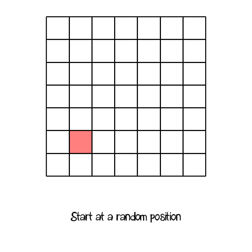

Simple maze generation

===

# Depth first maze generation

There are many ways to generate a maze, you can have a look at [Wikipedia](https://en.wikipedia.org/wiki/Maze_generation_algorithm?target=_blank) to get a view of what is possible.

We'll implement a **depth first algorithm**, because i find, it's the easiest and most performant way to build a random maze.

So, what the heck is depth first?

Let's think of a grid of 7 by 7 tiles. We start at a random point and go two steps a random position, if that cell is not marked as a track yet and it's in the grid, we mark that as a track and we also mark the cell before. Then we move two cells in another random position, and so on. We'll do this, till every point has checked every direction. If every cell of the grid is processed, we'll get a perfectly generated maze.



So, enough theory. Let's create a new Unity3D project and create a folder structure like this


Then save the current scene in our Scenes folder.


Next, create a new Folder in our Scripts folder and name it **Maze**, and inside, create a new C# script with the name **Maze**


Our Maze class is just a simple class
``` csharp
using UnityEngine;
using System.Collections;

public class Maze {
    


}
```

Our maze has a width and a height
``` csharp
    int width;
    int height;
```

To store our grid, we need a two dimensional boolean array
``` csharp
    bool[,] grid;
```

We are using a random generator for our random direction movement
``` csharp
    System.Random rg;
```

And we are storing the start position of our maze generation
``` csharp
    int startX;
    int startY;
```

We need a public getter for our grid array
``` csharp
    public bool[,] Grid {
        get { return grid; }
    }
```

Our **constructor** just sets the values
``` csharp
    public Maze(int width, int height, System.Random rg) {
        this.width = width;
        this.height = height;

        this.rg = rg;
    }
```

Now we need a function to generate our maze, we call it Generate (surprise ;)), all it does is to initialize our grid array, sets the start position (we could generate a random value, but i thought it would be nice to have our character to start in the bottom left corner) sets the grid value at that position to true and starts our MazeDigger, which we build later
``` csharp
    public void Generate() {
        grid = new bool[width, height];

        startX = 1;
        startY = 1;

        grid[startX, startY] = true;

        MazeDigger(startX, startY);
    }
 ``` 

Now comes our **MazeDigger**, it's the heart peace of our maze generation, but before we start that, we have to create a little helper function, which shuffles an array, it's a pity, that this isn't done already... So create a new folder in our Scripts folder and name it **Tools**, and inside create a new C# script with the name **Tools**


Our Tools class just have a single static function for now, the **Shuffle** function, which just shuffles an array of any type
``` csharp
using UnityEngine;
using System.Collections;

public class Tools {
    
    public static T[] Shuffle<T>(T[] array, System.Random rg) {
        for(int i = 0; i < array.Length - 1; i++) {
            int randomIndex = rg.Next(i, array.Length);

            T tempItem = array[randomIndex];

            array[randomIndex] = array[i];
            array[i] = tempItem;
        }

        return array;
    }

}
```

Alright, back in our **Maze class**, we can now create our **MazeDigger** function. It gets the current position and creates a direction array and shuffles it, so we have an array with all directions, but randomly shuffled.
``` csharp
    void MazeDigger(int x, int y) {
        int[] directions = new int[] { 1, 2, 3, 4 };

        Tools.Shuffle(directions, rg);
    }
```

Next we loop through every direction
``` csharp
        for(int i = 0; i < directions.Length; i++) {

        }
```

In the loop we check every direction, if the cell two units in that direction is not a pathway already, and if not, we build a way and then we call the MazeDigger itself again recursively, till we checked every direction.
``` csharp
        for(int i = 0; i < directions.Length; i++) {
            if(directions[i] == 1) {
                if(y - 2 <= 0)
                    continue;

                if(grid[x, y - 2] == false) {
                    grid[x, y - 2] = true;
                    grid[x, y - 1] = true;

                    MazeDigger(x, y - 2);
                }
            }

            if(directions[i] == 2) {
                if(x - 2 <= 0)
                    continue;

                if(grid[x - 2, y] == false) {
                    grid[x - 2, y] = true;
                    grid[x - 1, y] = true;

                    MazeDigger(x - 2, y);
                }
            }

            if(directions[i] == 3) {
                if(x + 2 >= width - 1)
                    continue;

                if(grid[x + 2, y] == false) {
                    grid[x + 2, y] = true;
                    grid[x + 1, y] = true;

                    MazeDigger(x + 2, y);
                }
            }

            if(directions[i] == 4) {
                if(y + 2 >= height - 1)
                    continue;

                if(grid[x, y + 2] == false) {
                    grid[x, y + 2] = true;
                    grid[x, y + 1] = true;

                    MazeDigger(x, y + 2);
                }
            }
        }
```

After the **Generate** function runs through, we have our maze stored in our grid array. Next time, we [create our sprites for the maze](../chapter-02?classes=button).

Our complete Maze class looks like this
``` csharp
using UnityEngine;
using System.Collections;

public class Maze {

    int width;
    int height;

    bool[,] grid;

    System.Random rg;

    int startX;
    int startY;

    public bool[,] Grid {
        get { return grid; }
    }

    public Maze(int width, int height, System.Random rg) {
        this.width = width;
        this.height = height;

        this.rg = rg;
    }

    public void Generate() {
        grid = new bool[width, height];

        startX = 1;
        startY = 1;

        grid[startX, startY] = true;

        MazeDigger(startX, startY);
    }

    void MazeDigger(int x, int y) {
        int[] directions = new int[] { 1, 2, 3, 4 };

        Tools.Shuffle(directions, rg);

        for(int i = 0; i < directions.Length; i++) {
            if(directions[i] == 1) {
                if(y - 2 <= 0)
                    continue;

                if(grid[x, y - 2] == false) {
                    grid[x, y - 2] = true;
                    grid[x, y - 1] = true;

                    MazeDigger(x, y - 2);
                }
            }

            if(directions[i] == 2) {
                if(x - 2 <= 0)
                    continue;

                if(grid[x - 2, y] == false) {
                    grid[x - 2, y] = true;
                    grid[x - 1, y] = true;

                    MazeDigger(x - 2, y);
                }
            }

            if(directions[i] == 3) {
                if(x + 2 >= width - 1)
                    continue;

                if(grid[x + 2, y] == false) {
                    grid[x + 2, y] = true;
                    grid[x + 1, y] = true;

                    MazeDigger(x + 2, y);
                }
            }

            if(directions[i] == 4) {
                if(y + 2 >= height - 1)
                    continue;

                if(grid[x, y + 2] == false) {
                    grid[x, y + 2] = true;
                    grid[x, y + 1] = true;

                    MazeDigger(x, y + 2);
                }
            }
        }
    }
    
}
```