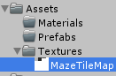
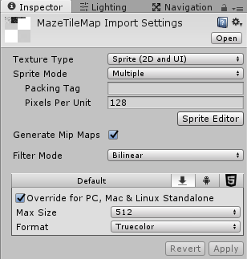
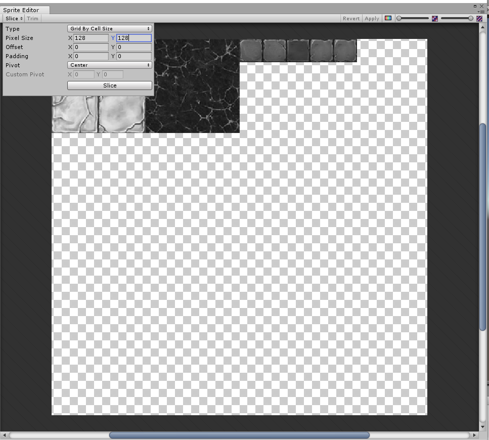
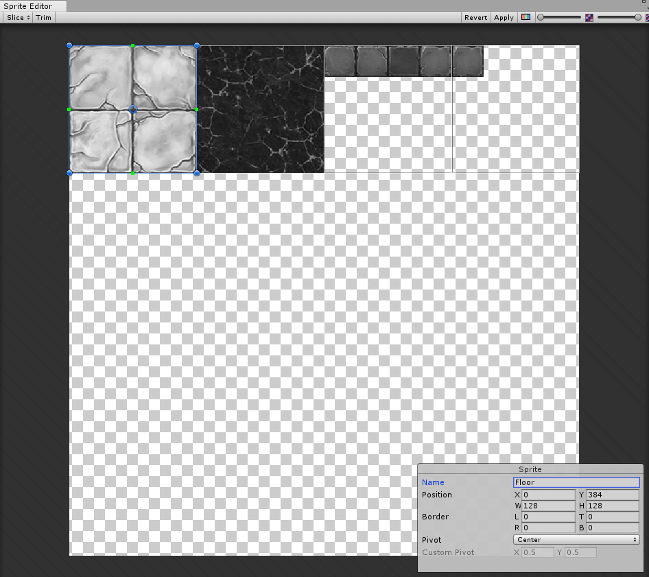
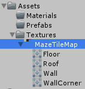

Create the maze sprites

===

# Maze Sprites

To visualize our Maze, we need a bunch of sprites. We need
* Floor Sprite
* Roof Sprite
* Wall Sprite
* WallCorner Sprite

So we need to create a texture with multiple sprites in it. I chose a 512 by 512 pixel texture, which i cut into a 4 by 4 grid, so every sprite will be 128 by 128 pixels.

You can make a texture by your own, or you can download a texture here.

[Download PSD](MazeTileMap.psd?target=_blank&classes=button)
[Download PNG](MazeTileMap.png?target=_blank&classes=button)

Save the texture to our Textures folder

Edit the import settings of the texture
* set the **Texture Type** to **Sprite(2D and UI)**
* set the **Sprite Mode** to** Multiple**
* set **Pixels Per Unit** to **128**
* Override the **Max Size** to **512**
* set the **Format** to **Truecolor**

and hit **Apply**

Next, open the Sprite Editor, click on **Slice**, then choose the **Type** **Grid by Cell Size**, set the **PixelSize** to 128 and 128 and click on the **Slice** button.

Then, click on the first sprite and name it **Floor**

The second sprite is called **Roof** the third one **Wall** and the fourth one is the **WallCorner**

After that, click on **Apply** and close the Sprite Editor. If you look at the MazeTileMap Texture in the project, you should see something like that

Alright, now we have our sprites prepared. Next time, we [create our actual maze visualization](../chapter-03?classes=button).