Draw the maze

===

# Maze Drawing

It's time to draw our maze. At first, we need a **prefab**, which holds our sprite tile. So, create a new **empty GameObject** and name it **MazeSprite**.
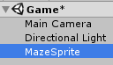

Add a **SpriteRenderer** component to it.
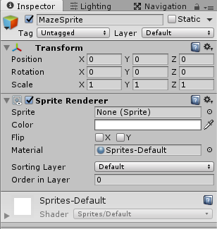

Next, create a **new Material** in our Materials folder and name it **MazeSprite**
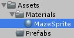

In the Material settings, choose **Sprites/Diffuse** for the Shader
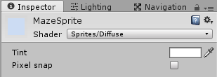

Drop the new Material on our **MazeSprite GameObject**
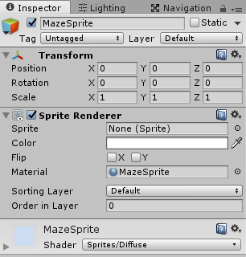

Next, we need a little class, which sets a sprite to our MazeSprite GameObject, so create a new C# script in our **Maze** folder and name it **MazeSprite**
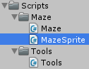

Drop this new script on our **MazeSprite** GameObject
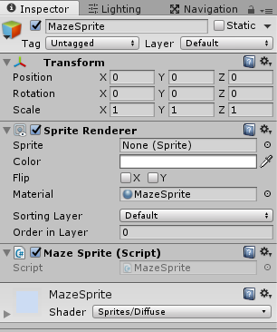

The **MazeSprite class** is a simple MonoBehaviour
``` csharp
using UnityEngine;
using System.Collections;

public class MazeSprite : MonoBehaviour {
    


}
```

We need a reference to our SpriteRenderer, which we assign in the **Awake** function
``` csharp
    SpriteRenderer sRenderer;

    void Awake() {
        sRenderer = GetComponent<SpriteRenderer>();
    }
```

Next, we need a public function **SetSprite** which sets a sprite to our SpriteRenderer and sets the sortingOrder. We also create an overload for this function, so we can set a sprite with the lowest sortingOrder without setting it as a parameter.
``` csharp
    public void SetSprite(Sprite sprite, int sortingOrder) {
        sRenderer.sprite = sprite;
        sRenderer.sortingOrder = sortingOrder;
    }

    public void SetSprite(Sprite sprite) {
        SetSprite(sprite, 0);
    }
```

So, our complete MazeSprite script looks like this
``` csharp
using UnityEngine;
using System.Collections;

public class MazeSprite : MonoBehaviour {

    SpriteRenderer sRenderer;

    void Awake() {
        sRenderer = GetComponent<SpriteRenderer>();
    }

    public void SetSprite(Sprite sprite, int sortingOrder) {
        sRenderer.sprite = sprite;
        sRenderer.sortingOrder = sortingOrder;
    }

    public void SetSprite(Sprite sprite) {
        SetSprite(sprite, 0);
    }
}
```

Back in Unity, drop the MazeSprite GameObject to our Prefabs folder and delete it from the scene.
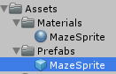

Now, create a new **empty GameObject** and name it **Maze**
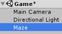

Next, we create our **MazeGenerator** script, so create a new C# script in our **Maze** folder and name it **MazeGenerator**
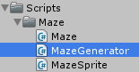

Our MazeGenerator class is a simple MonoBehaviour
``` csharp
using UnityEngine;
using System.Collections;

public class MazeGenerator : MonoBehaviour {
    


}
```

We need to set the width and the height of the maze and also the seed for our random generator, so we can have the same maze.
``` csharp
    public int mazeWidth;
    public int mazeHeight;
    public string mazeSeed;
```

Next, we need references to our four sprites, we created before
``` csharp
    public Sprite floorSprite;
    public Sprite roofSprite;
    public Sprite wallSprite;
    public Sprite wallCornerSprite;
```

And we also need a reference to our MazeSprite prefab
``` csharp
    public MazeSprite mazeSpritePrefab;
```

We need a reference for our random generator
``` csharp
    System.Random mazeRG;
```

and we need the instance of our Maze class
``` csharp
    Maze maze;
```

The **Start** function initializes our random generator, checks if we have set odd dimensions, if not, we add 1 to the width or height, then it creates a new instance of our maze and generates the maze and calls the DrawMaze function
``` csharp
    void Start() {
        mazeRG = new System.Random(mazeSeed.GetHashCode());

        if(mazeWidth % 2 == 0)
            mazeWidth++;

        if(mazeHeight % 2 == 0) {
            mazeHeight++;
        }

        maze = new Maze(mazeWidth, mazeHeight, mazeRG);
        maze.Generate();

        DrawMaze();
    }
```

The **DrawMaze** function loops through the grid and checks, if the maze cell is a path, and if it is, we create a new maze sprite
``` csharp
    void DrawMaze() {
        for(int x = 0; x < mazeWidth; x++) {
            for(int y = 0; y < mazeHeight; y++) {
                Vector3 position = new Vector3(x, y);

                if(maze.Grid[x,y] == true) {
                    CreateMazeSprite(position, floorSprite, transform, 0, mazeRG.Next(0, 3) * 90);
                }
            }
        }
    }
```
the **CreateMazeSprite** function instantiates a new MazeSprite prefab at the current position, sets the sprite with the sorting order, sets the instances transform parent and rotates the sprite
``` csharp
    void CreateMazeSprite(Vector3 position, Sprite sprite, Transform parent, int sortingOrder, float rotation) {
        MazeSprite mazeSprite = Instantiate(mazeSpritePrefab, position, Quaternion.identity) as MazeSprite;
        mazeSprite.SetSprite(sprite, sortingOrder);
        mazeSprite.transform.SetParent(parent);
        mazeSprite.transform.Rotate(0, 0, rotation);
    }
```

Alright, back in Unity, drop our MazeGenerator class on our Maze GameObject, set the width, height and seed to your needs and drag the right sprites to every sprite field and also drop the maze prefab to the right field
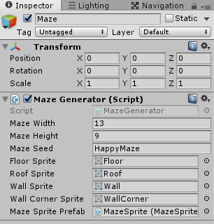

If you hit play now, you should see something like this
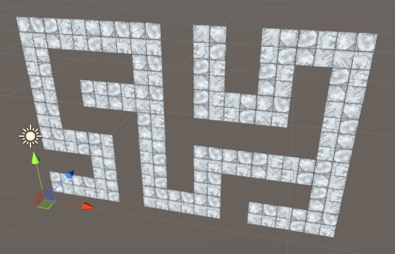

Our path is ready to go, nice :) But we also want walls and roof tiles, so we need to add this in our DrawMaze function. In the if statement, where we check, if the grid cell is true, we need to add an else block, where we draw our roof and the right walls
``` csharp
    void DrawMaze() {
        for(int x = 0; x < mazeWidth; x++) {
            for(int y = 0; y < mazeHeight; y++) {
                Vector3 position = new Vector3(x, y);

                if(maze.Grid[x,y] == true) {
                    CreateMazeSprite(position, floorSprite, transform, 0, mazeRG.Next(0, 3) * 90);
                }else {
                    CreateMazeSprite(position, roofSprite, transform, 0, 0);

                    DrawWalls(x, y);
                }
            }
        }
    }
```

The **DrawWalls** function, checks the four neighbors, if they are path cells or wall cells
``` csharp
    void DrawWalls(int x, int y) {
        bool top = GetMazeGridCell(x, y + 1);
        bool bottom = GetMazeGridCell(x, y - 1);
        bool right = GetMazeGridCell(x + 1, y);
        bool left = GetMazeGridCell(x - 1, y);
    }
```

For this, we need a new function **GetMazeGridCell**, which just returns the current grid cell, or false if we are out of the grid
``` csharp
    public bool GetMazeGridCell(int x, int y) {
        if(x >= mazeWidth || x < 0 || y >= mazeHeight || y <= 0) {
            return false;
        }

        return maze.Grid[x, y];
    }
```

After we got the neighbors, we set the position, and draw the wall and wall corner sprites and rotate them to the right rotation
``` csharp
    void DrawWalls(int x, int y) {
        bool top = GetMazeGridCell(x, y + 1);
        bool bottom = GetMazeGridCell(x, y - 1);
        bool right = GetMazeGridCell(x + 1, y);
        bool left = GetMazeGridCell(x - 1, y);

        Vector3 position = new Vector3(x, y);

        if(top) {
            CreateMazeSprite(position, wallSprite, transform, 1, 0);
        }

        if(left) {
            CreateMazeSprite(position, wallSprite, transform, 1, 90);
        }

        if(bottom) {
            CreateMazeSprite(position, wallSprite, transform, 1, 180);
        }

        if(right) {
            CreateMazeSprite(position, wallSprite, transform, 1, 270);
        }

        if(!left && !top && x > 0 && y < mazeHeight - 1) {
            CreateMazeSprite(position, wallCornerSprite, transform, 2, 0);
        }

        if(!left && !bottom && x > 0 && y > 0) {
            CreateMazeSprite(position, wallCornerSprite, transform, 2, 90);
        }

        if(!right && !bottom && x < mazeWidth - 1 && y > 0) {
            CreateMazeSprite(position, wallCornerSprite, transform, 2, 180);
        }

        if(!right && !top && x < mazeWidth - 1 && y < mazeHeight - 1) {
            CreateMazeSprite(position, wallCornerSprite, transform, 2, 270);
        }
    }
```

So, the complete code for our **MazeGenerator class** looks like this
``` csharp
using UnityEngine;
using System.Collections;

public class MazeGenerator : MonoBehaviour {

    public int mazeWidth;
    public int mazeHeight;
    public string mazeSeed;

    public Sprite floorSprite;
    public Sprite roofSprite;
    public Sprite wallSprite;
    public Sprite wallCornerSprite;

    public MazeSprite mazeSpritePrefab;

    System.Random mazeRG;

    Maze maze;

    void Start() {
        mazeRG = new System.Random(mazeSeed.GetHashCode());

        if(mazeWidth % 2 == 0)
            mazeWidth++;

        if(mazeHeight % 2 == 0) {
            mazeHeight++;
        }

        maze = new Maze(mazeWidth, mazeHeight, mazeRG);
        maze.Generate();

        DrawMaze();
    }

    void DrawMaze() {
        for(int x = 0; x < mazeWidth; x++) {
            for(int y = 0; y < mazeHeight; y++) {
                Vector3 position = new Vector3(x, y);

                if(maze.Grid[x,y] == true) {
                    CreateMazeSprite(position, floorSprite, transform, 0, mazeRG.Next(0, 3) * 90);
                }else {
                    CreateMazeSprite(position, roofSprite, transform, 0, 0);

                    DrawWalls(x, y);
                }
            }
        }
    }

    void DrawWalls(int x, int y) {
        bool top = GetMazeGridCell(x, y + 1);
        bool bottom = GetMazeGridCell(x, y - 1);
        bool right = GetMazeGridCell(x + 1, y);
        bool left = GetMazeGridCell(x - 1, y);

        Vector3 position = new Vector3(x, y);

        if(top) {
            CreateMazeSprite(position, wallSprite, transform, 1, 0);
        }

        if(left) {
            CreateMazeSprite(position, wallSprite, transform, 1, 90);
        }

        if(bottom) {
            CreateMazeSprite(position, wallSprite, transform, 1, 180);
        }

        if(right) {
            CreateMazeSprite(position, wallSprite, transform, 1, 270);
        }

        if(!left && !top && x > 0 && y < mazeHeight - 1) {
            CreateMazeSprite(position, wallCornerSprite, transform, 2, 0);
        }

        if(!left && !bottom && x > 0 && y > 0) {
            CreateMazeSprite(position, wallCornerSprite, transform, 2, 90);
        }

        if(!right && !bottom && x < mazeWidth - 1 && y > 0) {
            CreateMazeSprite(position, wallCornerSprite, transform, 2, 180);
        }

        if(!right && !top && x < mazeWidth - 1 && y < mazeHeight - 1) {
            CreateMazeSprite(position, wallCornerSprite, transform, 2, 270);
        }
    }

    public bool GetMazeGridCell(int x, int y) {
        if(x >= mazeWidth || x < 0 || y >= mazeHeight || y <= 0) {
            return false;
        }

        return maze.Grid[x, y];
    }

    void CreateMazeSprite(Vector3 position, Sprite sprite, Transform parent, int sortingOrder, float rotation) {
        MazeSprite mazeSprite = Instantiate(mazeSpritePrefab, position, Quaternion.identity) as MazeSprite;
        mazeSprite.SetSprite(sprite, sortingOrder);
        mazeSprite.transform.SetParent(parent);
        mazeSprite.transform.Rotate(0, 0, rotation);
    }
}
```

Okay, if you run this game now, you should see something like this
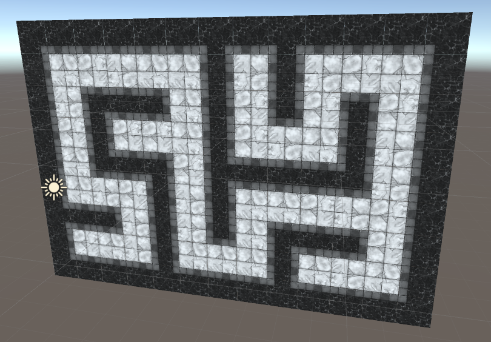

Cool, we have our maze in place, so we can [create our character](../chapter-04?classes=button) next time.