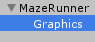
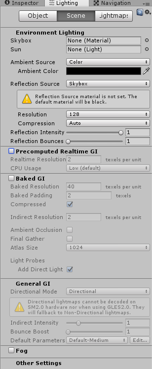

Create the character

===

# Maze Character

For our Maze Character, we need a new **empty GameObject** in the scene, so create one and name it **MazeRunner**


Then create a new **Sprite** as a **child** of the **MazeRunner**


and name it **Graphics**


Next, drop the **Main Camera** GameObject to the **MazeRunner** GameObject


New, edit the **Main Camera** settings
* set the **position** to **Vector3(0, 0, -1f)**
* set the **Clear Flags** to **Solid Color**
* set the **Background** to a color, which fits your needs
* set the **Projection** to **Orthographic**
* set the **Size** to **6**


Now, delete the **Directional Light** from the scene. Then open the **Lighting** window, and
* set the **Skybox** to **None**
* set the **Ambient Source** to **Color**
* set the **Ambient Color** to **black**
* disable **Precomputed Realtime GI**
* disable **Baked GI**


Then add a new **PointLight** GameObject as a **child** of our **MazeRunner** GameObject and rename it to **AmbientLight**


Edit the Light settings
* set the **position** to **Vector3(0, 0, -5f)**
* set the **Range** to **9**
* set the **Color** to **white**
* set the **Intensity** to **0.15f**
* set the **Bounce Intensity** to **0**
* set the **Render Mode** to **Important**


This gives us a little view of the contours in the game, we don't want, that the player sees too much ;)

Next create a new **SpotLight** GameObject as a **child** of our **Graphics** GameObject and name it **Flashlight**


Edit the SpotLight settings
* set the **position** to **Vector3(0, 0, -0.5f)**
* set the **rotation** to **Vector3(-60f, 0, 0)**
* set the **Range** to **20**
* set the **Spot Angle** to **105**
* set the **Color** to a **light yellow**
* set the **Intensity** to something like **1.8f**
* set the **Bounce Intensity** to **0**
* set the **Render Mode** to **Important**


Alright, with this done, we can start to create our **MazeRunner class**, so create a new **folder** inside our Scripts folder and name it **MazeRunner**, and inside create a new C# script and call it **MazeRunner**


Our MazeRunner class is a simple MonoBehaviour
``` csharp
using UnityEngine;
using System.Collections;

public class MazeRunner : MonoBehaviour {
    


}
```

We need a walk and rotation speed 
``` csharp
    public float walkSpeed;
    public float rotationSpeed;
```

We need a reference to the Transform, which we want to rotate(for the light rotation)
``` csharp
    public Transform rotationTransform;
```

We need a Vector2 object, which holds our current move direction
``` csharp
    Vector2 direction = Vector2.zero;
```

We are moving from cell to cell, so we need properties, to store the target cell and the current cell position, and since we are starting at the cell 1,1 we set it to this at the beginning
``` csharp
    int targetX = 1;
    int targetY = 1;

    int currentX = 1;
    int currentY = 1;
```

For our rotation, we need two properties which hold the current and the last angle
``` csharp
    float currentAngle;
    float lastAngle;
```

In the Update function, we check, if we have reached the target cell
``` csharp
    void Update() {
        bool targetReached = transform.position.x == targetX && transform.position.y == targetY;
    }
```

Then we set the current cell
``` csharp
        currentX = Mathf.FloorToInt(transform.position.x);
        currentY = Mathf.FloorToInt(transform.position.y);
```

Next, we set the current direction depending on the input
``` csharp
        direction.x = Input.GetAxisRaw("Horizontal");
        direction.y = Input.GetAxisRaw("Vertical");
```


Alright, before we move on, we need the possibility to get the state of a maze cell, if you remember, we have a function in our **MazeGenerator** class for this, the **GetMazeGridCell** function, so we just need the ability to reach this function, so head over to the **MazeGenerator class** and create a **public static instance** property
``` csharp
    public static MazeGenerator instance;
```

In the **Awake** function of the MazeGenerator class, we just fill this property
``` csharp
    void Awake() {
        instance = this;
    }
```

Okay, back in our **MazeRunner class**, we can move on with our **Update** function, we just set the angle depending on the direction value, and only if the cell at the direction is a path and we already reached to last target
``` csharp
        float angle = 0;

        if(direction.x > 0) {
            angle = 270;

            if(MazeGenerator.instance.GetMazeGridCell(currentX + 1, currentY) && targetReached) {
                targetX = currentX + 1;
                targetY = currentY;
            }
        } else if(direction.x < 0) {
            angle = 90;

            if(MazeGenerator.instance.GetMazeGridCell(currentX - 1, currentY) && targetReached) {
                targetX = currentX - 1;
                targetY = currentY;
            }
        } else if(direction.y > 0) {
            angle = 0;

            if(MazeGenerator.instance.GetMazeGridCell(currentX, currentY + 1) && targetReached) {
                targetX = currentX;
                targetY = currentY + 1;
            }
        } else if(direction.y < 0) {
            angle = 180;

            if(MazeGenerator.instance.GetMazeGridCell(currentX, currentY - 1) && targetReached) {
                targetX = currentX;
                targetY = currentY - 1;
            }
        } else {
            angle = lastAngle;
        }
```

After that, we lerp to this new angle
``` csharp
        currentAngle = Mathf.LerpAngle(currentAngle, angle, rotationSpeed * Time.deltaTime);
```

Next, we move our Transform to the target cell
``` csharp
    transform.position = Vector3.MoveTowards(transform.position, new Vector3(targetX, targetY), walkSpeed * Time.deltaTime);
```

Then we set the rotation of the rotation Transform
``` csharp
    rotationTransform.eulerAngles = new Vector3(0, 0, currentAngle);
```

At last, we set the last angle value
``` csharp
    lastAngle = angle;
```

Back in Unity, drop the **MazeRunner** class to our **MazeRunner** GameObject and set the position of the MazeRunner GameObject to Vector3(1f,1f,0), set the walk speed to 4 and the rotation speed to 8, and then drop the **Graphics** Transform to the RotationTransform property


If you run the game now, you should see something like this and you should be able to walk around with the arrow keys or with WSAD keys


Cool, we have a working maze runner :) next time, we [add a little bit of flickering](../chapter-05?classes=button) to our flash light.