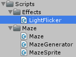
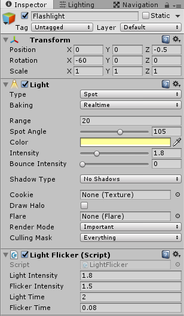

Create a light flicker effect

===

# Light Flickering

We want to have an effect for our flashlight, so that it seems, the batteries are low and the lamp is flickering sometimes.

To get such effect, we need a new C# script, so create a new folder in our Scripts folder and name it **Effects**. In there create a new C# script and name it **LightFlicker**.


Our LightFlicker class is a simple MonoBehaviour
``` csharp
using UnityEngine;
using System.Collections;

public class LightFlicker : MonoBehaviour {
    


}
```

First, we need to store the **light intensity** and the **flicker intensity** values
``` csharp
    public float lightIntensity;
    public float flickerIntensity;
```

Then we need our **lighting time** and our **flicker time** stored
``` csharp
    public float lightTime;
    public float flickerTime;
```

Next, we need a **random generator** and the reference to the **Light component**
``` csharp
    System.Random rg;

    Light flashlight;
```

In the **Awake** function, we create a new **instance** of our **random generator** and get the **reference** of the **Light component**
``` csharp
    void Awake() {
        rg = new System.Random();
        flashlight = GetComponent<Light>();
    }
```

In the **Start** function, we start a new **Coroutine, Flicker**, which flickers our light
``` csharp
    void Start() {
        StartCoroutine(Flicker());
    }
```

Our Coroutine Flicker runs an **endless loop**, at first, we **set the intensity** to our lightIntensity property value, then we **wait light time seconds** (with a little random variation), then we set a **random value** between 4 and 9 which is our flicker count value, then we loop flicker count times, in this loop, we **set the flashlight intensity** to a random value and wait a random time between 0 and the flicker time.
``` csharp
    IEnumerator Flicker() {
        while(true) {
            flashlight.intensity = lightIntensity;

            float lightingTime = lightTime + ((float)rg.NextDouble() - 0.5f);
            yield return new WaitForSeconds(lightingTime);

            int flickerCount = rg.Next(4, 9);

            for(int i = 0; i < flickerCount; i++) {
                float flickingIntensity = lightIntensity - ((float)rg.NextDouble() * flickerIntensity);
                flashlight.intensity = flickingIntensity;

                float flickingTime = (float)rg.NextDouble() * flickerTime;
                yield return new WaitForSeconds(flickingTime);
            }
        }
    }
```

Alright, this was it. Back in Unity, drop the LightFlicker class onto our Flashlight GameObject and then
* set the LightIntensity to 1.8
* set the FlickerIntensity to 1.5
* set the LightTime to 2
* set the FlickerTime to 0.08


Okay, if you run the game now, you should see the light flickering around :)

Next time, we let our character [escape the maze](../chapter-06?classes=button)

The complete **LightFlicker class** code looks like this
``` csharp
using UnityEngine;
using System.Collections;

public class LightFlicker : MonoBehaviour {

    public float lightIntensity;
    public float flickerIntensity;

    public float lightTime;
    public float flickerTime;

    System.Random rg;

    Light flashlight;

    void Awake() {
        rg = new System.Random();
        flashlight = GetComponent<Light>();
    }

    void Start() {
        StartCoroutine(Flicker());
    }

    IEnumerator Flicker() {
        while(true) {
            flashlight.intensity = lightIntensity;

            float lightingTime = lightTime + ((float)rg.NextDouble() - 0.5f);
            yield return new WaitForSeconds(lightingTime);

            int flickerCount = rg.Next(4, 9);

            for(int i = 0; i < flickerCount; i++) {
                float flickingIntensity = lightIntensity - ((float)rg.NextDouble() * flickerIntensity);
                flashlight.intensity = flickingIntensity;

                float flickingTime = (float)rg.NextDouble() * flickerTime;
                yield return new WaitForSeconds(flickingTime);
            }
        }
    }

}
```