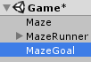
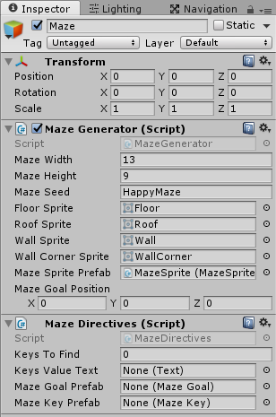

Let the character escape

===

# Get out of the maze

It's time to let our maze runner getting out of the maze.

Before we start, we need to make a few changes to our **Maze** class. Now, we have hardcoded the starting point to x=1 and y=1, we want to change that. To do so, we need to **change the constructor** of our **Maze** class. We create another constructor, which lets us set the start point (in our case from the MazeGenerator class)
``` csharp
    public Maze(int width, int height, System.Random rg) {
        this.width = width;
        this.height = height;

        this.startX = 1;
        this.startY = 1;

        this.rg = rg;
    }

    public Maze(int width, int height, int startX, int startY, System.Random rg) {
        this.width = width;
        this.height = height;

        this.startX = startX;
        this.startY = startY;

        this.rg = rg;
    }
```

Alright, next we need to **add a function**, which gives us the **goal position**. In this function, we set a radius to look for a floor cell and we start from the opposite of the starting point, then we loop through the positions around the end point and return the first floor cell position we find. We also create a little helper function to get the current cell.
``` csharp
    public Vector3 GetGoalPosition() {
        int radius = 2;

        int endX = width - startX;
        int endY = height - startY;

        for(int x = endX - radius; x <= endX + radius; x++) {
            for(int y = endY - radius; y <= endY + radius; y++) {
                if(GetCell(x, y)) {
                    return new Vector3(x, y);
                }
            }
        }

        return Vector3.one * 1000;
    }

    public bool GetCell(int x, int y) {
        if(x >= width || x < 0 || y >= height || y <= 0) {
            return false;
        }

        return grid[x, y];
    }
```

Back in our **MazeGenerator class**, we can also use the **GetCell function** from the Maze class, so we **change the GetMazeGridCell** function
``` csharp
    public bool GetMazeGridCell(int x, int y) {
        return maze.GetCell(x, y);
    }
```

Next, we need a new class that handles our directives for the MazeRunner. So create a new C# script in our **Maze** folder and name it **MazeDirectives**


Our **MazeDirectives** class uses a list, so we need the System.Collections.Generic namespace and it also uses the UnityUI, so we need the UnityEngine.UI namespace
``` csharp
using UnityEngine;
using UnityEngine.UI;
using System.Collections;
using System.Collections.Generic;

public class MazeDirectives : MonoBehaviour {
    


}
```

We want our character to find multiple keys, before he can escape from the maze
``` csharp
    public int keysToFind;
```

To show the player, how many keys he has found already, we need a reference to the UI Text, which we create later
``` csharp
    public Text keysValueText;
```

Next, we need two new prefabs, we need one for our goal and one for the keys (for this, we also need two more classes, which we create later)
``` csharp
    public MazeGoal mazeGoalPrefab;
    public MazeKey mazeKeyPrefab;
```

Then we need to store the instance of the maze goal
``` csharp
    MazeGoal mazeGoal;
```

We also need to store the value of the found keys
``` csharp
    int foundKeys;
```

We have a list of Vector3 positions for the keys
``` csharp
    List<Vector3> mazeKeyPositions;
```

Back in Unity, create a new empty GameObject in the scene and name it **MazeGoal**


In there, create a new Sprite GameObject and name it **Graphics**


Drop our MazeSprite Material on the Graphics GameObject


Alright, let's create a new class for our maze goal. So, create a new C# script in our Maze folder and name it MazeGoal


Then drop the MazeGoal script on our MazeGoal GameObject


Next, add a CircleCollider component to the MazeGoal GameObject, set it as a trigger and set the radius to 0.25f


Drop the MazeGoal GameObject to our Prefabs folder and delete it from the scene


Open the MazeGoal script. The MazeGoal class is a simple MonoBehaviour
``` csharp
using UnityEngine;
using System.Collections;

public class MazeGoal : MonoBehaviour {
    


}
```

We have two states for our maze goal, one state is the closed state and one state is the opened state. We show the states to the player by switching the sprites, so we need to references to the corresponding sprites.
``` csharp
    public Sprite closedGoalSprite;
    public Sprite openedGoalSprite;
```

In the Start function, we just set the closed sprite
``` csharp
    void Start() {
        GetComponentInChildren<SpriteRenderer>().sprite = closedGoalSprite;
    }
```

We also create a public function, which opens the goal
``` csharp
    public void OpenGoal() {
        GetComponentInChildren<SpriteRenderer>().sprite = openedGoalSprite;
    }
```

So, this was it for the MazeGoal for now. Next, create a new empty GameObject in our Scene and name it MazeKey


In there, create a new Sprite GameObject and name it Graphics


Drop our MazeSprite Material on the Graphics GameObject


In the MazeGoal GameObject, add a new CircleCollider2D component and set it as a trigger


Next we need a new class for our maze keys. Create a new C# script in our Maze folder and name it MazeKey


Drop the MazeKey class on our MazeKey GameObject


Then drop the MazeKey GameObject to our Prefabs folder and delete it from the scene.


Our MazeKey class is a simple MonoBehaviour
``` csharp
using UnityEngine;
using System.Collections;

public class MazeKey : MonoBehaviour {
    


}
```

Before we move on, we need to **add functionality** to our **MazeGenerator class**. At first, we need to add a new namespace to our class, because we use a list
``` csharp
using System.Collections.Generic;
```

We need to store the goal position in a Vector3 property
``` csharp
    public Vector3 mazeGoalPosition;
```

In the **Start** function, after we have generated the maze, we need to get the goal position of the maze
``` csharp
        maze = new Maze(mazeWidth, mazeHeight, mazeRG);
        maze.Generate();

        mazeGoalPosition = maze.GetGoalPosition();
```

We need to find some floor positions, in which we can drop our keys. So we create a function for this. The **GetRandomFloorPositions** function returns a list of Vector3s. To ensure, we don't have multiple values with the same position, we check if the new position is already in the list, and if it is, we run the random generator again, till we find a position, that isn't already occupied.
``` csharp
    public List<Vector3> GetRandomFloorPositions(int count) {
        List<Vector3> positions = new List<Vector3>();

        for(int i = 0; i < count; i++) {
            Vector3 position = Vector3.one;

            do {
                int posX = 0;
                int posY = 0;

                while(!GetMazeGridCell(posX, posY)) {
                    posX = mazeRG.Next(3, mazeWidth);
                    posY = mazeRG.Next(3, mazeHeight);
                }

                position = new Vector3(posX, posY);
            } while(positions.Contains(position));

            positions.Add(position);
        }

        return positions;
    }
```

Since we don't know, when the maze is ready, we need to add an event, to which we can subscribe in the **MazeDirectives** class, so open the **MazeGenerator** script and add our **OnMazeReady** event
``` csharp
    public delegate void MazeReadyAction();
    public static event MazeReadyAction OnMazeReady;
```

Then we need to call the event in the **Start** function, after we have generated the maze and everything is in place
``` csharp
        if(OnMazeReady != null) {
            OnMazeReady();
        }
```

So, back in our **MazeDirectives class**, we can now subsribe to the **OnMazeReady** event of the **MazeGenerator** class in the Awake function. This means, when the maze is ready, the function **StartDirectives** will be called.
``` csharp
    void Awake() {
        MazeGenerator.OnMazeReady += StartDirectives;
    }

    void StartDirectives() {

    }
```

The **StartDirectives** function instantiates the maze goal prefab at the goal position, gets random positions for the keys and instantiates our keys at the right positions
``` csharp
    void StartDirectives() {
        mazeGoal = Instantiate(mazeGoalPrefab, MazeGenerator.instance.mazeGoalPosition, Quaternion.identity) as MazeGoal;
        mazeGoal.transform.SetParent(transform);

        mazeKeyPositions = MazeGenerator.instance.GetRandomFloorPositions(keysToFind);

        for(int i = 0; i < mazeKeyPositions.Count; i++) {
            MazeKey mazeKey = Instantiate(mazeKeyPrefab, mazeKeyPositions[i], Quaternion.identity) as MazeKey;
            mazeKey.transform.SetParent(transform);
        }
    }
```

Now, we need to visualize the goal and the keys. So we need three new sprites.

* The key sprite - you can create one by your own, or you can [download it here](Key.png?target=_blank&classes=button)
* The closed goal sprite - you can create one by your own, or you can [download it here](ClosedDoor.png?target=_blank&classes=button)
* The opened goal sprite - you can create one by your own, or you can [download it here](OpenedDoor.png?target=_blank&classes=button)

Save this sprites into our Textures folder


Back in Unity, select all three sprites and set it up as followed
* Texture Type - Sprite(2D and UI)
* Pixels Per Unit - 128
* Max Size - 128
* Format - Truecolor


Now, select the MazeSprite Prefab and select the Graphics GameObject in there


Set the Order in Layer value to 10. Then select the Key sprite in the SpriteRenderer component


Next select the MazeGoal Prefab


and select the right sprites in our MazeGoal component


Then select the Graphics GameObject inside the MazeGoal prefab and set the Order in Layer value to 10.

Now, we can add our MazeDirectives component to the Maze GameObject in the scene


Drop the MazeGoal and MazeKey prefab to the properties and set the KeysToFind value to 3


If you hit play now, you should find the keys and the door


But, we won't fetch the keys. Because we haven't defined the functions to collect the keys yet. To get the collision check working, we need to add a Rigidbody2D to our MazeRunner GameObject and set the Gravity Scale of the RigidBody to 0


We also need a CircleCollider2D component on the MazeRunner GameObject, with a radius of 0.25f


Alright. Now we need to add the OnTriggerEnter functions to our MazeKey and MazeGoal class. Let's start with the MazeKey class. At the OnTriggerEnter2D function, we send a message to the parent GameObject of the MazeKey GameObject (which is our Maze GameObject which contains our MazeDirectives component) and then we destroy the MazeKey GameObject
``` csharp
    void OnTriggerEnter2D() {
        transform.parent.SendMessage("OnKeyFound", SendMessageOptions.DontRequireReceiver);
        GameObject.Destroy(gameObject);
    }
```

At the MazeGoal class, we also send a message to the parent GameObject(which is also our Maze GameObject which contains our MazeDirectives component) in the OnTriggerEnter2D function
``` csharp
    void OnTriggerEnter2D() {
        transform.parent.SendMessage("OnGoalReached", SendMessageOptions.DontRequireReceiver);
    }
```

Now, we need to add the message receiver functions to our MazeDirectives class. In the OnGoalFound function, we just check, if we already found all keys, and if it is so, we can escape the maze. In the OnKeyFound function, we just add 1 to the foundKeys value and if we found all keys, we open the goal.
``` csharp
    public void OnGoalReached() {
        Debug.Log("Goal Reached");
        if(foundKeys == keysToFind) {
            Debug.Log("Escape the maze");
        }
    }

    public void OnKeyFound() {
        foundKeys++;

        if(foundKeys == keysToFind) {
            GetComponentInChildren<MazeGoal>().OpenGoal();
        }
    }
```

Okay, if you hit play now and you've collected all keys, you should see the opened door


Our last thing we do is to add a little UI, to let our player know, how many keys he has to find. So back in Unity, create a new UI Panel


Set the SourceImage to None and the Color to complete transparent


Inside of the Panel, create a new Panel and name it KeyPanel


Set the anchor of the KeyPanel to top right, the width to 230 and the height to 40, remove the SourceImage and set the Color to nearly transparent


Inside the KeyPanel, create a new UI Image and name it KeyImage


Set the anchor of the KeyImage to middle left, the posX to 5 the width and height to 32 and select the Key sprite in the SourceImage


Now add a new UI Text to the KeyPanel and name it KeyText


Set the anchor of the KeyText to middle right, the posX to -5, the width to 105 and the height to 40. In the Text component, set the text to "keys found", the font size to 16, the alignment to right middle and the color to a half transparent white.


Then duplicate the KeyText GameObject, by selecting it and then press CTRL + D. Then rename it to KeyValueText


Set the posX to -110 and the width to 80. At the Text component, set the text to "0 of 0"


Now, select the Maze GameObject and drop the KeyValueText GameObject to the KeysValueText property of the MazeDirectives component.


Now open the MazeDirectives class. We add a new function, which sets the text for our found keys
``` csharp
    void SetKeyValueText() {
        keysValueText.text = foundKeys.ToString() + " of " + keysToFind.ToString();
    }
```

We call this function in the Start function
``` csharp
    void Start() {
        SetKeyValueText();
    }
```

And we also call this function in the OnKeyFound function
``` csharp
    public void OnKeyFound() {
        foundKeys++;

        SetKeyValueText();

        if(foundKeys == keysToFind) {
            GetComponentInChildren<MazeGoal>().OpenGoal();
        }
    }
```

If you hit play now, you should be able to see how many keys you have already collected.


Cool, we have now a working maze, in which we have to find keys to escape the maze :) Now, it's your turn to create an aMazeIng game from this :)

The complete Maze class
``` csharp
using UnityEngine;
using System.Collections;

public class Maze {

    int width;
    int height;

    bool[,] grid;

    System.Random rg;

    int startX;
    int startY;

    public bool[,] Grid {
        get { return grid; }
    }

    public Maze(int width, int height, System.Random rg) {
        this.width = width;
        this.height = height;

        this.startX = 1;
        this.startY = 1;

        this.rg = rg;
    }

    public Maze(int width, int height, int startX, int startY, System.Random rg) {
        this.width = width;
        this.height = height;

        this.startX = startX;
        this.startY = startY;

        this.rg = rg;
    }

    public void Generate() {
        grid = new bool[width, height];

        startX = 1;
        startY = 1;

        grid[startX, startY] = true;

        MazeDigger(startX, startY);
    }

    public Vector3 GetGoalPosition() {
        int radius = 2;

        int endX = width - startX;
        int endY = height - startY;

        for(int x = endX - radius; x <= endX + radius; x++) {
            for(int y = endY - radius; y <= endY + radius; y++) {
                if(GetCell(x, y)) {
                    return new Vector3(x, y);
                }
            }
        }

        return Vector3.one * 1000;
    }

    public bool GetCell(int x, int y) {
        if(x >= width || x < 0 || y >= height || y <= 0) {
            return false;
        }

        return grid[x, y];
    }

    void MazeDigger(int x, int y) {
        int[] directions = new int[] { 1, 2, 3, 4 };

        Tools.Shuffle(directions, rg);

        for(int i = 0; i < directions.Length; i++) {
            if(directions[i] == 1) {
                if(y - 2 <= 0)
                    continue;

                if(grid[x, y - 2] == false) {
                    grid[x, y - 2] = true;
                    grid[x, y - 1] = true;

                    MazeDigger(x, y - 2);
                }
            }

            if(directions[i] == 2) {
                if(x - 2 <= 0)
                    continue;

                if(grid[x - 2, y] == false) {
                    grid[x - 2, y] = true;
                    grid[x - 1, y] = true;

                    MazeDigger(x - 2, y);
                }
            }

            if(directions[i] == 3) {
                if(x + 2 >= width - 1)
                    continue;

                if(grid[x + 2, y] == false) {
                    grid[x + 2, y] = true;
                    grid[x + 1, y] = true;

                    MazeDigger(x + 2, y);
                }
            }

            if(directions[i] == 4) {
                if(y + 2 >= height - 1)
                    continue;

                if(grid[x, y + 2] == false) {
                    grid[x, y + 2] = true;
                    grid[x, y + 1] = true;

                    MazeDigger(x, y + 2);
                }
            }
        }
    }
    
}
```

The complete MazeGenerator class
``` csharp
using UnityEngine;
using System.Collections;
using System.Collections.Generic;

public class MazeGenerator : MonoBehaviour {

    public static MazeGenerator instance;

    public int mazeWidth;
    public int mazeHeight;
    public string mazeSeed;

    public Sprite floorSprite;
    public Sprite roofSprite;
    public Sprite wallSprite;
    public Sprite wallCornerSprite;

    public MazeSprite mazeSpritePrefab;

    System.Random mazeRG;

    Maze maze;

    public Vector3 mazeGoalPosition;

    public delegate void MazeReadyAction();
    public static event MazeReadyAction OnMazeReady;

    void Awake() {
        instance = this;
    }

    void Start() {
        mazeRG = new System.Random(mazeSeed.GetHashCode());

        if(mazeWidth % 2 == 0)
            mazeWidth++;

        if(mazeHeight % 2 == 0) {
            mazeHeight++;
        }

        maze = new Maze(mazeWidth, mazeHeight, mazeRG);
        maze.Generate();

        mazeGoalPosition = maze.GetGoalPosition();

        DrawMaze();

        if(OnMazeReady != null) {
            OnMazeReady();
        }
    }

    void DrawMaze() {
        for(int x = 0; x < mazeWidth; x++) {
            for(int y = 0; y < mazeHeight; y++) {
                Vector3 position = new Vector3(x, y);

                if(maze.Grid[x,y] == true) {
                    CreateMazeSprite(position, floorSprite, transform, 0, mazeRG.Next(0, 3) * 90);
                }else {
                    CreateMazeSprite(position, roofSprite, transform, 0, 0);

                    DrawWalls(x, y);
                }
            }
        }
    }

    void DrawWalls(int x, int y) {
        bool top = GetMazeGridCell(x, y + 1);
        bool bottom = GetMazeGridCell(x, y - 1);
        bool right = GetMazeGridCell(x + 1, y);
        bool left = GetMazeGridCell(x - 1, y);

        Vector3 position = new Vector3(x, y);

        if(top) {
            CreateMazeSprite(position, wallSprite, transform, 1, 0);
        }

        if(left) {
            CreateMazeSprite(position, wallSprite, transform, 1, 90);
        }

        if(bottom) {
            CreateMazeSprite(position, wallSprite, transform, 1, 180);
        }

        if(right) {
            CreateMazeSprite(position, wallSprite, transform, 1, 270);
        }

        if(!left && !top && x > 0 && y < mazeHeight - 1) {
            CreateMazeSprite(position, wallCornerSprite, transform, 2, 0);
        }

        if(!left && !bottom && x > 0 && y > 0) {
            CreateMazeSprite(position, wallCornerSprite, transform, 2, 90);
        }

        if(!right && !bottom && x < mazeWidth - 1 && y > 0) {
            CreateMazeSprite(position, wallCornerSprite, transform, 2, 180);
        }

        if(!right && !top && x < mazeWidth - 1 && y < mazeHeight - 1) {
            CreateMazeSprite(position, wallCornerSprite, transform, 2, 270);
        }
    }

    public bool GetMazeGridCell(int x, int y) {
        return maze.GetCell(x, y);
    }

    public List<Vector3> GetRandomFloorPositions(int count) {
        List<Vector3> positions = new List<Vector3>();

        for(int i = 0; i < count; i++) {
            Vector3 position = Vector3.one;

            do {
                int posX = 0;
                int posY = 0;

                while(!GetMazeGridCell(posX, posY)) {
                    posX = mazeRG.Next(3, mazeWidth);
                    posY = mazeRG.Next(3, mazeHeight);
                }

                position = new Vector3(posX, posY);
            } while(positions.Contains(position));

            positions.Add(position);
        }

        return positions;
    }

    void CreateMazeSprite(Vector3 position, Sprite sprite, Transform parent, int sortingOrder, float rotation) {
        MazeSprite mazeSprite = Instantiate(mazeSpritePrefab, position, Quaternion.identity) as MazeSprite;
        mazeSprite.SetSprite(sprite, sortingOrder);
        mazeSprite.transform.SetParent(parent);
        mazeSprite.transform.Rotate(0, 0, rotation);
    }
}

```

The complete MazeKey class
``` csharp
using UnityEngine;
using System.Collections;

public class MazeKey : MonoBehaviour {

    void OnTriggerEnter2D() {
        transform.parent.SendMessage("OnKeyFound", SendMessageOptions.DontRequireReceiver);
        GameObject.Destroy(gameObject);
    }

}

```

The complete MazeGoal class
``` csharp
using UnityEngine;
using System.Collections;

public class MazeGoal : MonoBehaviour {

    public Sprite closedGoalSprite;
    public Sprite openedGoalSprite;

    void Start() {
        GetComponentInChildren<SpriteRenderer>().sprite = closedGoalSprite;
    }

    public void OpenGoal() {
        GetComponentInChildren<SpriteRenderer>().sprite = openedGoalSprite;
    }

    void OnTriggerEnter2D() {
        transform.parent.SendMessage("OnGoalReached", SendMessageOptions.DontRequireReceiver);
    }
}

```

The complete MazeDirectives class
``` csharp
using UnityEngine;
using UnityEngine.UI;
using System.Collections;
using System.Collections.Generic;

public class MazeDirectives : MonoBehaviour {

    public int keysToFind;

    public Text keysValueText;

    public MazeGoal mazeGoalPrefab;
    public MazeKey mazeKeyPrefab;

    MazeGoal mazeGoal;

    int foundKeys;

    List<Vector3> mazeKeyPositions;

    void Awake() {
        MazeGenerator.OnMazeReady += StartDirectives;
    }

    void Start() {
        SetKeyValueText();
    }

    void StartDirectives() {
        mazeGoal = Instantiate(mazeGoalPrefab, MazeGenerator.instance.mazeGoalPosition, Quaternion.identity) as MazeGoal;
        mazeGoal.transform.SetParent(transform);

        mazeKeyPositions = MazeGenerator.instance.GetRandomFloorPositions(keysToFind);

        for(int i = 0; i < mazeKeyPositions.Count; i++) {
            MazeKey mazeKey = Instantiate(mazeKeyPrefab, mazeKeyPositions[i], Quaternion.identity) as MazeKey;
            mazeKey.transform.SetParent(transform);
        }
    }

    public void OnGoalReached() {
        Debug.Log("Goal Reached");
        if(foundKeys == keysToFind) {
            Debug.Log("Escape the maze");
        }
    }

    public void OnKeyFound() {
        foundKeys++;

        SetKeyValueText();

        if(foundKeys == keysToFind) {
            GetComponentInChildren<MazeGoal>().OpenGoal();
        }
    }

    void SetKeyValueText() {
        keysValueText.text = foundKeys.ToString() + " of " + keysToFind.ToString();
    }

}

```