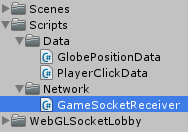
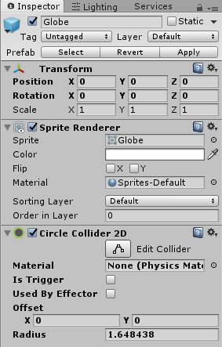
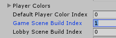

Prepare the Unity3D game

===

# The Unity3D part

Create a new 2D Unity3D project and import the [WebGLSocketLobby package from github](https://github.com/daspete/unity3d-webgl-socket-lobby-package?target=_blank)

After you imported the package, drag the **WebGLSocketLobby** prefab onto the scene


Then drop the **TopPanel** prefab to the **Panels** GameObject in the scene.


Change the **title** to your game name


And hit **Apply**


Then **delete** the **TopPanel** GameObject from the scene.

Save the scene as **Lobby**


Create a new scene and save it as **Game**


Now create a new folder with the name **Scripts** and in there create two other folders with the name **Data** and **Network**


We are getting the position data for the globe sprite from the server, but in json format, we will have to convert it into a C# class, so we can use the data. For this, we need to create a **GlobePositionData** class in the **Data** folder.


The **GlobePositionData** class is a simple serializable class, which stores the position in two float variables.
``` csharp
using UnityEngine;
using System.Collections;

[System.Serializable]
public class GlobePositionData {

    public float x;
    public float y;

}
```

Next, we need a data object, which sends the players click time, when he hits the globe, so we create a new data class with the name **PlayerClickData**


The **PlayerClickData** class is also a simple serializable class, which stores the current player id, the click time and if the player has clicked on the globe or not.
``` csharp
using UnityEngine;
using System.Collections;

[System.Serializable]
public class PlayerClickData {

    public string playerID;
    public float clickTime;
    public bool foundGlobe;

}
```

Alright, after we have the data objects in place, we need the connection objects. We have a sender and a receiver. Let's start with the receiver object. Create a new C# script in the Network folder and name it **GameSocketReceiver**


The **GameSocketReceiver** uses the namespace `WebGLSocketLobby.Game` and extends the **GameReceiver** class from this namespace.
``` csharp
using UnityEngine;
using System.Collections;
using WebGLSocketLobby.Game;

public class GameSocketReceiver : GameReceiver {
    


}
```

Since we are getting the globe position from the server, we need to listen for this event. For this, we create a new event in our receiver class. And we are getting the data as a json string, so we need to convert this data into our GlobePositionData class.
``` csharp
    public delegate void SetGlobePositionAction(GlobePositionData position);
    public static event SetGlobePositionAction OnSetGlobePosition;

    public void OnSocketSetGlobePosition(string data) {
        if(OnSetGlobePosition != null)
            OnSetGlobePosition(JsonUtility.FromJson<GlobePositionData>(data));
    }
```

We are getting two more events from the server. One, if the player has won and one, when the player has lost, so we need to create these two events as well in our receiver class. We are not getting any data with these two events, so we don't need to convert anything.
``` csharp
    public delegate void PlayerHasWonAction();
    public static event PlayerHasWonAction OnPlayerHasWon;

    public void OnSocketPlayerHasWon() {
        if(OnPlayerHasWon != null)
            OnPlayerHasWon();
    }

    public delegate void PlayerHasLostAction();
    public static event PlayerHasLostAction OnPlayerHasLost;

    public void OnSocketPlayerHasLost() {
        if(OnPlayerHasLost != null)
            OnPlayerHasLost();
    }
```

So, our complete **GameSocketReceiver class looks like this**
``` csharp
using UnityEngine;
using System.Collections;
using WebGLSocketLobby.Game;

public class GameSocketReceiver : GameReceiver {

    public delegate void SetGlobePositionAction(GlobePositionData position);
    public static event SetGlobePositionAction OnSetGlobePosition;

    public void OnSocketSetGlobePosition(string data) {
        if(OnSetGlobePosition != null)
            OnSetGlobePosition(JsonUtility.FromJson<GlobePositionData>(data));
    }

    public delegate void PlayerHasWonAction();
    public static event PlayerHasWonAction OnPlayerHasWon;

    public void OnSocketPlayerHasWon() {
        if(OnPlayerHasWon != null)
            OnPlayerHasWon();
    }

    public delegate void PlayerHasLostAction();
    public static event PlayerHasLostAction OnPlayerHasLost;

    public void OnSocketPlayerHasLost() {
        if(OnPlayerHasLost != null)
            OnPlayerHasLost();
    }

}
```

Okay, now we need our sender class. So create a new C# script in our **Network** folder and name it **GameSocketSender**


The **GameSocketSender** class also uses the WebGLSocketLobby.Game namespace and extends the GameSender class from there.
``` csharp
using UnityEngine;
using System.Collections;
using WebGLSocketLobby.Game;

public class GameSocketSender : GameSender {


}
```

We have only one event, which we want to send. The player's click. 
``` csharp
    public static void SendPlayerClick(string parameter) {
        Send("PlayerClicked", parameter);
    }
```

So, our complete GameSocketSender class looks like this
``` csharp
using UnityEngine;
using System.Collections;
using WebGLSocketLobby.Game;

public class GameSocketSender : GameSender {

    public static void SendPlayerClick(string parameter) {
        Send("PlayerClicked", parameter);
    }

}
```

Alright, now we have our networking in place, so we can start to create the game itself.

Create a new 2D GameObject (Sprite) and name it **Globe**


Set the globe sprite, which is provided in the unity package as the sprite of the globe


Add a CircleCollider component to the Globe GameObject


Set the size of the camera to about 30 and the position to Vector3(20, 20, -10)


Create a new folder in our project and name it **Prefabs**


Drop our **Globe** GameObject into it and delete it from the scene


Next, create a new UI Panel in our scene


Delete the sprite from it and set the color to total transparent


Then add a UI Text GameObject to the panel and name it **PlayerWinInfo**


Next, set the dimension to 300x200, delete the text, set the font size to 60 and set it horizontally and vertically center aligned.


Now, create a new **empty GameObject** in the scene and name it **GameManager**


Then create a new C# script in our **Scripts** folder and call it **GameManager**


Drop the GameManager script onto our GameManager GameObject


And then drop our GameSocketReceiver Component on it


Our GameManager class is a simple MonoBehaviour which uses the `WebGLSocketLobby` namespace as well as the `UnityEngine.UI` namespace.
``` csharp
using UnityEngine;
using UnityEngine.UI;
using System.Collections;
using WebGLSocketLobby;

public class GameManager : MonoBehaviour {
    


}
```

First, we need a reference to the UI Text component, which holds the text, when the player won or lost a round.
``` csharp
    public Text playerWinInfo;
```

Next, we need a reference of our globe prefab and a reference to the currently instantiated globe GameObject.
``` csharp
    public GameObject globePrefab;
    GameObject globe;
```

Then we need to store the players network id
``` csharp
    string playerID;
```

Next, we need to store the time, when the round has started. And we need a boolean, which tells us, if we can click, or not.
``` csharp
    float roundStartTime;
    bool roundActive;
```

In the Awake function, we set the playerID, register for the socket events and set the player win info text to an empty string.
``` csharp
    void Awake() {
        playerID = SocketLobby.Player.playerID;

        GameSocketReceiver.OnSetGlobePosition += OnSetGlobePosition;
        GameSocketReceiver.OnPlayerHasWon += PlayerWonRound;
        GameSocketReceiver.OnPlayerHasLost += PlayerLostRound;

        playerWinInfo.text = "";
    }

    void OnSetGlobePosition(GlobePositionData position) {

    }
```

in the **OnSetGlobePosition** function, we reset the player win info text, then we check, if there is already a globe instantiated and delete it, then we instantiate a new globe on the position, which the server gave us and set the roundStartTime to the current time and we set the roundActive to true.
``` csharp
    void OnSetGlobePosition(GlobePositionData position) {
        playerWinInfo.text = "";

        if(globe != null)
            GameObject.Destroy(globe);

        globe = Instantiate(globePrefab, new Vector3(position.x, position.y), Quaternion.identity) as GameObject;

        roundStartTime = Time.time;
        roundActive = true;
    }
```

The **PlayerWonRound** and **PlayerLostRound** function, just update the player win info text.
``` csharp
void PlayerWonRound() {
        playerWinInfo.text = "YOU WON";
    }

    void PlayerLostRound() {
        playerWinInfo.text = "YOU LOST";
    }
```

In the **Update** function, we check if the round is active, otherwise we just return. Then we check for a left mouse button click, and if the player clicked, we set the round active to false and we check, if the globe is around the click position and then we call the **PlayerClick** function with the result.
``` csharp
    void Update() {
        if(!roundActive)
            return;

        if(Input.GetMouseButtonDown(0)) {
            roundActive = false;
            Vector3 mousePosition = Camera.main.ScreenToWorldPoint(Input.mousePosition - Vector3.forward * Camera.main.transform.position.z);
            
            if(Physics2D.OverlapCircle(mousePosition, 0.1f) != null) {
                PlayerClicked(true);
            } else {
                PlayerClicked(false);
            }
        }
    }
```

In the **PlayerClicked** function, we check, if the player hit the globe, if not, we show him, that we has lost, otherwise we just get the ellapsed round time and send the click data to the server.
``` csharp
    void PlayerClicked(bool foundGlobe) {
        if(foundGlobe == false) {
            PlayerLostRound();
            return;
        }

        float clickTime = Time.time - roundStartTime;

        PlayerClickData clickData = new PlayerClickData();
        clickData.playerID = playerID;
        clickData.foundGlobe = foundGlobe;
        clickData.clickTime = clickTime;

        GameSocketSender.SendPlayerClick(JsonUtility.ToJson(clickData));
    }
```

Alright, so our complete **GameManager** class looks like this
``` csharp
using UnityEngine;
using UnityEngine.UI;
using System.Collections;
using WebGLSocketLobby;

public class GameManager : MonoBehaviour {

    public Text playerWinInfo;

    public GameObject globePrefab;
    GameObject globe;

    string playerID;

    float roundStartTime;
    bool roundActive;
    
    void Awake() {
        playerID = SocketLobby.Player.playerID;

        GameSocketReceiver.OnSetGlobePosition += OnSetGlobePosition;
        GameSocketReceiver.OnPlayerHasWon += PlayerWonRound;
        GameSocketReceiver.OnPlayerHasLost += PlayerLostRound;

        playerWinInfo.text = "";
    }

    void Update() {
        if(!roundActive)
            return;

        if(Input.GetMouseButtonDown(0)) {
            roundActive = false;
            Vector3 mousePosition = Camera.main.ScreenToWorldPoint(Input.mousePosition - Vector3.forward * Camera.main.transform.position.z);
            
            if(Physics2D.OverlapCircle(mousePosition, 0.1f) != null) {
                PlayerClicked(true);
            } else {
                PlayerClicked(false);
            }
        }
    }

    void PlayerClicked(bool foundGlobe) {
        if(foundGlobe == false) {
            PlayerLostRound();
            return;
        }

        float clickTime = Time.time - roundStartTime;

        PlayerClickData clickData = new PlayerClickData();
        clickData.playerID = playerID;
        clickData.foundGlobe = foundGlobe;
        clickData.clickTime = clickTime;

        GameSocketSender.SendPlayerClick(JsonUtility.ToJson(clickData));
    }

    void OnSetGlobePosition(GlobePositionData position) {
        playerWinInfo.text = "";

        if(globe != null)
            GameObject.Destroy(globe);

        globe = Instantiate(globePrefab, new Vector3(position.x, position.y), Quaternion.identity) as GameObject;

        roundStartTime = Time.time;
        roundActive = true;
    }


    void PlayerWonRound() {
        playerWinInfo.text = "YOU WON";
    }

    void PlayerLostRound() {
        playerWinInfo.text = "YOU LOST";
    }

}
```

Now, save the scene and head back to our **Lobby** scene.

Select the **WebGLSocketLobby** GameObject and search for the **SocketLobby** component in the inspector. In there, there is a **Settings** field, which holds our game settings.

For local testing, set the **DefaultGameServerUrl** to **localhost:3000**


Now, open the **Build Settings** and drag the **Lobby** scene and the **Game** scene onto it.


Mind the numbers on the right. The Lobby scene is the scene with the index 0 and the Game scene has the index 1. These numbers have also to be set in the **SocketLobby** settings in the **GameSceneBuildIndex** field and in the **LobbySceneBuildIndex**.


Next, switch to the **WebGL** platform in the build settings.


Then click on the **player settings**. Change the default **resolution** to **1280x720** and check the **RunInBackground** checkmark.


In the **PublishingSettings** enable the **DataCaching**.


Now, we are ready to build out our WebGL game. So click on **Build** in the **Build Settings**. This may take a while.

After the build, we are ready to [create our client](../the-client-part?classes=button)