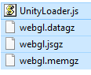
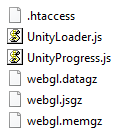
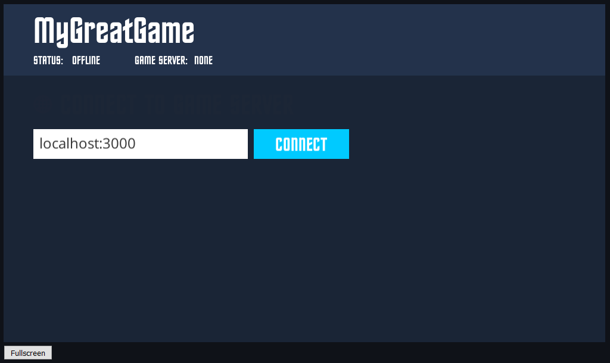

Create the game client

===

# The client part

Now, we need to create our HTML5 Javascript client script. To do this, go to the terminal and navigate to the folder in which you cloned the client repository.

Next we need to install the dependencies. So type
```
npm install
```
and let the node package manager do the rest.

We also need an HTTP-Server node module. To install it, just type
```
npm install -g http-server
``` 

Next, we need to start our Javascript watcher. To do that, type in
```
gulp
```
this will start the watcher.

Before we move on, we need to copy the Unity WebGL files to the /unity folder. When you built the Unity3D game, you got four files in the build/Release folder.

* UnityLoader.js
* webgl.datagz
* webgl.jsgz
* webgl.memgz



We need these four files in our client folder. In our client folder lies a folder named unity. Open it and copy the four new files in there. Just override the existing files, which are there.


## The GameClient class
In the `src/Game/` folder exists our `MyGameClient.js` files, which we need now. You can delete the whole content and replace it with an empty template.
``` javascript
import GameClient from './GameClient.js';

class MyGameClient extends GameClient {

    StartClient(){
    
    }

}

export default MyGameClient;
```

In the **StartGame** function, we have to register the events, we will get from the server. If you followed the tutorial before, you know, we have three events. 

* set-globe-position
* player-won-round
* player-lost-round

We can register the events with the `this.socket.on` function
``` javascript
    StartClient(){
        this.socket.on('set-globe-position', this.OnSetGlobePosition.bind(this));
        this.socket.on('player-won-round', this.OnPlayerWonRound.bind(this));
        this.socket.on('player-lost-round', this.OnPlayerLostRound.bind(this));
    }

    OnSetGlobePosition(data){

    }

    OnPlayerWonRound(){

    }

    OnPlayerLostRound(){
        
    }
```

In the **OnSetGlobePosition** event callback function, we need to send the values (as a json string) to the game. For this we can use the `this.SendToGame` function
``` javascript
    OnSetGlobePosition(data){
        this.SendToGame('OnSocketSetGlobePosition', JSON.stringify(data));
    }
```

The OnPlayerWonRound and OnPlayerLostRound function also sends the event to the game
``` javascript
    OnPlayerWonRound(){
        this.SendToGame('OnSocketPlayerHasWon');
    }

    OnPlayerLostRound(){
        this.SendToGame('OnSocketPlayerHasLost');
    }
```

At last, we need to send the PlayerClicked event from the player to the server, we can do this with the `this.socket.emit` function
``` javascript
    PlayerClicked(data){
        this.socket.emit('player-got-globe', data);
    }
```

So, the complete MyGameClient.js file looks like this
``` javascript
import GameClient from './GameClient.js';

class MyGameClient extends GameClient {

    StartClient(){
        this.socket.on('set-globe-position', this.OnSetGlobePosition.bind(this));
        this.socket.on('player-won-round', this.OnPlayerWonRound.bind(this));
        this.socket.on('player-lost-round', this.OnPlayerLostRound.bind(this));
    }

    OnSetGlobePosition(data){
        this.SendToGame('OnSocketSetGlobePosition', JSON.stringify(data));
    }

    OnPlayerWonRound(){
        this.SendToGame('OnSocketPlayerHasWon');
    }

    OnPlayerLostRound(){
        this.SendToGame('OnSocketPlayerHasLost');
    }

    PlayerClicked(data){
        this.socket.emit('player-got-globe', data);
    }

}

export default MyGameClient;
```

Head back to the terminal, in which you started the watch task, and see if there were any errors. If not, you can stop the watcher by pressing CTRL + C (maybe you have to press it multiple times). If there were any errors, debug it and start the build task by writing
```
gulp js
```
in the terminal.

When it builds it successfully, we can run the client and see, if everything works. To start the client, just type
```
hs
```
into the terminal, which starts us an HTTP-Server on localhost:8080, so you can go to the browser and open [http://localhost:8080](http://localhost:8080?target=_blank)

You should see something like this


Alright. Now comes the fun part, the [server script](../the-server-part?classes=button)