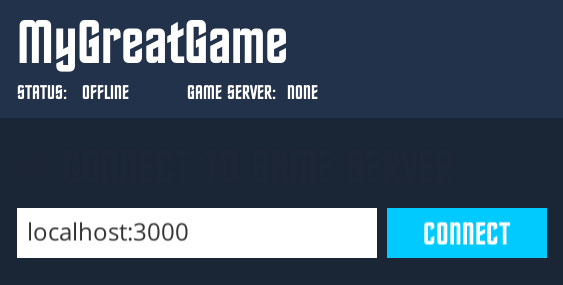
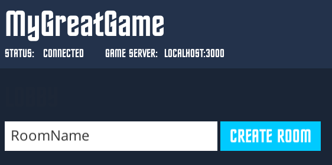
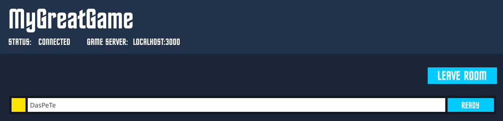

Create the game server

===

# The server part

In the terminal, go to the folder in which you cloned the server repository and type in 
```
npm install
```
this will install our dependencies.

After that, open the file `/game/MyGameServer.js` and delete everything inside and replace it with an empty template
``` javascript
var GameServer = require('./GameServer.js');

class MyGameServer extends GameServer {

    constructor(data){
        super(data);

    }

    StartGame(){
        
    }

}

module.exports = MyGameServer;
```

In the StartGame function, we need to register the events, we will get from the players. In our game, we just have one event. We can register it with the `this.AddEvent` function
``` 
    StartGame(){
        this.AddEvent({
            event: 'player-got-globe', 
            callback: this.OnPlayerGotGlobe.bind(this)
        });
    }

    OnPlayerGotGlobe(data){
        data = JSON.parse(data);
    }
```

In the OnPlayerGotGlobe function, we have to convert the json string into a json object first.

For our game, we need to store the times of the players. So we need to create an object for this in our constructor
``` javascript
    constructor(data){
        super(data);

        this.playerTimes = {};
    }
```

In the OnPlayerGotGlobe function, we check, if the player already has submitted his time, and if he did, we just return, otherwise, we store his time
``` javascript
    OnPlayerGotGlobe(data){
        data = JSON.parse(data);

        if(typeof this.playerTimes[data.playerID] === 'undefined') return;
        if(this.playerTimes[data.playerID] !== null) return;

        this.playerTimes[data.playerID] = data;
    }
```

Alright, back in our StartGame function, we need to call a new function, the StartGameRound function, which we create after.
``` javascript
    StartGame(){
        this.AddEvent({
            event: 'player-got-globe', 
            callback: this.OnPlayerGotGlobe.bind(this)
        });

        this.StartGameRound();
    }

    StartGameRound(){
        
    }
```

In the StartGameRound function, we check, if the game is running, if not, we just return. Then we get all player ids from the current game and set their player times to null. Then we wait 2 seconds and send a new globe position to the players.
``` 
    StartGameRound(){
        if(this.isRunning == false) return;

        var playerIDs = this.room.GetPlayerIDs();
        this.playerTimes = {};

        for(var i = 0; i < playerIDs.length; i++){
            this.playerTimes[playerIDs[i]] = null;
        }

        setTimeout(this.SendGlobePosition.bind(this), 5000);
    }

    SendGlobePosition(){
        
    }
```

In the SendGlobePosition function, we send a new random globe position to all players by using the `this.SendToAllPlayers`function, then we wait 5 seconds, till we check the player times.
``` javascript
    SendGlobePosition(){
        this.SendToAllPlayers({
            event: 'set-globe-position',
            data: {
                x: Math.random() * 40,
                y: Math.random() * 40
            }
        });

        setTimeout(this.CheckPlayerTimes.bind(this), 5000);
    }

    CheckPlayerTimes(){
        
    }
```

In the CheckPlayerTimes, we loop through every playerID and compare their times, the lowest time gets a player-won-round event, the others, which have times submitted get a player-lost-round event. Then we call the StartGameRound function again.
``` javascript
    CheckPlayerTimes(){
        var playerIDs = this.room.GetPlayerIDs();

        var lowestPlayerTime = 10000;
        var winnerPlayerID = null;

        for(var i = 0; i < playerIDs.length; i++){
            if(this.playerTimes[playerIDs[i]] != null){
                if(this.playerTimes[playerIDs[i]].clickTime < lowestPlayerTime){
                    winnerPlayerID = playerIDs[i];
                    lowestPlayerTime = this.playerTimes[playerIDs[i]].clickTime;
                }
            }
        }

        if(winnerPlayerID != null){
            for(var i = 0; i < playerIDs.length; i++){
                if(this.playerTimes[playerIDs[i]] != null){
                    if(playerIDs[i] == winnerPlayerID){
                        this.SendToOnePlayer({
                            event: 'player-won-round',
                            playerID: winnerPlayerID
                        });
                    }else{
                        this.SendToOnePlayer({
                            event: 'player-lost-round',
                            playerID: playerIDs[i]
                        })
                    }
                }
            }
        }

        this.StartGameRound();
    }
```

So, our complete MyGameServer.js code looks like this
``` javascript
var GameServer = require('./GameServer.js');

class MyGameServer extends GameServer {

    constructor(data){
        super(data);

        this.playerTimes = {};
    }

    StartGame(){
        this.AddEvent({
            event: 'player-got-globe', 
            callback: this.OnPlayerGotGlobe.bind(this)
        });

        this.StartGameRound();
    }

    StartGameRound(){
        if(this.isRunning == false) return;

        var playerIDs = this.room.GetPlayerIDs();
        this.playerTimes = {};

        for(var i = 0; i < playerIDs.length; i++){
            this.playerTimes[playerIDs[i]] = null;
        }

        setTimeout(this.SendGlobePosition.bind(this), 2000);
    }

    SendGlobePosition(){
        this.SendToAllPlayers({
            event: 'set-globe-position',
            data: {
                x: Math.random() * 40,
                y: Math.random() * 40
            }
        });

        setTimeout(this.CheckPlayerTimes.bind(this), 5000);
    }

    CheckPlayerTimes(){
        var playerIDs = this.room.GetPlayerIDs();

        var lowestPlayerTime = 10000;
        var winnerPlayerID = null;

        for(var i = 0; i < playerIDs.length; i++){
            if(this.playerTimes[playerIDs[i]] != null){
                if(this.playerTimes[playerIDs[i]].clickTime < lowestPlayerTime){
                    winnerPlayerID = playerIDs[i];
                    lowestPlayerTime = this.playerTimes[playerIDs[i]].clickTime;
                }
            }
        }

        if(winnerPlayerID != null){
            for(var i = 0; i < playerIDs.length; i++){
                if(this.playerTimes[playerIDs[i]] != null){
                    if(playerIDs[i] == winnerPlayerID){
                        this.SendToOnePlayer({
                            event: 'player-won-round',
                            playerID: winnerPlayerID
                        });
                    }else{
                        this.SendToOnePlayer({
                            event: 'player-lost-round',
                            playerID: playerIDs[i]
                        })
                    }
                }
            }
        }

        this.StartGameRound();
    }

    OnPlayerGotGlobe(data){
        data = JSON.parse(data);

        if(typeof this.playerTimes[data.playerID] === 'undefined') return;
        if(this.playerTimes[data.playerID] !== null) return;

        this.playerTimes[data.playerID] = data;
    }

}

module.exports = MyGameServer;
```

Now, we are ready to start our server. Head back to the terminal and type in 
```
node server.js
```

this should start the server. If you have the client running and you go to the browser at localhost:8080, you should be able to press the Connect button and to create a room and wait for other players to join the game




Have fun with this package. If you have questions or feedback, just leave me a comment.