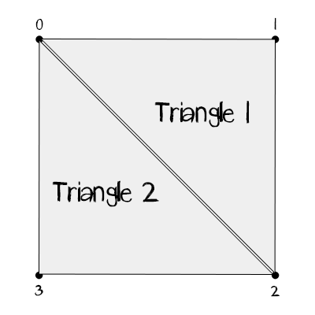

The basics of mesh creation

===

# The basics

A basic mesh consists of 
* multiple **vertex** points (called **vertices**), which represents the corner points of the desired shape
* **triangles**, which connects the vertices
* and **uv coords**, which maps the triangles to the texture coords.

!!!! Vertex points should be arranged clockwise

Let's see, what we'll have to do, if we want to draw a **rectangle** or a **square**.

At first, we need **4 vertices**

now, we need to connect these vertices with **2 triangles**

for the **first triangle**, we start with the first vertex point with the index **0** and then we go clockwise, so the next vertex point is **1** and the next point is **2**.

for the **second triangle**, we also start with the vertex point **0**, then we go clockwise to the vertex point **2** and the point **3**.

With this two triangles, we already got a visual presentation of the mesh, but there is no connection to the texture, so we need to create uv coordinates.

It's quite simple to create uv coords. If we want to use the whole texture for the **square**, we add **4 Vector2 points**, like:
* Vector2(0,1)
* Vector2(1,1)
* Vector2(1,0)
* Vector2(0,0)

!!!! uvcoords start at the bottom, so the y coord 0 is the bottom and the y coord 1 is the top

You see, that we are going from the **top left** corner of the texture, to the **top right**, then to the **bottom right** and to the **bottom left**. 

so, if we want to use the bottom half of the texture, we would create this coords:
* Vector2(0,0.5)
* Vector2(1, 0.5)
* Vector2(1, 0)
* Vector2(0, 0)

In the [next chapter](../the-code?classes=button), we'll code the mesh.

