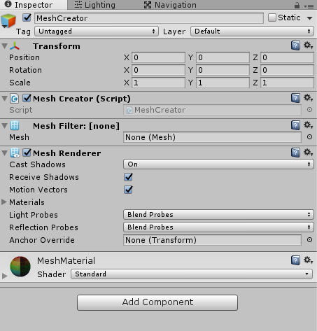

The code for the mesh creation

===

# The code

We need two C# scripts to get the mesh creation started. At first, we need an object, which stores the vertices, triangles and uv coords and gives us the generated mesh, let's call it **MeshData**. Then we need a script, in which we create meshes, we call this script **MeshCreator**.

So let's start with the **MeshData** class.

``` csharp
using UnityEngine;
using System.Collections;
using System.Collections.Generic;

public class MeshData {

}
```

We are using lists, so we need the `System.Collections.Generic` namespace.

Next, we need a Mesh object and the lists for the vertices, the triangles and the uvcoords

``` csharp
	Mesh mesh;

    List<Vector3> vertices;
    List<Vector2> uvs;
    List<int> triangles;
```

In the constructor, we just create the lists

``` csharp
	public MeshData() {
        vertices = new List<Vector3>();
        uvs = new List<Vector2>();
        triangles = new List<int>();
    }
```

Now, we need a function, which let's us draw a square, or a rectangle

``` csharp
	public void DrawQuad(Vector3 vertex0, Vector3 vertex1, Vector3 vertex2, Vector3 vertex3) {
        int vertexIndex = vertices.Count;

        vertices.Add(vertex0);
        vertices.Add(vertex1);
        vertices.Add(vertex2);
        vertices.Add(vertex3);

        triangles.Add(vertexIndex);
        triangles.Add(vertexIndex + 1);
        triangles.Add(vertexIndex + 2);

        triangles.Add(vertexIndex);
        triangles.Add(vertexIndex + 2);
        triangles.Add(vertexIndex + 3);

        uvs.Add(new Vector2(0, 1));
        uvs.Add(new Vector2(1, 1));
        uvs.Add(new Vector2(1, 0));
        uvs.Add(new Vector2(0, 0));
    }
```

What this method does:
* stores the actual vertex count in a variable
* adds four vertex points for our quad
* adds the two triangles
* adds the uv coords (in this case, we want to use the whole texture for the quad)

The last step is to create the mesh

``` csharp
	public Mesh GetMesh() {
        mesh = new Mesh();

        mesh.vertices = vertices.ToArray();
        mesh.uv = uvs.ToArray();
        mesh.triangles = triangles.ToArray();

        mesh.Optimize();
        mesh.RecalculateBounds();
        mesh.RecalculateNormals();

        return mesh;
    }
```

In this method, we
* create a new mesh object
* add the vertices
* add the uvs
* add the triangles
* we are optimizing the mesh (there could be multiple vertexpoints overlapping)
* we recalculate the bounds
* we recalculate the normals
* and we are returning the generated mesh object

so, the complete code:

``` csharp
using UnityEngine;
using System.Collections;
using System.Collections.Generic;

public class MeshData {

    Mesh mesh;

    List<Vector3> vertices;
    List<Vector2> uvs;
    List<int> triangles;

    public MeshData() {
        vertices = new List<Vector3>();
        uvs = new List<Vector2>();
        triangles = new List<int>();
    }

    public void DrawQuad(Vector3 vertex0, Vector3 vertex1, Vector3 vertex2, Vector3 vertex3) {
        int vertexIndex = vertices.Count;

        vertices.Add(vertex0);
        vertices.Add(vertex1);
        vertices.Add(vertex2);
        vertices.Add(vertex3);

        triangles.Add(vertexIndex);
        triangles.Add(vertexIndex + 1);
        triangles.Add(vertexIndex + 2);

        triangles.Add(vertexIndex);
        triangles.Add(vertexIndex + 2);
        triangles.Add(vertexIndex + 3);

        uvs.Add(new Vector2(0, 1));
        uvs.Add(new Vector2(1, 1));
        uvs.Add(new Vector2(1, 0));
        uvs.Add(new Vector2(0, 0));
    }

    public Mesh GetMesh() {
        mesh = new Mesh();

        mesh.vertices = vertices.ToArray();
        mesh.uv = uvs.ToArray();
        mesh.triangles = triangles.ToArray();

        mesh.Optimize();
        mesh.RecalculateBounds();
        mesh.RecalculateNormals();

        return mesh;
    }

}
```

With this done, we can create a new **Material** in Unity. Then we create a new **GameObject**, add a **MeshFilter** and a **MeshRenderer** component to it and drag the new Material on it. Then we create a new C# script and name it **MeshCreator**. Then we add this new script to our MeshCreator GameObject.


The MeshCreator class is quite straight forward:

``` csharp
using UnityEngine;
using System.Collections;

public class MeshCreator : MonoBehaviour {

    MeshData meshData;

    MeshFilter mFilter;

    void Start() {
        meshData = new MeshData();

        mFilter = GetComponent<MeshFilter>();

        meshData.DrawQuad(
            new Vector3(0, 1, 0),
            new Vector3(1, 1, 0),
            new Vector3(1, 0, 0),
            new Vector3(0, 0, 0)
        );

        mFilter.mesh = meshData.GetMesh();
    }

}

```

We are creating a new MeshData object, then we are getting the reference for the MeshFilter of our GameObject, then we draw a quad and give the MeshFilter the generated mesh.

If we hit play now in unity, we will see a nice little quad drawn on the screen.

I hope, you njoyed this little instruction. If you have any questions or thoughts, just leave me a comment :)
