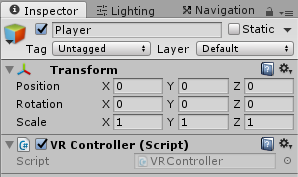

Use the cardboard without a gyro

===

# Using the Cardboard SDK without a gyroscope

I recently bought a Cardboard to play around with the possibilities of VR in Unity3D. But then i realized, that my smartphone doesn't have a gyroscope... holy crap... So, what now? Just find a way to get it working without it :) If you have a smartphone with a compass and a accelerometer module, then this is for you.

Just create a new project and download the [Google VR unitypackage](https://github.com/googlevr/gvr-unity-sdk/blob/master/GoogleVRForUnity.unitypackage?target=_blank) from their GitHub page. Just click on the **Download** button on the right side, and choose **Open with unity editor** in the download options. Then just click on import.


Then create a new empty GameObject, name it **Player** and drag the **GVRMain** Prefab from the **Legacy** folder onto it.


Select the Head object from the GVRMain object and uncheck **Track Rotation** and **Track Position**.


Next, create a new C# script and name it **VRController** and drag it onto the **Player** GameObject.



We need to start the compass and the location services in the **Start** function
``` csharp
using UnityEngine;
using System.Collections;

public class VRController : MonoBehaviour {
    
    void Start() {
        Input.compass.enabled = true;
        Input.location.Start();
    }

}
```

We also need a **Vector3** to store the **accelerometer values** and a **float** to store the current **compass heading**.
``` csharp
    Vector3 acceleration = Vector3.zero;
    float heading = 0f;
```

Since the compass and the accelerator are quite choppy, we need to **smooth the calculation**, and therefore we need a **rotationspeed float**.
``` csharp
    public float rotationSpeed = 8f;
```

So, our script till now:
``` csharp
using UnityEngine;
using System.Collections;

public class VRController : MonoBehaviour {

    public float rotationSpeed = 8f;

    Vector3 acceleration = Vector3.zero;
    float heading = 0f;

    void Start() {
        Input.compass.enabled = true;
        Input.location.Start();
    }

}
```

Next step is our **Update** function. In there, we are setting the **current acceleration** and the **current compass heading** and then we set the **rotation of our Player GameObject** to the calculated rotation
``` csharp
    void Update() {
        SetAcceleration();
        SetCompassHeading();

        transform.eulerAngles = SetRotation();
    }

    void SetAcceleration() {

    }

    void SetCompassHeading() {

    }

    Vector3 SetRotation() {

    }
```

In the **SetAcceleration** function, we are getting the current **acceleration** from the **Input** and **Lerp** the previously stored acceleration to the new value
``` csharp
    void SetAcceleration() {
        Vector3 _acceleration = Input.acceleration;

        acceleration.x = Mathf.Lerp(acceleration.x, _acceleration.x, Time.deltaTime * rotationSpeed);
        acceleration.y = Mathf.Lerp(acceleration.y, _acceleration.y, Time.deltaTime * rotationSpeed);
        acceleration.z = Mathf.Lerp(acceleration.z, _acceleration.z, Time.deltaTime * rotationSpeed);
    }
```

In the **SetCompassHeading** function, we do the same, but just for the **float** value of the compass **heading**, and we are using **LerpAngle** here, because if we used Lerp, we would get wrong angles, if the value if going greater then 180 degrees.
``` csharp
    void SetCompassHeading() {
        float _heading = Input.compass.trueHeading;

        heading = Mathf.LerpAngle(heading, _heading, Time.deltaTime * rotationSpeed);
    }
```

In the **SetRotation** function, we are calculating the x and z **angles** and return the **Vector3** object for the transform's **eulerAngles** property.
``` csharp
    Vector3 SetRotation() {
        float _rotationX = Mathf.Atan2(acceleration.z, acceleration.y);
        float _magnitudeYZ = Mathf.Sqrt(Mathf.Pow(acceleration.y, 2) + Mathf.Pow(acceleration.z, 2));
        float _rotationZ = Mathf.Atan2(acceleration.x, _magnitudeYZ);

        float _angleX = _rotationX * (180f / Mathf.PI) + 90f;
        float _angleZ = -_rotationZ * (180f / Mathf.PI);

        return new Vector3(_angleX, -(_angleZ - heading), 0f);
    }
```

So, our complete script should look like this
``` csharp
using UnityEngine;
using System.Collections;

public class VRController : MonoBehaviour {

    public float rotationSpeed = 8f;

    Vector3 acceleration = Vector3.zero;
    float heading = 0f;

    void Start() {
        Input.compass.enabled = true;
        Input.location.Start();
    }

    void Update() {
        SetAcceleration();
        SetCompassHeading();

        transform.eulerAngles = SetRotation();
    }

    void SetAcceleration() {
        Vector3 _acceleration = Input.acceleration;

        acceleration.x = Mathf.Lerp(acceleration.x, _acceleration.x, Time.deltaTime * rotationSpeed);
        acceleration.y = Mathf.Lerp(acceleration.y, _acceleration.y, Time.deltaTime * rotationSpeed);
        acceleration.z = Mathf.Lerp(acceleration.z, _acceleration.z, Time.deltaTime * rotationSpeed);
    }

    void SetCompassHeading() {
        float _heading = Input.compass.trueHeading;

        heading = Mathf.LerpAngle(heading, _heading, Time.deltaTime * rotationSpeed);
    }

    Vector3 SetRotation() {
        float _rotationX = Mathf.Atan2(acceleration.z, acceleration.y);
        float _magnitudeYZ = Mathf.Sqrt(Mathf.Pow(acceleration.y, 2) + Mathf.Pow(acceleration.z, 2));
        float _rotationZ = Mathf.Atan2(acceleration.x, _magnitudeYZ);

        float _angleX = _rotationX * (180f / Mathf.PI) + 90f;
        float _angleZ = -_rotationZ * (180f / Mathf.PI);

        return new Vector3(_angleX, -(_angleZ - heading), 0f);
    }

}
```

With this done, we are able to control the cardboard without a gyroscope, just with a compass and an accelerometer module. It's not as exact as a gyroscope, but at least, it's working. You can optimize this little module with a detector, if the device has a gyroscope, and if yes, you can disable the manual calculation and enable the track position and rotation booleans from the GVRHead again.