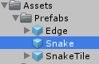

Let's create a snake game in 15 minutes

===

# Snake in 15 minutes

Today, we'll build a basic Snake game, which we can extend later on
[plugin:youtube](https://www.youtube.com/watch?v=EsY3Ort-ibk)

Create a new Unity3D Project and create following folder structure


Save the current scene in our **Scenes** folder.


Set the **Main Camera** object to the position Vector3(0,0,-1), set the **Clear Flags** to **Solid Color** and choose a lighter green. The **Projection** should be **Orthographic** and the **Size** should be **30**.


Next, we need our textures. We need a **SnakeTile** texture, an **Edge** texture and a **Goodie** texture. The SnakeTile and the Edge texture is just a white square width 128x128 pixels dimension. You can create one by yourself, or you can [download a PNG here](Texture.png?target=_blank). The Goodie texture has also 128x128 pixels, but you can choose yourself, how it should look like, i chose a star texture, your can [download the PNG here](Goodie.png?target=_blank).

Save this two images to our **Textures** folder and select them both.


Set the **Teture Type** to **Sprite (2D and UI)**, the **Pixels Per Unit** to **128**, the **Filter Mode** to **Point (no filter)** and override the format settings, set the **Max Size** to **128** and the **Format** to **Truecolor**


Now, let's create our Prefabs. We start with the **Edge** Prefab, create a new empty GameObject in our scene and drag the **Texture** sprite onto it. Rename the **Texture** to **Graphics**


Set the color in the SpriteRenderer to black


Now, drag the Edge object to our Prefabs folder.


Let's do the same thing with our **SnakeTile** prefab. Create a new empty GameObject, name it SnakeTile, drag the Texture texture onto it, rename it to Graphics, and set the SpriteRenderer color to black. Then drag the **SnakeTile** GameObject onto our Prefabs folder.


You can now delete the two GameObjects from the scene.

Next, we start with our **Snake** class. Create a new C# script in our Scripts folder and name it Snake.


We are using a List, so we need the System.Collections.Generic namespace.
``` csharp
using UnityEngine;
using System.Collections;
using System.Collections.Generic;

public class Snake : MonoBehaviour {


}
```

We need a reference to the SnakeTile prefab
``` csharp
    public GameObject snakeTilePrefab;
```

We need to know, how big the gamefield is
``` csharp
    int fieldWidth;
    int fieldHeight;
```

If we want to have a multiplayer game, we need to know our playerID
``` csharp
    int playerID;
```

We need to know, how long our snake currently is
``` csharp
    int length;
```

We need to store the bounds of our game field
``` csharp
    int minX;
    int minY;
    int maxX;
    int maxY;
```

We need to know, at what position we are and in what direction we are going
``` csharp
    Vector3 position = Vector3.zero;
    Vector3 direction = Vector3.up;
```

We need to store all the SnakeTiles we are currently have in our snake.
``` csharp
    List<Transform> snakeTiles;
```

And we need to set a speed, a tick time.
``` csharp
    public float tickTime;
```

Alright, let's start with our **StartSnake** function. It get's the length of our snake, the start position, the start direction and the current playerID, then we initialize our snakeTiles list and then we are creating every single SnakeTile, till it is as long as the length defines.
``` csharp
    public void StartSnake(int length, Vector3 position, Vector3 direction, int playerID) {
        this.length = length;
        this.position = position;
        this.direction = direction;
        this.playerID = playerID;

        snakeTiles = new List<Transform>();

        for(int i = 0; i < length; i++) {
            GameObject snakeTile = Instantiate(snakeTilePrefab, position, Quaternion.identity) as GameObject;
            snakeTiles.Add(snakeTile.transform);
        }
    }
```

In our Update function, we just need to get the player input and set the current direction
``` csharp
    void Update() {
        SetDirection();
    }

    void SetDirection() {

    }
```

For the player input, we need a new class, so create a new C# script in our Scripts folder and name it **PlayerInput**


It's just a simple class, which has 4 booleans, one for every direction
``` csharp
using UnityEngine;
using System.Collections;

public class PlayerInput {

    public bool left;
    public bool right;
    public bool up;
    public bool down;

}
```

Back in our Snake class, we can now fill our SetDirection function, we initialize a new PlayerInput instance, and then we are getting the player input, depending, which playerID the snake has, the first player will play with the WASD keys and the second player plays with the arrow keys. Adn then we are setting the current direction based on the player input.
``` csharp
    void SetDirection() {
        PlayerInput input = GetPlayerInput();

        if(input.right) {
            direction = Vector3.right;
        } else if(input.left) {
            direction = Vector3.left;
        } else if(input.up) {
            direction = Vector3.up;
        } else if(input.down) {
            direction = Vector3.down;
        }
    }

    PlayerInput GetPlayerInput() {
        PlayerInput input = new PlayerInput();

        if(playerID == 0) {
            input.left = Input.GetKey(KeyCode.A);
            input.right = Input.GetKey(KeyCode.D);
            input.up = Input.GetKey(KeyCode.W);
            input.down = Input.GetKey(KeyCode.S);
        }

        if(playerID == 1) {
            input.left = Input.GetKey(KeyCode.LeftArrow);
            input.right = Input.GetKey(KeyCode.RightArrow);
            input.up = Input.GetKey(KeyCode.UpArrow);
            input.down = Input.GetKey(KeyCode.DownArrow);
        }
        
        return input;
    }
```

Now, we need our snake movement, back in our StartSnake function, we need to add one more line.
``` csharp
    Invoke("Tick", tickTime);
```

This starts the function **Tick** in the given tickTime. Now we need to create this function, in every tick, we are adding the current direction to our position, then we are checking, if we are out of the game field, and if we are, we call a new function, GameOver and return.
``` csharp
    void Tick() {
        position += direction;

        if(position.x < minX || position.y < minY || position.x >= maxX || position.y >= maxY) {
            GameOver();
            return;
        }
    }

    void GameOver() {

    }
```

Next, we need a function, which checks, if we are colliding with ourself or with other snakes around. The IsColliding function just gets every snake which is instantiated in the scene, and checks, if there is a SnakeTile at the current position.
``` csharp
    public bool IsColliding(Vector3 position) {
        Snake[] snakes = GameObject.FindObjectsOfType<Snake>();

        bool collided = false;

        for(int i = 0; i < snakes.Length; i++) {
            if(snakes[i].snakeTiles.Find(_s => _s.position == position) != null) {
                collided = true;

                break;
            }
        }
        
        return collided;
    }
```

Back in our Tick function, we need to call the IsColliding function
``` csharp
    if(IsColliding(position)) {
        GameOver();
        return;
    }
```

If we are still inside the Tick function, we now need to get the first item of our SnakeTiles list, set the position to the last position, remove the item from ths first position and add this tile to the last position
``` csharp
    Transform tileTransform = snakeTiles[0];
    snakeTiles.RemoveAt(0);
    tileTransform.position = position;

    snakeTiles.Add(tileTransform);
```

At the end of the Tick function, we need to call itself again, to have the snake moving
``` csharp
    Invoke("Tick", tickTime);
```

Okay, now we can actually start with our GameManager class, so create a new C# script in our Scripts folder and name it GameManager.


Then create a new empty GameObject and name it GameManager and drag the GameManager script onto it.


The GameManager class is just a simple MonoBehaviour
``` csharp
using UnityEngine;
using System.Collections;
using System.Collections.Generic;

public class GameManager : MonoBehaviour {
    


}
```

At first, we need to have a static instance property, so we can get access to this instance in any other class
``` csharp
    public static GameManager instance;
```

Then we need to set the game field's dimension
``` csharp
    public int fieldWidth;
    public int fieldHeight;
```

Next, we need the references to our prefabs, we will create the SnakePrefab and the GoodiePrefabs later.
``` csharp
    public Snake snakePrefab;
    public GameObject edgePrefab;
    public GameObject goodiePrefab;
```

Then we need the references to our instantiated snakes
``` csharp
    Snake snake1;
    Snake snake2;
```

We also need a list of our instantiated goodies
``` csharp
    List<GameObject> goodies;
```

In the Awake function, we just set the instance.
``` csharp
    void Awake() {
        instance = this;
    }
```
In our Start function, we create our game field edges and the snakes, then we are initializing our goodies and then we are starting the snakes.
``` csharp
    void Start() {
        CreateEdges();
        CreateSnakes();

        InitGoodies();

        StartSnakes();
    }

    void CreateEdges() {

    }

    void CreateSnakes() {

    }

    void InitGoodies() {

    }

    void StartSnakes() {

    }
```

The CreateEdges function instantiates the edge prefab for every direction
``` csharp
    void CreateEdges() {
        GameObject edgeTop = Instantiate(edgePrefab, Vector3.up * ((float)fieldHeight / 2f), Quaternion.identity) as GameObject;
        GameObject edgeBottom = Instantiate(edgePrefab, Vector3.down * ((float)fieldHeight / 2f), Quaternion.identity) as GameObject;
        GameObject edgeLeft = Instantiate(edgePrefab, Vector3.left * ((float)fieldWidth / 2f), Quaternion.identity) as GameObject;
        GameObject edgeRight = Instantiate(edgePrefab, Vector3.right * ((float)fieldWidth / 2f), Quaternion.identity) as GameObject;

        edgeTop.transform.localScale = new Vector3(fieldWidth + 1, 1, 1);
        edgeBottom.transform.localScale = new Vector3(fieldWidth + 1, 1, 1);
        edgeLeft.transform.localScale = new Vector3(1, fieldHeight + 1, 1);
        edgeRight.transform.localScale = new Vector3(1, fieldHeight + 1, 1);
    }
```

the CreateSnakes function instantiates our two snakes
``` csharp
    void CreateSnakes() {
        snake1 = Instantiate(snakePrefab) as Snake;
        snake2 = Instantiate(snakePrefab) as Snake;
    }
```

The StartSnakes function calls the StartSnake function from our Snake class.
``` csharp
    void StartSnakes() {
        snake1.StartSnake(3, Vector3.zero + Vector3.left, Vector3.up, 0);
        snake2.StartSnake(3, Vector3.zero + Vector3.right, Vector3.down, 1);
    }
```

Back in our **Snake** class, we need to add a Start function, in which we are setting the gamefield bounds
``` csharp
    void Start() {
        fieldWidth = GameManager.instance.fieldWidth;
        fieldHeight = GameManager.instance.fieldHeight;

        maxX = fieldWidth / 2;
        minX = -maxX + 1;
        maxY = fieldHeight / 2;
        minY = -maxY + 1;
    }
```

Turn back to our **GameManager** class. We can now initialize our goodies.
``` csharp
    void InitGoodies() {
        goodies = new List<GameObject>();

        StartCoroutine(GoodieSpawner());
    }
```

We need a new coroutine **GoodieSpawner**, it's an endless loop which instantiates a new goodie at a random position every 3 seconds, if there are less than 6 goodies already in the scene.
``` csharp
    IEnumerator GoodieSpawner() {
        while(true) {
            yield return new WaitForSeconds(3f);

            if(goodies.Count >= 5) {
                continue;
            }

            int x = Random.Range(-(fieldWidth - 2) / 2, (fieldWidth - 2) / 2);
            int y = Random.Range(-(fieldHeight - 2) / 2, (fieldHeight - 2) / 2);

            GameObject goodie = Instantiate(goodiePrefab, new Vector3(x, y, 0), Quaternion.identity) as GameObject;
            goodies.Add(goodie);
        }
    }
```

Now we also need a function, which let's us remove a goodie
``` csharp
    public void RemoveGoodie(GameObject goodie) {
        goodies.Remove(goodie);
        GameObject.Destroy(goodie);
    }
```

Back in our **Snake** class, we need to add a collision check in our Tick function
``` csharp
     Collider2D col = Physics2D.OverlapCircle(new Vector2(position.x, position.y), 0.3f);

    if(col != null) {
        AddLength();
        GameManager.instance.RemoveGoodie(col.gameObject);
    }
```

The AddLength function just adds one more SnakeTile to the list
``` csharp
    void AddLength() {
        length++;

        GameObject tile = Instantiate(snakeTilePrefab, position, Quaternion.identity) as GameObject;
        snakeTiles.Add(tile.transform);
    }
```

We can now create our Snake prefab, so create a new empty GameObject in our Scene and name it **Snake**, then drop the Snake class onto it


Then drop the SnakeTile prefab to the SnakeTilePrefab field and set the tickTime to something like 0.15f


Then drag the Snake GameObject to our Prefabs folder and delete it from the scene


Now, we can create our last prefab, the goodie Prefab. Create a new empty GameObject and name it Goodie. Then drag the Goodie texture onto it and name it Graphics, set the SpriteRenderer color to black.


At the Goodie GameObject add a new CircleCollider2D component and set the radius to 0.4f


Then drag the Goodie GameObject to our Prefabs folder and delete it from the scene


Select the GameManager GameObject in the scene and drag every prefab to the corrent field and then set the game field width to 90 and the height to 50.


If you run the game now, you should be able to play snake :)


The complete code for our Snake class looks like this
``` csharp
using UnityEngine;
using System.Collections;
using System.Collections.Generic;

public class Snake : MonoBehaviour {

    public GameObject snakeTilePrefab;
    public float tickTime;

    int fieldWidth;
    int fieldHeight;

    int playerID;

    int length;

    int minX;
    int minY;
    int maxX;
    int maxY;

    Vector3 position = Vector3.zero;
    Vector3 direction = Vector3.up;

    List<Transform> snakeTiles;

    void Start() {
        fieldWidth = GameManager.instance.fieldWidth;
        fieldHeight = GameManager.instance.fieldHeight;

        maxX = fieldWidth / 2;
        minX = -maxX + 1;
        maxY = fieldHeight / 2;
        minY = -maxY + 1;
    }

    public void StartSnake(int length, Vector3 position, Vector3 direction, int playerID) {
        this.length = length;
        this.position = position;
        this.direction = direction;
        this.playerID = playerID;

        snakeTiles = new List<Transform>();

        for(int i = 0; i < length; i++) {
            GameObject snakeTile = Instantiate(snakeTilePrefab, position, Quaternion.identity) as GameObject;
            snakeTiles.Add(snakeTile.transform);
        }

        Invoke("Tick", tickTime);
    }

    void Update() {
        SetDirection();
    }

    void SetDirection() {
        PlayerInput input = GetPlayerInput();

        if(input.right) {
            direction = Vector3.right;
        } else if(input.left) {
            direction = Vector3.left;
        } else if(input.up) {
            direction = Vector3.up;
        } else if(input.down) {
            direction = Vector3.down;
        }
    }

    PlayerInput GetPlayerInput() {
        PlayerInput input = new PlayerInput();

        if(playerID == 0) {
            input.left = Input.GetKey(KeyCode.A);
            input.right = Input.GetKey(KeyCode.D);
            input.up = Input.GetKey(KeyCode.W);
            input.down = Input.GetKey(KeyCode.S);
        }

        if(playerID == 1) {
            input.left = Input.GetKey(KeyCode.LeftArrow);
            input.right = Input.GetKey(KeyCode.RightArrow);
            input.up = Input.GetKey(KeyCode.UpArrow);
            input.down = Input.GetKey(KeyCode.DownArrow);
        }

        return input;
    }

    void Tick() {
        position += direction;

        if(position.x < minX || position.y < minY || position.x >= maxX || position.y >= maxY) {
            GameOver();
            return;
        }

        if(IsColliding(position)) {
            GameOver();
            return;
        }

        Transform tileTransform = snakeTiles[0];
        snakeTiles.RemoveAt(0);
        tileTransform.position = position;

        snakeTiles.Add(tileTransform);

        Collider2D col = Physics2D.OverlapCircle(new Vector2(position.x, position.y), 0.3f);

        if(col != null) {
            AddLength();
            GameManager.instance.RemoveGoodie(col.gameObject);
        }

        Invoke("Tick", tickTime);
    }

    void GameOver() {

    }

    void AddLength() {
        length++;

        GameObject tile = Instantiate(snakeTilePrefab, position, Quaternion.identity) as GameObject;
        snakeTiles.Add(tile.transform);
    }

    public bool IsColliding(Vector3 position) {
        Snake[] snakes = GameObject.FindObjectsOfType<Snake>();

        bool collided = false;

        for(int i = 0; i < snakes.Length; i++) {
            if(snakes[i].snakeTiles.Find(_s => _s.position == position) != null) {
                collided = true;

                break;
            }
        }

        return collided;
    }
}
```

The complete code for our GameManager class looks like this
``` csharp
using UnityEngine;
using System.Collections;
using System.Collections.Generic;

public class GameManager : MonoBehaviour {

    public static GameManager instance;

    public int fieldWidth;
    public int fieldHeight;

    public Snake snakePrefab;
    public GameObject edgePrefab;
    public GameObject goodiePrefab;

    Snake snake1;
    Snake snake2;

    List<GameObject> goodies;

    void Awake() {
        instance = this;
    }

    void Start() {
        CreateEdges();
        CreateSnakes();

        InitGoodies();

        StartSnakes();
    }

    void CreateEdges() {
        GameObject edgeTop = Instantiate(edgePrefab, Vector3.up * ((float)fieldHeight / 2f), Quaternion.identity) as GameObject;
        GameObject edgeBottom = Instantiate(edgePrefab, Vector3.down * ((float)fieldHeight / 2f), Quaternion.identity) as GameObject;
        GameObject edgeLeft = Instantiate(edgePrefab, Vector3.left * ((float)fieldWidth / 2f), Quaternion.identity) as GameObject;
        GameObject edgeRight = Instantiate(edgePrefab, Vector3.right * ((float)fieldWidth / 2f), Quaternion.identity) as GameObject;

        edgeTop.transform.localScale = new Vector3(fieldWidth + 1, 1, 1);
        edgeBottom.transform.localScale = new Vector3(fieldWidth + 1, 1, 1);
        edgeLeft.transform.localScale = new Vector3(1, fieldHeight + 1, 1);
        edgeRight.transform.localScale = new Vector3(1, fieldHeight + 1, 1);
    }

    void CreateSnakes() {
        snake1 = Instantiate(snakePrefab) as Snake;
        snake2 = Instantiate(snakePrefab) as Snake;
    }

    void InitGoodies() {
        goodies = new List<GameObject>();

        StartCoroutine(GoodieSpawner());
    }

    void StartSnakes() {
        snake1.StartSnake(3, Vector3.zero + Vector3.left, Vector3.up, 0);
        snake2.StartSnake(3, Vector3.zero + Vector3.right, Vector3.down, 1);
    }

    IEnumerator GoodieSpawner() {
        while(true) {
            yield return new WaitForSeconds(3f);

            if(goodies.Count >= 5) {
                continue;
            }

            int x = Random.Range(-(fieldWidth - 2) / 2, (fieldWidth - 2) / 2);
            int y = Random.Range(-(fieldHeight - 2) / 2, (fieldHeight - 2) / 2);

            GameObject goodie = Instantiate(goodiePrefab, new Vector3(x, y, 0), Quaternion.identity) as GameObject;
            goodies.Add(goodie);
        }
    }

    public void RemoveGoodie(GameObject goodie) {
        goodies.Remove(goodie);
        GameObject.Destroy(goodie);
    }

}
```

And the complete code for our PlayerInput class looks like this
``` csharp
using UnityEngine;
using System.Collections;

public class PlayerInput {

    public bool left;
    public bool right;
    public bool up;
    public bool down;

}
```