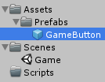
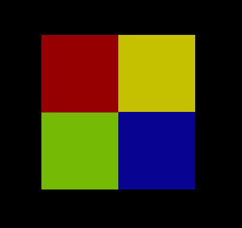

Create a simon says game in 15 minutes

===

# Simon Says in 15 minutes

Today, we'll build a basic Simon Says game, which we can extend later on
[plugin:youtube](https://www.youtube.com/watch?v=i8t6nexGZZw)

Create a new Unity3D project and create the following folder structure


Save the current scene in out **Scenes** folder.


Select the **Main Camera** GameObject in the scene and set the **Clear Flags** setting to **Solid Color** and set the background to a color, which fits your needs. I chose black.


Create a new **UI Panel** in our scene.


This will create a **Canvas** object and a **Panel**, rename the **Panel** to **GameFieldPanel**


In the **GameFieldPanel** create a new UIButton


Remove the **Text** GameObject from the button and rename the button to **GameButton**


Set the size of the GameButton to 128x128 pixels, set the **Source Image** to **None** and set the **Transition** of the button to **None**


Drag the GameButton GameObject to our Prefabs folder and delete it from the scene


Create a new C# script and name it **ButtonSetting**


The **ButtonSetting** class just holds two color states, the normal color and the highlight color, and since we want to have multiple instances, which we want to edit in the editor, we make it serializable.
``` csharp
using UnityEngine;
using System;
using System.Collections;

[Serializable]
public class ButtonSetting {

    public Color normalColor;
    public Color highlightColor;

}
```
Next, we need a new empty GameObject in the scene with the name **GameManager**


We also need a new C# script called **GameManager**, which we drag on the GameManager GameObject.


The GameManager class is a simple MonoBehaviour, and since we are using lists, we need the System.Collections.Generic namespace, and we are using the Unity UI, so we also need the UnityEngine.UI namespace.
``` csharp
using UnityEngine;
using UnityEngine.UI;
using System.Collections;
using System.Collections.Generic;

public class GameManager : MonoBehaviour {
    


}
```

First, we need a reference to our GameButton prefab
``` csharp
    public GameObject gameButtonPrefab;
```

Then, we need a list of our button settings (each button has other colors)
``` csharp
    public List<ButtonSetting> buttonSettings;
```

We also need a reference to the GameFieldPanel, so we can add the GameButtons to it.
``` csharp
    public Transform gameFieldPanelTransform;
```
Next, we need a list for our instantiated GameButtons
``` csharp
    List<GameObject> gameButtons;
```


We need an integer to set the current bleep count, which defaults to 3
``` csharp
    int bleepCount = 3;
```

Then we need two lists, one for the generated bleeps and one for the player's bleeps
``` csharp
    List<int> bleeps;
    List<int> playerBleeps;
```

Next, we need an instance of a random generator
``` csharp
    System.Random rg;
```

We also need a bool, which disables or enables the user input, since we don't want the player to click buttons while simon says something ;) and we need a bool for the game over state
``` csharp
    bool inputEnabled = false;
    bool gameOver = false;
```

In the Start function, we initialize our gameButtons list and create our GameButtons, in my case, i created four buttons, two in a row.
``` csharp
    void Start() {
        gameButtons = new List<GameObject>();

        CreateGameButton(0, new Vector3(-64, 64));
        CreateGameButton(1, new Vector3(64, 64));
        CreateGameButton(2, new Vector3(-64, -64));
        CreateGameButton(3, new Vector3(64, -64));
    }
```

The CreateGameButton function instantiates the prefab, then it sets the transform parent to the GameFieldPanel, sets the position, the color depending on the index, and adds a click listener.
``` csharp
    void CreateGameButton(int index, Vector3 position) {
        GameObject gameButton = Instantiate(gameButtonPrefab, Vector3.zero, Quaternion.identity) as GameObject;

        gameButton.transform.SetParent(gameFieldPanelTransform);
        gameButton.transform.localPosition = position;

        gameButton.GetComponent<Image>().color = buttonSettings[index].normalColor;
        gameButton.GetComponent<Button>().onClick.AddListener(() => {
            // player has clicked the button
        });

        gameButtons.Add(gameButton);
    }
```

Back in Unity, we can now set the GameManager's properties.


If you run the game now, you should see something like this


Next, we need some audio bleeps :) We'll use the **LeanTween** system for this, so go to the **Asset Store** and search for LeanTween


Click on **Download** (or **Import** if you already have it)


On the selection dialog just click on import


LeanTween has a nice procedural audio generation on board, which we are using. So, back in our GameManager class, we create a new function **PlayAudio**. In there, we set the length of our new audio and the frequency of our Sine waveform. Then we create the waveform itself and the audioclip of it. and then we play the audio clip.
``` csharp
    void PlayAudio(int index) {
        float length = 0.5f;
        float frequency = 0.001f * ((float)index + 1f);

        AnimationCurve volumeCurve = new AnimationCurve(new Keyframe(0f, 1f, 0f, -1f), new Keyframe(length, 0f, -1f, 0f));
        AnimationCurve frequencyCurve = new AnimationCurve(new Keyframe(0f, frequency, 0f, 0f), new Keyframe(length, frequency, 0f, 0f));

        LeanAudioOptions audioOptions = LeanAudio.options();
        audioOptions.setWaveSine();
        audioOptions.setFrequency(44100);

        AudioClip audioClip = LeanAudio.createAudio(volumeCurve, frequencyCurve, audioOptions);

        LeanAudio.play(audioClip, 0.5f);
    }
```

Now, we can create our **OnGameButtonClick** function for the player buttons.
``` csharp
    void OnGameButtonClick(int index) {
        if(!inputEnabled) {
            return;
        }

        PlayAudio(index);
    }
```

We need to call this function in our click listener on the button in the **CreateGameButton** function
``` csharp
    gameButton.GetComponent<Button>().onClick.AddListener(() => {
        OnGameButtonClick(index);
    });
```

Alright, now we can actually start to create the game itself. We create a new Coroutine **SimonSays** which we start in the Start function after we create the GameButtons. At first, we set the input enabled to false and create a new random generator.
``` csharp
    void Start() {
        gameButtons = new List<GameObject>();

        CreateGameButton(0, new Vector3(-64, 64));
        CreateGameButton(1, new Vector3(64, 64));
        CreateGameButton(2, new Vector3(-64, -64));
        CreateGameButton(3, new Vector3(64, -64));

        StartCoroutine(SimonSays());
    }

    IEnumerator SimonSays() {
        inputEnabled = false;

        rg = new System.Random("hakunamatata".GetHashCode());

        yield return null;
    }
```

Then we set the bleeps, which simon says :) in the **SetBleeps** function, we reset the generated bleeps and the player bleeps, then we generate new random bleeps and then we increase the bleep count for the next round.
``` csharp
    IEnumerator SimonSays() {
        inputEnabled = false;

        rg = new System.Random("hakunamatata".GetHashCode());

        SetBleeps();

        yield return null;
    }

    void SetBleeps() {
        bleeps = new List<int>();
        playerBleeps = new List<int>();

        for(int i = 0; i < bleepCount; i++) {
            bleeps.Add(rg.Next(0, gameButtons.Count));
        }

        bleepCount++;
    }
```

Next, we  wait a second and then we play every bleep and we also tween the button colors
``` csharp
    IEnumerator SimonSays() {
        inputEnabled = false;

        rg = new System.Random("hakunamatata".GetHashCode());

        SetBleeps();

        yield return new WaitForSeconds(1f);

        for(int i = 0; i < bleeps.Count; i++) {
            Bleep(bleeps[i]);

            yield return new WaitForSeconds(0.6f);
        }

        yield return null;
    }

    void Bleep(int index) {
        LeanTween.value(gameButtons[index], buttonSettings[index].normalColor, buttonSettings[index].highlightColor, 0.25f).setOnUpdate((Color color) => {
            gameButtons[index].GetComponent<Image>().color = color;
        });

        LeanTween.value(gameButtons[index], buttonSettings[index].highlightColor, buttonSettings[index].normalColor, 0.25f)
            .setDelay(0.5f)
            .setOnUpdate((Color color) => {
                gameButtons[index].GetComponent<Image>().color = color;
            });

        PlayAudio(index);
    }
```

After we played every bleep, we set the input back to enabled
``` csharp
    IEnumerator SimonSays() {
        inputEnabled = false;

        rg = new System.Random("hakunamatata".GetHashCode());

        SetBleeps();

        for(int i = 0; i < bleeps.Count; i++) {
            Bleep(bleeps[i]);

            yield return new WaitForSeconds(0.6f);
        }

        inputEnabled = true;

        yield return null;
    }
```

At last, we need to edit the **OnGameButtonClick** function a little bit. On every click, we add the current index to the player bleeps list, and check if it's the correct bleep, if it's not, we are game over. If we have clicked all correctly, we just restart the SimonSays Coroutine for the next round.
``` csharp
    void OnGameButtonClick(int index) {
        if(!inputEnabled) {
            return;
        }

        Bleep(index);

        playerBleeps.Add(index);

        if(bleeps[playerBleeps.Count - 1] != index) {
            GameOver();
            return;
        }

        if(bleeps.Count == playerBleeps.Count) {
            StartCoroutine(SimonSays());
        }
    }

    void GameOver() {
        gameOver = true;
        inputEnabled = false;
    }
```

If you run the game now, you should be able to play Simon Says :)

The complete code for our ButtonSetting class looks like this
``` csharp
using UnityEngine;
using System;
using System.Collections;

[Serializable]
public class ButtonSetting {

    public Color normalColor;
    public Color highlightColor;

}

```

The complete code for our GameManager class looks like this
``` csharp
using UnityEngine;
using UnityEngine.UI;
using System.Collections;
using System.Collections.Generic;

public class GameManager : MonoBehaviour {

    public GameObject gameButtonPrefab;

    public List<ButtonSetting> buttonSettings;

    public Transform gameFieldPanelTransform;

    List<GameObject> gameButtons;

    int bleepCount = 3;

    List<int> bleeps;
    List<int> playerBleeps;

    System.Random rg;

    bool inputEnabled = false;
    bool gameOver = false;

    void Start() {
        gameButtons = new List<GameObject>();

        CreateGameButton(0, new Vector3(-64, 64));
        CreateGameButton(1, new Vector3(64, 64));
        CreateGameButton(2, new Vector3(-64, -64));
        CreateGameButton(3, new Vector3(64, -64));

        StartCoroutine(SimonSays());
    }

    void CreateGameButton(int index, Vector3 position) {
        GameObject gameButton = Instantiate(gameButtonPrefab, Vector3.zero, Quaternion.identity) as GameObject;

        gameButton.transform.SetParent(gameFieldPanelTransform);
        gameButton.transform.localPosition = position;

        gameButton.GetComponent<Image>().color = buttonSettings[index].normalColor;
        gameButton.GetComponent<Button>().onClick.AddListener(() => {
            OnGameButtonClick(index);
        });

        gameButtons.Add(gameButton);
    }

    void PlayAudio(int index) {
        float length = 0.5f;
        float frequency = 0.001f * ((float)index + 1f);

        AnimationCurve volumeCurve = new AnimationCurve(new Keyframe(0f, 1f, 0f, -1f), new Keyframe(length, 0f, -1f, 0f));
        AnimationCurve frequencyCurve = new AnimationCurve(new Keyframe(0f, frequency, 0f, 0f), new Keyframe(length, frequency, 0f, 0f));

        LeanAudioOptions audioOptions = LeanAudio.options();
        audioOptions.setWaveSine();
        audioOptions.setFrequency(44100);

        AudioClip audioClip = LeanAudio.createAudio(volumeCurve, frequencyCurve, audioOptions);

        LeanAudio.play(audioClip, 0.5f);
    }

    void OnGameButtonClick(int index) {
        if(!inputEnabled) {
            return;
        }

        Bleep(index);

        playerBleeps.Add(index);

        if(bleeps[playerBleeps.Count - 1] != index) {
            GameOver();
            return;
        }

        if(bleeps.Count == playerBleeps.Count) {
            StartCoroutine(SimonSays());
        }
    }

    void GameOver() {
        gameOver = true;
        inputEnabled = false;
    }

    IEnumerator SimonSays() {
        inputEnabled = false;

        rg = new System.Random("hakunamatata".GetHashCode());

        SetBleeps();

        yield return new WaitForSeconds(1f);

        for(int i = 0; i < bleeps.Count; i++) {
            Bleep(bleeps[i]);

            yield return new WaitForSeconds(0.6f);
        }

        inputEnabled = true;

        yield return null;
    }

    void Bleep(int index) {
        LeanTween.value(gameButtons[index], buttonSettings[index].normalColor, buttonSettings[index].highlightColor, 0.25f).setOnUpdate((Color color) => {
            gameButtons[index].GetComponent<Image>().color = color;
        });

        LeanTween.value(gameButtons[index], buttonSettings[index].highlightColor, buttonSettings[index].normalColor, 0.25f)
            .setDelay(0.5f)
            .setOnUpdate((Color color) => {
                gameButtons[index].GetComponent<Image>().color = color;
            });

        PlayAudio(index);
    }

    void SetBleeps() {
        bleeps = new List<int>();
        playerBleeps = new List<int>();

        for(int i = 0; i < bleepCount; i++) {
            bleeps.Add(rg.Next(0, gameButtons.Count));
        }

        bleepCount++;
    }
}

```