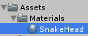

Create a curve fever game in 15 minutes

===

# Curve Fever in 15 minutes

Today, we'll build a basic Curve Fever game, which we can extend later on
[plugin:youtube](https://www.youtube.com/watch?v=eM7_thGGXIs)

Create a new Unity3D project and create the following folder structure


Save the current scene in out **Scenes** folder.


Select the **Main Camera** GameObject in the scene and set it up:
* **Clear Flags** to **Solid Color** 
* **Background** to a color, which fits your needs, i chose black
* **Projection** to **Orthographic**
* **Size** to **10**
* Transform **Position** to Vector3(0, 0, -1f)


Next, we need a SnakeTail, the actually snake visualization. So create a new folder in our **Scripts** folder with the name **Snake** and inside create a new C# script called **SnakeTail**. 


We are using the LineRenderer component for our SnakeTail, so we are using a list to store our line points, so we need the System.Collections.Generic namespace.
``` csharp
using UnityEngine;
using System.Collections;
using System.Collections.Generic;

public class SnakeTail : MonoBehaviour {

    
    
}
```

Next, we need a reference for the LineRenderer component and a reference for our Collider2D component, we are using an **EdgeCollider2D**
``` csharp
    LineRenderer line;
    EdgeCollider2D edgeCollider;
```

We also need a list for our line points
``` csharp
    List<Vector2> linePoints;
```

In the Awake function, we set up our LineRenderer and EdgeCollider2D and initialize our linePoints list
``` csharp
    void Awake() {
        line = GetComponent<LineRenderer>();
        line.SetVertexCount(0);
        line.useWorldSpace = true;

        linePoints = new List<Vector2>();

        edgeCollider = GetComponent<EdgeCollider2D>();
    }
```

Since we maybe have more than one snake in the game, we need the ability to set the color of the current snake tail
``` csharp
    public void SetColor(Color color) {
        line.SetColors(color, color);
    }
```

Maybe we have PowerUps in the game, which sets the width of the snake tail, so we need a function for this
``` csharp
    public void SetWidth(float width) {
        line.SetWidth(width, width);
    }
```

The last function for our snake tail is the UpdateTail function, it adds a new point to our linePoint list and adds it to our LineRenderer and EdgeCollider
``` csharp
    public void UpdateTail(Vector2 position) {
        linePoints.Add(position);

        line.SetVertexCount(linePoints.Count);
        line.SetPosition(linePoints.Count - 1, linePoints[linePoints.Count - 1]);

        if(linePoints.Count > 1) {
            edgeCollider.points = linePoints.ToArray();
        }
        
    }
```

Alright, so the complete code for our SnakeTail looks like this
``` csharp
using UnityEngine;
using System.Collections;
using System.Collections.Generic;

public class SnakeTail : MonoBehaviour {

    LineRenderer line;
    EdgeCollider2D edgeCollider;

    List<Vector2> linePoints;

    void Awake() {
        line = GetComponent<LineRenderer>();
        line.SetVertexCount(0);
        line.useWorldSpace = true;

        linePoints = new List<Vector2>();

        edgeCollider = GetComponent<EdgeCollider2D>();
    }

    public void SetColor(Color color) {
        line.SetColors(color, color);
    }

    public void SetWidth(float width) {
        line.SetWidth(width, width);
    }

    public void UpdateTail(Vector2 position) {
        linePoints.Add(position);

        line.SetVertexCount(linePoints.Count);
        line.SetPosition(linePoints.Count - 1, linePoints[linePoints.Count - 1]);

        if(linePoints.Count > 1) {
            edgeCollider.points = linePoints.ToArray();
        }
    }
    
}
```

For our game, we now need a prefab of our SnakeTail. So create a new empty GameObject in the scene and name it **SnakeTail**


Then add a LineRenderer component to it, disable **Cast Shadows**, **Receive Shadows** and **Motion Vectors** and set the **Positions** size to 0. Next, add a EdgeCollider2D component. And last, add our SnakeTail component to it.


Next, create a new material in our Materials folder and name it SnakeTail. Set the Shader to **Particles/Additive**


Drag the SnakeTail GameObject on our Prefabs folder and delete it from the scene.


The game curve fever works, because there are gaps between the snake tails. So we need a class, which controls the snake tails and the gaps between. So create a new C# script in our Snake folder with the name **Snake**


Our Snake class is a simple MonoBehaviour which uses the System.Collection.Generic namespace
``` csharp
using UnityEngine;
using System.Collections;
using System.Collections.Generic;

public class Snake : MonoBehaviour {
    


}
```

Our snake has a head object and a headcollider object, so one for the movement and one for the visualization and colision handling.
``` csharp
    public Transform headTransform;
    public Transform headColliderTransform;
```

We also need the reference for our SnakeTail prefab
``` csharp
    public SnakeTail snakeTailPrefab;
```

Our snake has a speed for the movement and a speed for the rotation
``` csharp
    public float speed;
    public float angularSpeed;
```

It also has a color and a line width
``` csharp
    public Color color;
    public float width;
```

Since we are going to break the snake tails into peaces, we need a time for drawing and a time for the break
``` csharp
    public float lineTime;
    public float breakTime;
```

We also have to keep track of the current angle of the head and the current position
``` csharp
    public float headAngle;
    public Vector3 headPosition;
```

To store our snake tails, we have a list
``` csharp
    List<SnakeTail> snakeTails;
```

If we want to add more snakes to the game, we need to have an id for every snake
``` csharp
    public int snakeID;
```

For knowing, if it's tail drawing time or not, we have a boolean.
``` csharp
    bool tailActive = true;
```

Because, we don't want to have always the axact draw and break time, we add a little random value to that, so we need a random generator
``` csharp
    System.Random rg;
```

we also need a game over state and a ready state
``` csharp
    bool gameOver = false;
    bool isReady = false;
```

Alright. In the Awake function, we initialize the random generator and our snakeTails list
``` csharp
    void Awake() {
        rg = new System.Random();
        snakeTails = new List<SnakeTail>();
    }
```

Then, we have a public StartSnake function, which adds a new snake tail, starts our snake tail drawer and sets the ready state to true.
``` csharp
    public void StartSnake() {
        AddTail();

        StartCoroutine(TailDrawer());

        isReady = true;
    }
```

The AddTail function instantiates a new SnakeTail prefab, sets it's color and width and adds the new snake tail to our list
``` csharp
    void AddTail() {
        SnakeTail tail = Instantiate(snakeTailPrefab, Vector3.zero, Quaternion.identity) as SnakeTail;
        tail.SetColor(color);
        tail.SetWidth(width);

        snakeTails.Add(tail);
    }
```

Our TailDrawer Coroutine runs while we are not game over, waits for the end of the line time, then it sets the tail active boolean to false and waits for the end of the break time and then it adds a new snake tail, which will be drawn, and so on.
``` csharp
    IEnumerator TailDrawer() {
        while(!gameOver) {
            float randomLineTime = (float)rg.NextDouble() - 0.5f;
            yield return new WaitForSeconds(lineTime + randomLineTime);

            tailActive = false;

            float randomBreakTime = (float)rg.NextDouble() * (breakTime * 0.5f) - (breakTime * 0.5f);
            yield return new WaitForSeconds(breakTime + randomBreakTime);

            AddTail();

            tailActive = true;
        }
    }
```

In the FixedUpdate function, we check if we are not game over and if the snake is ready, otherwise we do nothing. Then we calculate the current angle of the head and move the head forward in the right angle. Then the get the last snake tail and update it with the new position
``` csharp
    void FixedUpdate() {
        if(gameOver || !isReady) {
            return;
        }

        headAngle += angularSpeed * GetSteerDirection();

        headPosition.x += speed * Mathf.Cos(headAngle * Mathf.PI / 180f) * Time.fixedDeltaTime;
        headPosition.y += speed * Mathf.Sin(headAngle * Mathf.PI / 180f) * Time.fixedDeltaTime;

        if(tailActive) {
            GetCurrentSnakeTail().UpdateTail(headPosition);
        }
    }
```

The GetSteerDirection function just return a float, it looks for different keys depending on the snake id, the first player can play with the A and D keys and the second player can play with the left and right arrow key
``` csharp
    float GetSteerDirection() {
        if(snakeID == 0) {
            if(Input.GetKey(KeyCode.A)) {
                return 1f;
            } else if(Input.GetKey(KeyCode.D)) {
                return -1f;
            } else {
                return 0;
            }
        }

        if(snakeID == 1) {
            if(Input.GetKey(KeyCode.LeftArrow)) {
                return 1f;
            } else if(Input.GetKey(KeyCode.RightArrow)) {
                return -1f;
            } else {
                return 0;
            }
        }

        return 0;
    }
```

The GetCurrentSnakeTail function just returns the last snake tail of our list
``` csharp
    SnakeTail GetCurrentSnakeTail() {
        return snakeTails[snakeTails.Count - 1];
    }
```

In the Update function, we also check if we are not game over and if the snake is ready. Then we update the head transforms position and rotation, then we check, if our head collider transform collides with snake tails, and if so, we will be game over
``` csharp
    void Update() {
        if(gameOver || !isReady) {
            return;
        }

        headTransform.position = headPosition;
        headTransform.localRotation = Quaternion.Euler(0, 0, headAngle);

        Collider2D colliders = Physics2D.OverlapCircle(headColliderTransform.position, width * 0.5f);

        if(colliders != null) {
            GameOver();
        }
    }
```

the GameOver function sets the game over state and destroys every snake tail of our snake and also its head
``` csharp
    void GameOver() {
        gameOver = true;

        for(int i = 0; i < snakeTails.Count; i++) {
            GameObject.Destroy(snakeTails[i].gameObject);
        }

        snakeTails.Clear();

        GameObject.Destroy(headTransform.gameObject);
    }
```

Ok, now we need to create our Snake prefab. So create a new empty GameObject in the scene and name it Snake


Then inside the Snake GameObject create a new empty GameObject and name it SnakeHead, and inside the SnakeHead create a new Sphere and name it Graphics


Then create a new Material in our Materials folder and name it SnakeHead


Then drag it onto our Graphics GameObject, and set the Scale of the Transform to Vector3(0.1f, 0.1f, 0.1f) and the X position to 0.1f and remove the Collider


Back in our Snake GameObject add our Snake class to it and drag the SnakeHead GameObject to the HeadTransform field and the Graphics GameObject to the HeadColliderTransform field, set the speed to something like 1.5f and the angular speed to something like 4.5, choose a color and set the width to something like 0.1f, the line time to 3f and the break time to 0.5f.


Then drag our Snake GameObject to the Prefabs folder and delete it from the scene.


Our last class will be our GameManager class, so create a new C# script in our Scripts folder and name it GameManager


Then create a new empty GameObject in the scene and name it also GameManager and drag the GameManager script onto it


Our GameManager is a simple MonoBehaviour which uses the System.Collections.Generic namespace
``` csharp
using UnityEngine;
using System.Collections;
using System.Collections.Generic;

public class GameManager : MonoBehaviour {
    


}
```

We need the reference to our Snake prefab, then we need multiple colors for our snakes and a list for the instantiated snakes
``` csharp
    public Snake snakePrefab;

    public Color[] snakeColors;

    List<Snake> snakes;
```

in the Start function, we initialize the snake list, then we add two snakes and then we start the two snakes
``` csharp
    void Start() {
        snakes = new List<Snake>();

        AddSnake(0, Vector3.left, -90f);
        AddSnake(1, Vector3.right, 90f);

        for(int i = 0; i < snakes.Count; i++) {
            snakes[i].StartSnake();
        }
    }
```

The AddSnake function gets the snake id, the current head position and the current head angle, then it instantiates a new snake and sets its color, angle, position and id.
``` csharp
    void AddSnake(int snakeID, Vector3 headPosition, float headAngle) {
        Snake snake = Instantiate(snakePrefab, Vector3.zero, Quaternion.identity) as Snake;
        snake.color = snakeColors[snakeID];
        snake.headAngle = headAngle;
        snake.headPosition = headPosition;
        snake.snakeID = snakeID;

        snakes.Add(snake);
    }
```

Back in Unity, we now need to set the snake prefab and at least two colors for the snakes in the GameManager GameObject.


If you run the game now, you should see something like this


So, our complete GameManager script looks like this
``` csharp
using UnityEngine;
using System.Collections;
using System.Collections.Generic;

public class GameManager : MonoBehaviour {

    public Snake snakePrefab;

    public Color[] snakeColors;

    List<Snake> snakes;

    void Start() {
        snakes = new List<Snake>();

        AddSnake(0, Vector3.left, -90f);
        AddSnake(1, Vector3.right, 90f);

        for(int i = 0; i < snakes.Count; i++) {
            snakes[i].StartSnake();
        }
    }

    void AddSnake(int snakeID, Vector3 headPosition, float headAngle) {
        Snake snake = Instantiate(snakePrefab, Vector3.zero, Quaternion.identity) as Snake;
        snake.color = snakeColors[snakeID];
        snake.headAngle = headAngle;
        snake.headPosition = headPosition;
        snake.snakeID = snakeID;

        snakes.Add(snake);
    }

}
```

The complete code for the Snake class looks like this
``` csharp
using UnityEngine;
using System.Collections;
using System.Collections.Generic;

public class Snake : MonoBehaviour {

    public Transform headTransform;
    public Transform headColliderTransform;

    public SnakeTail snakeTailPrefab;

    public float speed;
    public float angularSpeed;

    public Color color;
    public float width;

    public float lineTime;
    public float breakTime;

    public float headAngle;
    public Vector3 headPosition;

    List<SnakeTail> snakeTails;

    public int snakeID;

    bool tailActive = true;

    System.Random rg;

    bool gameOver = false;
    bool isReady = false;

    void Awake() {
        rg = new System.Random();
        snakeTails = new List<SnakeTail>();
    }

    public void StartSnake() {
        AddTail();

        StartCoroutine(TailDrawer());

        isReady = true;
    }

    void AddTail() {
        SnakeTail tail = Instantiate(snakeTailPrefab, Vector3.zero, Quaternion.identity) as SnakeTail;
        tail.SetColor(color);
        tail.SetWidth(width);

        snakeTails.Add(tail);
    }

    IEnumerator TailDrawer() {
        while(!gameOver) {
            float randomLineTime = (float)rg.NextDouble() - 0.5f;
            yield return new WaitForSeconds(lineTime + randomLineTime);

            tailActive = false;

            float randomBreakTime = (float)rg.NextDouble() * (breakTime * 0.5f) - (breakTime * 0.5f);
            yield return new WaitForSeconds(breakTime + randomBreakTime);

            AddTail();

            tailActive = true;
        }
    }

    void FixedUpdate() {
        if(gameOver || !isReady) {
            return;
        }

        headAngle += angularSpeed * GetSteerDirection();

        headPosition.x += speed * Mathf.Cos(headAngle * Mathf.PI / 180f) * Time.fixedDeltaTime;
        headPosition.y += speed * Mathf.Sin(headAngle * Mathf.PI / 180f) * Time.fixedDeltaTime;

        if(tailActive) {
            GetCurrentSnakeTail().UpdateTail(headPosition);
        }
    }

    void Update() {
        if(gameOver || !isReady) {
            return;
        }

        headTransform.position = headPosition;
        headTransform.localRotation = Quaternion.Euler(0, 0, headAngle);

        Collider2D colliders = Physics2D.OverlapCircle(headColliderTransform.position, width * 0.5f);

        if(colliders != null) {
            GameOver();
        }
    }

    void GameOver() {
        gameOver = true;

        for(int i = 0; i < snakeTails.Count; i++) {
            GameObject.Destroy(snakeTails[i].gameObject);
        }

        snakeTails.Clear();

        GameObject.Destroy(headTransform.gameObject);
    }

    float GetSteerDirection() {
        if(snakeID == 0) {
            if(Input.GetKey(KeyCode.A)) {
                return 1f;
            } else if(Input.GetKey(KeyCode.D)) {
                return -1f;
            } else {
                return 0;
            }
        }

        if(snakeID == 1) {
            if(Input.GetKey(KeyCode.LeftArrow)) {
                return 1f;
            } else if(Input.GetKey(KeyCode.RightArrow)) {
                return -1f;
            } else {
                return 0;
            }
        }

        return 0;
    }

    SnakeTail GetCurrentSnakeTail() {
        return snakeTails[snakeTails.Count - 1];
    }

}

```

And the complete code for our SnakeTail class looks like this
``` csharp
using UnityEngine;
using System.Collections;
using System.Collections.Generic;

public class SnakeTail : MonoBehaviour {

    LineRenderer line;
    EdgeCollider2D edgeCollider;

    List<Vector2> linePoints;

    void Awake() {
        line = GetComponent<LineRenderer>();
        line.SetVertexCount(0);
        line.useWorldSpace = true;

        linePoints = new List<Vector2>();

        edgeCollider = GetComponent<EdgeCollider2D>();
    }

    public void SetColor(Color color) {
        line.SetColors(color, color);
    }

    public void SetWidth(float width) {
        line.SetWidth(width, width);
    }

    public void UpdateTail(Vector2 position) {
        linePoints.Add(position);

        line.SetVertexCount(linePoints.Count);
        line.SetPosition(linePoints.Count - 1, linePoints[linePoints.Count - 1]);

        if(linePoints.Count > 1) {
            edgeCollider.points = linePoints.ToArray();
        }
    }

}

```