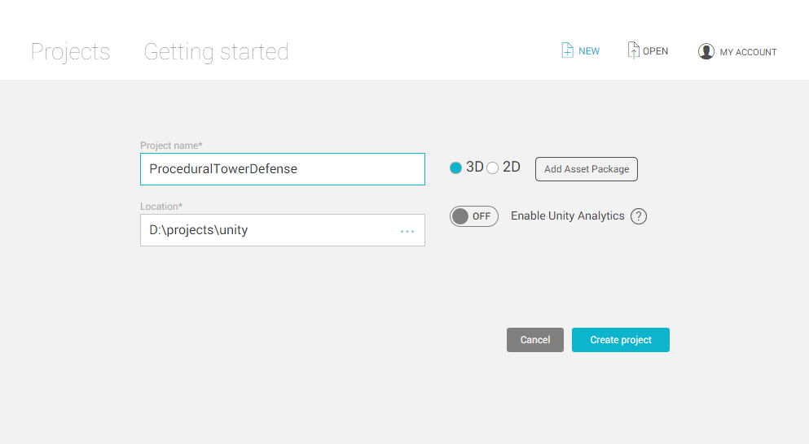
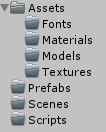
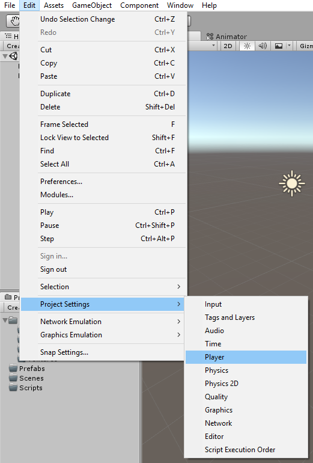
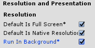
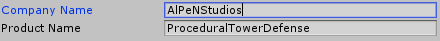
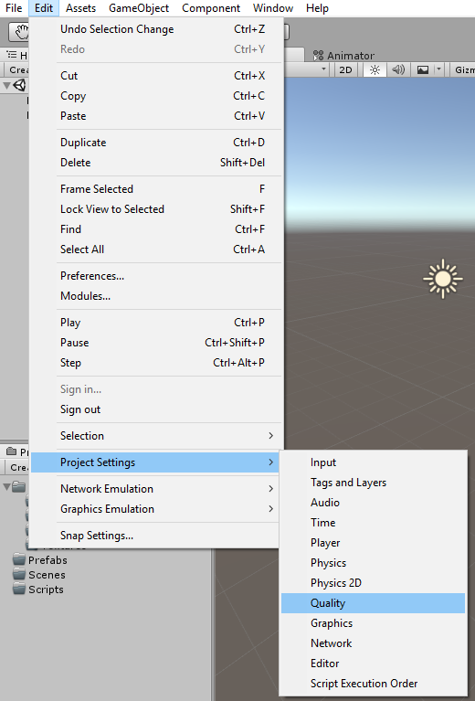
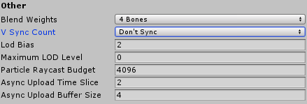

Set the project for the TD

===

# Project setup

## New project
Create a new project and name it **ProceduralTowerDefense**.

## Folders
Create a folder structure for our contents.

## Player settings
Go to the player settings

and check the checkbox at **Run In Background**, because later on, we'll have a network mode, so we shouldn't pause the game, when the window isn't active.

Then fill in the **Company Name**

## Quality Settings
Go the the quality settings

and set the **VSyncCount** to **Don't Sync** to get a little better performance. (you'll have to change it for every quality level)

## Save the scene
Press _**Ctrl+S**_ to save the scene. Save it into the **Scene** folder and name it **Main**.
