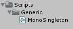

About the singleton pattern

===

# MonoSingleton

! ### :fa-question-circle: What is a Singleton?
! A Singleton is a design pattern to ensure that there is only one instance of an object loaded. This is useful for objects like GameManagers or NetworkManagers, because you just want to have one game loop, or one network listener running.

Create a new folder in the **Scripts** folder called **Generic**. Then create a new C# script in the **Generic** folder and name it **MonoSingleton**.


Our MonoSingleton class is an abstract class which can be inherited from any other class.

``` csharp
using UnityEngine;
using System.Collections;

public abstract class MonoSingleton<T> : MonoBehaviour where T : MonoSingleton<T> {

}
```

At first, we need an instance variable, which is private

``` csharp
	private static T instance = null;
```

Then we need a public getter of this instance, in which we check, if the private instance already exists. If the object isn't created yet, we create a new GameObject and add the component to it. Then we return the instance.

``` csharp
	public static T Instance {
        get {
            if(instance == null) {
                instance = new GameObject(typeof(T).ToString(), typeof(T)).GetComponent<T>();
                instance.Init();
            }

            return instance;
        }
    }
```

Since we instantiate a MonoBehaviour object, we can use the Awake function for our initialization function, in the Awake, we just check, if there is already an instance of this object, if this is so, we throw an error. The base MonoSingleton simply does nothing in the Init function, but every class, which inherits the MonoSingleton, can override the Init function to have it's own initialization.

``` csharp
    void Awake() {
        if(instance == null) {
            instance = this as T;
        } else {
            Debug.LogError("The " + typeof(T).ToString() + " singleton is already instantiated!", gameObject);
            return;
        }

        Init();
    }

    public virtual void Init() { }
```

Now we have our complete MonoSingleton class, which we can use for our manager scripts, or randomizing scripts.

``` csharp
using UnityEngine;
using System.Collections;

public abstract class MonoSingleton<T> : MonoBehaviour where T : MonoSingleton<T> {

    static T instance = null;

    public static T Instance {
        get {
            if(instance == null) {
                instance = new GameObject(typeof(T).ToString(), typeof(T)).GetComponent<T>();
                instance.Init();
            }

            return instance;
        }
    }

    void Awake() {
        if(instance == null) {
            instance = this as T;
        } else {
            Debug.LogError("The " + typeof(T).ToString() + " singleton is already instantiated!", gameObject);
            return;
        }

        Init();
    }

    public virtual void Init() { }

}
```