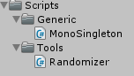

Create the random class for our TD

===

# Randomizer

We need multiple random values in our game, so it's a good idea to have a class which can handle multiple value outputs, like integers or floats. We also want to have a random seed, so we can generate same settings again. And, since we want to get random values from different classes, it's a good catch to create a singleton.

At first, create a new folder in the **Scripts** folder and name it **Tools**. In there create a new C# script called **Randomizer**.


Then create the basic class

``` csharp
using UnityEngine;
using System.Collections;

public class Randomizer : MonoSingleton<Randomizer> {

}
```

at first, we need a public string for our seed value

``` csharp
	public string seed;
```

We are using the random generator from the System namespace

``` csharp
	System.Random rg;
```

We need integer and float values, so lets start with the integer values. Since the `System.Random.Next()` function has already all variances built in, we can just return them.

``` csharp
	public static int GetInt() {
        return Instance.rg.Next();
    }

    public static int GetInt(int _max) {
        return Instance.rg.Next(_max);
    }

    public static int GetInt(int _min, int _max) {
        return Instance.rg.Next(_min, _max);
    }
```

Next, we need the float values. The `System.Random.NextDouble()` function will just return values between 0 and 1, so we need to add the min and max values and cast the results as float.

``` csharp
	public static float GetFloat() {
        return (float)Instance.rg.NextDouble();
    }

    public static float GetFloat(float _max) {
        return (float)Instance.rg.NextDouble() * _max;
    }

    public static float GetFloat(float _min, float _max) {
        return _min + (float)Instance.rg.NextDouble() * (_max - _min);
    }
```

Now we have our complete Randomizer class

``` csharp
using UnityEngine;
using System.Collections;

public class Randomizer : MonoSingleton<Randomizer> {

    public string seed;

    System.Random rg;

    public override void Init() {
        rg = new System.Random(seed.GetHashCode());
    }

    public static int GetInt() {
        return Instance.rg.Next();
    }

    public static int GetInt(int _max) {
        return Instance.rg.Next(_max);
    }

    public static int GetInt(int _min, int _max) {
        return Instance.rg.Next(_min, _max);
    }

    public static float GetFloat() {
        return (float)Instance.rg.NextDouble();
    }

    public static float GetFloat(float _max) {
        return (float)Instance.rg.NextDouble() * _max;
    }

    public static float GetFloat(float _min, float _max) {
        return _min + (float)Instance.rg.NextDouble() * (_max - _min);
    }

}
```