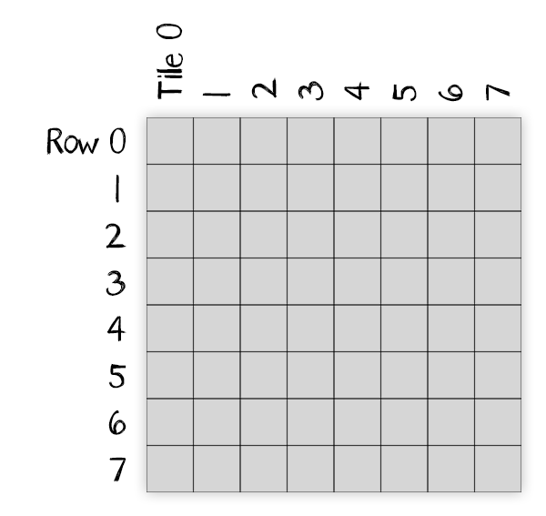
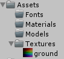
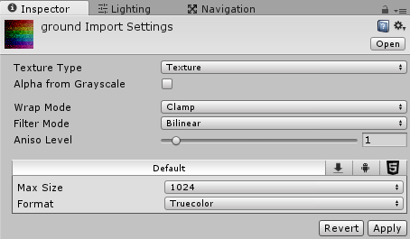

Create the texture for our TD

===

# Ground Texture

For our ground, we create a quadratic texture with a dimension of 1024x1024 pixels and an eight by eight tile grid, so every tile has 128x128 pixels. Each row marks a region and each column marks a tile, so we'll have 64 different ground tiles, which we can use for our procedural generated ground.

You can create a texture on your own, or you can download a texture here.

[Download PNG](000011.png?target=_blank)
[Download PSD](ground.psd)

Save the texture in the Textures folder.

and set the 
* **Wrap Mode** to **Clamp** 
* the **Max Size** to **1024**
* the **Format** to **Truecolor**
* and the **Aniso Level** to **6**

and hit **Apply**

