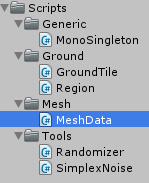
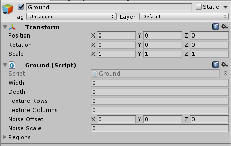
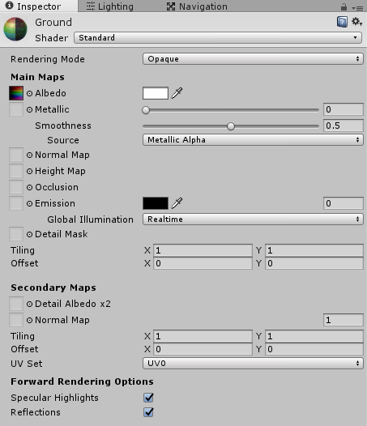

Build the mesh for our TD

===

# Ground Mesh

For our ground mesh, we need a bunch of classes:
* **Region** - stores the uv coordinates of the texture for the current ground tile
* **GroundTile** - stores the position and Region of the current ground tile
* **MeshData** - stores the data (vertices, triangles, uv coords) of our mesh and gives us a generated Mesh object
* **Ground** - generates and stores the grid of GroundTiles 

Let's start with the **Region** class, create a new folder in our Scripts folder and name it **Ground**. In there create a new C# script with the name **Region**


``` csharp
using System;
using UnityEngine;
using System.Collections;

[Serializable]
public class Region {

    public int textureRow;
    public int tileCount;

}
```

It's a serializable class, because we want to edit it's values in the editor window.

the **textureRow** integer sets the **current row of the texture** (from 0 to 7 in our case) and the **tileCount** integer sets the **maximum column count of the texture** in the current row. So, if we want to have just 2 columns for the first row, we set the tileCount to 2.

The next class we need is the **GroundTile** class, so create a new C# script in the **Ground** folder and name it **GroundTile**


``` csharp
using UnityEngine;
using System.Collections;

public class GroundTile {

    public int x;
    public int z;

    public Region region;

    public GroundTile(int _x, int _z, Region _region) {
        x = _x;
        z = _z;
        region = _region;
    }

}
```

To keep track of the current position of each tile, we just set it to the integers x and y and we also store the current Region. The constructor just sets these values.

Now, we need the **MeshData** class, if you haven't followed the [Mesh Generation Tutorial](../../mesh-generation/the-basics), just go through before.

Create a new Folder inside the Scripts folder and name it **Mesh** and in there, create a new C# script called **MeshData** and write the code you learned from the **Mesh Generation Tutorial**


``` csharp
using UnityEngine;
using System.Collections;
using System.Collections.Generic;

public class MeshData {

    Mesh mesh;

    List<Vector3> vertices;
    List<Vector2> uvs;
    List<int> triangles;

    public MeshData() {
        vertices = new List<Vector3>();
        uvs = new List<Vector2>();
        triangles = new List<int>();
    }

    public void DrawQuad(Vector3 vertex0, Vector3 vertex1, Vector3 vertex2, Vector3 vertex3) {
        int vertexIndex = vertices.Count;

        vertices.Add(vertex0);
        vertices.Add(vertex1);
        vertices.Add(vertex2);
        vertices.Add(vertex3);

        triangles.Add(vertexIndex);
        triangles.Add(vertexIndex + 1);
        triangles.Add(vertexIndex + 2);

        triangles.Add(vertexIndex);
        triangles.Add(vertexIndex + 2);
        triangles.Add(vertexIndex + 3);

        uvs.Add(new Vector2(0, 1));
        uvs.Add(new Vector2(1, 1));
        uvs.Add(new Vector2(1, 0));
        uvs.Add(new Vector2(0, 0));
    }

    public Mesh GetMesh() {
        mesh = new Mesh();

        mesh.vertices = vertices.ToArray();
        mesh.uv = uvs.ToArray();
        mesh.triangles = triangles.ToArray();

        mesh.Optimize();
        mesh.RecalculateBounds();
        mesh.RecalculateNormals();

        return mesh;
    }

}
```

the only thing, we have to change is the **DrawQuad** function, or we could overload this function:

``` csharp
    public void DrawQuad(Vector3 vertex0, Vector3 vertex1, Vector3 vertex2, Vector3 vertex3, Vector2 uvStart, Vector2 uvSize) {
        int vertexIndex = vertices.Count;

        vertices.Add(vertex0);
        vertices.Add(vertex1);
        vertices.Add(vertex2);
        vertices.Add(vertex3);

        triangles.Add(vertexIndex);
        triangles.Add(vertexIndex + 1);
        triangles.Add(vertexIndex + 2);

        triangles.Add(vertexIndex);
        triangles.Add(vertexIndex + 2);
        triangles.Add(vertexIndex + 3);

        uvs.Add(uvStart);
        uvs.Add(uvStart + Vector2.right * uvSize.x);
        uvs.Add(uvStart + Vector2.right * uvSize.x + Vector2.up * uvSize.y);
        uvs.Add(uvStart + Vector2.up * uvSize.y);
    }

    public void DrawQuad(Vector3 vertex0, Vector3 vertex1, Vector3 vertex2, Vector3 vertex3) {
        DrawQuad(vertex0, vertex1, vertex2, vertex3, new Vector2(0, 1), new Vector2(1, 1));
    }
```

so we created a function with the same name, but added two more parameters, uvStart and uvSize. uvStart sets the start position of the texture and uvSize sets the size of the texture part, we want to use for the mesh. If we don't specify the uv parameters, we just get the whole texture on the quad.

so, the complete code looks now like this:

``` csharp
using UnityEngine;
using System.Collections;
using System.Collections.Generic;

public class MeshData {

    Mesh mesh;

    List<Vector3> vertices;
    List<Vector2> uvs;
    List<int> triangles;

    public MeshData() {
        vertices = new List<Vector3>();
        uvs = new List<Vector2>();
        triangles = new List<int>();
    }

    public void DrawQuad(Vector3 vertex0, Vector3 vertex1, Vector3 vertex2, Vector3 vertex3, Vector2 uvStart, Vector2 uvSize) {
        int vertexIndex = vertices.Count;

        vertices.Add(vertex0);
        vertices.Add(vertex1);
        vertices.Add(vertex2);
        vertices.Add(vertex3);

        triangles.Add(vertexIndex);
        triangles.Add(vertexIndex + 1);
        triangles.Add(vertexIndex + 2);

        triangles.Add(vertexIndex);
        triangles.Add(vertexIndex + 2);
        triangles.Add(vertexIndex + 3);

        uvs.Add(uvStart);
        uvs.Add(uvStart + Vector2.right * uvSize.x);
        uvs.Add(uvStart + Vector2.right * uvSize.x + Vector2.up * uvSize.y);
        uvs.Add(uvStart + Vector2.up * uvSize.y);
    }

    public void DrawQuad(Vector3 vertex0, Vector3 vertex1, Vector3 vertex2, Vector3 vertex3) {
        DrawQuad(vertex0, vertex1, vertex2, vertex3, new Vector2(0, 1), new Vector2(1, 1));
    }

    public Mesh GetMesh() {
        mesh = new Mesh();

        mesh.vertices = vertices.ToArray();
        mesh.uv = uvs.ToArray();
        mesh.triangles = triangles.ToArray();

        mesh.Optimize();
        mesh.RecalculateBounds();
        mesh.RecalculateNormals();

        return mesh;
    }

}
```

With this done, we can start to greate our **Ground** class, so create a new C# script in our **Ground** folder and name it **Ground**.


We are using a list for our regions, so we need the `System.Collections.Generic` namespace.

``` csharp
using UnityEngine;
using System.Collections;
using System.Collections.Generic;

public class Ground : MonoBehaviour {


}
```

We need to define the **width** and the **depth** for our ground(how many tiles there are in x and z direction), then we need to store the texture settings (how many **rows** and **columns** are in the texture), then we need to store every tile in a **GroundTile array**, we need a list of regions (how many different ground patterns we want) and we need a **MeshData** object.

``` csharp
	public int width;
    public int depth;
    
    public int textureRows;
    public int textureColumns;
    
    GroundTile[,] tiles;
    List<Region> regions;
    
    MeshData meshData;
```

We also need a reference to the **MeshFilter** component, so we can set the generated mesh.

``` csharp
	MeshFilter mFilter;
```

Since we want to create a random generated ground, we need to setup the SimplexNoise values. The noise value is generated from a Vector3 point, so we can set a starting point(the offset from Vector3.zero) and we can set, how much the noise is scaled up.

``` csharp
	public Vector3 noiseOffset;
    public float noiseScale;
```

In the **Start** function, we initialize all objects, we use a seperate function, because later on, we will use this **Initialize** function for updating the ground.

``` csharp
	void Start() {
        Initialize();
    }

    void Initialize() {
        tiles = new GroundTile[width, depth];
        meshData = new MeshData();
        mFilter = GetComponent<MeshFilter>();
    }
```

After we have initialized the objects, we can start to generate the ground.

``` csharp
	void Start() {
        Initialize();
        GenerateGround();
    }
    
    void GenerateGround() {
    
    }
```

At first, we loop through the width and the depth and create every single tile. Every tile needs a position and a region. To get the region, we need to generate a noise value between 0 and 1 and then we need to multiply this value with the actual region list count. Then we can add the current ground tile to our tiles array.

``` csharp
    void GenerateGround() {
        for(int x = 0; x < width; x++) {
            for(int z = 0; z < depth; z++) {
                CreateGroundTile(x, z);
            }
        }
    }

    void CreateGroundTile(int x, int z) {
        Vector3 position = new Vector3(x, 0, z);
        Region region = GetRegion(position);

        tiles[x, z] = new GroundTile(x, z, region);
    }

    Region GetRegion(Vector3 position) {
        position += noiseOffset;
        position *= noiseScale;

        int regionIndex = (int)(Mathf.Clamp01(SimplexNoise.Generate(position)) * regions.Count);

        return regions[regionIndex];
    }
```

Next step is the actual mesh generation. We need to create every ground tile. So in our width and depth loop, we add a new function called **AddGroundTileMeshData** which gets the current position.

``` csharp
    void GenerateGround() {
        for(int x = 0; x < width; x++) {
            for(int z = 0; z < depth; z++) {
                CreateGroundTile(x, z);
                AddGroundTileMeshData(x, z);
            }
        }
    }

    void AddGroundTileMeshData(int x, int z) {

    }
```

In there, we need to get the current uv position and size. For this, we need 2 more functions, **GetTileUVPosition** and **GetTileUVSize**. In the GetTileUVPosition function, we are fetching the current region's texture row, getting the region's tile count and get a random column index, then we are calculating the actual uv position of the texture for our quad. In the GetTileUVSize function, we just get the actual size of a single texture tile. In the AddGroundTileMeshData function, we can now draw a quad with 1 unit width and 1 unit depth.

``` csharp
    void AddGroundTileMeshData(int x, int z) {
        meshData.DrawQuad(
            new Vector3(x, 0, z + 1),
            new Vector3(x + 1, 0, z + 1),
            new Vector3(x + 1, 0, z),
            new Vector3(x, 0, z),
            GetTileUVPosition(x, z),
            GetTileUVSize()
        );
    }

    Vector2 GetTileUVPosition(int x, int z) {
        int regionTextureRow = tiles[x, z].region.textureRow;
        int regionTileCount = tiles[x, z].region.tileCount;

        int regionTextureColumn = Randomizer.GetInt(regionTileCount - 1);

        Vector2 uvSize = GetTileUVSize();

        float uvX = (float)regionTextureColumn * uvSize.x;
        float uvY = (1f - uvSize.y) - (float)regionTextureRow * uvSize.y;

        return new Vector2(uvX, uvY);
    }

    Vector2 GetTileUVSize() {
        return new Vector2(1f / (float)textureColumns, 1f / (float)textureRows);
    }
```

So the complete ground class looks like this

``` csharp
using UnityEngine;
using System.Collections;
using System.Collections.Generic;

public class Ground : MonoBehaviour {

    public int width;
    public int depth;

    public int textureRows;
    public int textureColumns;

    public Vector3 noiseOffset;
    public float noiseScale;

    public List<Region> regions;
    GroundTile[,] tiles;
    

    MeshData meshData;
    
    MeshFilter mFilter;

    void Start() {
        Initialize();
        GenerateGround();
    }

    void Initialize() {
        tiles = new GroundTile[width, depth];
        meshData = new MeshData();
        mFilter = GetComponent<MeshFilter>();
    }

    void GenerateGround() {
        for(int x = 0; x < width; x++) {
            for(int z = 0; z < depth; z++) {
                CreateGroundTile(x, z);
                AddGroundTileMeshData(x, z);
            }
        }

        mFilter.mesh = meshData.GetMesh();
    }

    void AddGroundTileMeshData(int x, int z) {
        meshData.DrawQuad(
            new Vector3(x,0,z + 1),
            new Vector3(x + 1, 0, z + 1),
            new Vector3(x + 1, 0, z),
            new Vector3(x, 0, z),
            GetTileUVPosition(x, z),
            GetTileUVSize()
        );
    }

    Vector2 GetTileUVPosition(int x, int z) {
        int regionTextureRow = tiles[x, z].region.textureRow;
        int regionTileCount = tiles[x, z].region.tileCount;

        int regionTextureColumn = Randomizer.GetInt(regionTileCount - 1);

        Vector2 uvSize = GetTileUVSize();

        float uvX = (float)regionTextureColumn * uvSize.x;
        float uvY = (1f - uvSize.y) - (float)regionTextureRow * uvSize.y;

        return new Vector2(uvX, uvY);
    }

    Vector2 GetTileUVSize() {
        return new Vector2(1f / (float)textureColumns, 1f / (float)textureRows);
    }

    void CreateGroundTile(int x, int z) {
        Vector3 position = new Vector3(x, 0, z);
        Region region = GetRegion(position);

        tiles[x, z] = new GroundTile(x, z, region);
    }

    Region GetRegion(Vector3 position) {
        position += noiseOffset;
        position *= noiseScale;

        int regionIndex = (int)(Mathf.Clamp01(SimplexNoise.Generate(position)) * regions.Count);

        return regions[regionIndex];
    }

}
```


Alright, with this done, we can start to create our ground GameObject, so create a new GameObject and name it **Ground**.


Then add our **Ground** script to it.


Then, we can setup the ground.

* set the transform's position to Vector3(-0.5f, 0, -0.5f)
* set the width and the depth to 30
* textureRows and textureColumns to 8
* noiseOffset to (50, 0, -12)
* noiseScale to 0.04
* and set 3 regions, increment the textureRow for each by one (0, 1, 2) and set the tileCount for every region to 3


Before we can run this, we need to do a few more things. At first, we need an instance of our randomizer. So create a new GameObject and name it GameManager. In there put our Randomizer class and fill in the seed value, i took "ProceduralRocks".


Then we need a new Material for our ground. So go into our Assets/Materials folder and create a new material called Ground, then put our texture into the albedo channel.



Back in our Ground GameObject, we need to add 3 more things. We need a MeshFilter component, a MeshRenderer component and then we need to drop our Ground material on it.


If you press play now, you should see our first generated ground.


you can play around with the settings, since you find a ground, which fits your needs.

!!!! We will create a EditorScript for this a little bit later, but for now, we can use the Update function to update the mesh while we play around with the settings, so go back to the Ground script and add this Update function.

``` csharp
    void Update() {
        Randomizer.Instance.Init();
        Initialize();
        GenerateGround();
    }
```

! Since the Randomizer will always generate an other value, we need to reset it to get always the same values.