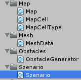

Set the parameters for our szenario

===

# Szenario structure

Before we start with the obstacles and the pathfinding structure, we need to plan our szenario settings. Since we have three classes which needs to touch the ground grid, we need to store a view more things, so we need a data structure for the **MapCell** which holds the type of the tile (walkable, obstacle, tower, path) - this will be an enum **MapCellType**

then, we need a structure, which holds the grid of our MapCells, let's call it **MapGrid**

At last, we need a class which has all the settings like **map width** and **depth**, **obstacle count**, **path count**, etc. this will be our **Szenario** class.

Let's start with our enum **MapCellType**, create a new folder inside our Scripts folder and name it **Map**. Create a new C# script with the name **MapCellType**.


For now, we have **four** different **cell types**:
``` csharp
using UnityEngine;
using System.Collections;

public enum MapCellType {
    WALKABLE = 10,
    OBSTACLE = 20,
    TOWER = 30,
    PATH = 40
}
```

The next class is our **MapCell** data structure, so create a new C# script inside our **Map** folder and name it **MapCell**


The MapCell is a simple serializable class
``` csharp
using UnityEngine;
using System;
using System.Collections;

[Serializable]
public class MapCell {
    


}
```

The MapCell needs to know which type it is. In the **constructor**, we set each MapCell to the type **WALKABLE**, we also create an **overloaded constructor**, which has the **MapCellType** as a **parameter**, and we create a **public getter** and **setter** for the **MapCellType**, so we can get it from another class.
``` csharp
    MapCellType type;

    public MapCellType Type {
        get { return type; }
        set { type = value; }
    }

    public MapCell() {
        Type = MapCellType.WALKABLE;
    }

    public MapCell(MapCellType _type) {
        Type = _type;
    }

    public MapCell(MapCellType _type) {
        Type = _type;
    }
```

Now, we can create our **Map** class, so create a new C# script called **Map** in our **Map** folder


The Map class is a simple class
``` csharp
using UnityEngine;
using System.Collections;

public class Map {
    


}
```

At first, we need a two-dimensional array of MapCells, the grid, and in the constructor, we initialize this array and set all MapCells to the grid.
``` csharp
    public MapCell[,] grid;

    public Map(int width, int depth) {
        grid = new MapCell[width, depth];

        for(int x = 0; x < width; x++) {
            for(int z = 0; z < depth; z++) {
                grid[x, z] = new MapCell();
            }
        }
    }
```

We also need the possibility to change a MapCell, so we create a function for this. Before we set the type, we check, if the provided position is valid.
``` csharp
    public void SetCell(int x, int z, MapCellType type) {
        if(x < 0 || z < 0 || x >= grid.GetLength(0) || z >= grid.GetLength(1)) {
            Debug.LogError("Map::SetCell position is out of range");
            return;
        }

        grid[x, z].Type = type;
    }
```

Next, we need the ability to get a MapCell at a position
``` csharp
    public MapCell GetCell(int x, int z) {
        if(x < 0 || z < 0 || x >= grid.GetLength(0) || z >= grid.GetLength(1)) {
            Debug.LogError("Map::GetCell position is out of range");
            return null;
        }

        return grid[x, z];
    }
```

And, for later use, we need the ability to check if a MapCell is walkable
``` csharp
    public bool IsWalkableCell(int x, int z) {
        if(x < 0 || z < 0 || x >= grid.GetLength(0) || z >= grid.GetLength(1)) {
            Debug.LogError("Map::IsWalkableCell position is out of range");
            return false;
        }
        return grid[x, z].Type == MapCellType.WALKABLE;
    }
```

So, the complete Map script looks like this
``` csharp
using UnityEngine;
using System.Collections;

public class Map {

    public MapCell[,] grid;

    public Map(int width, int depth) {
        grid = new MapCell[width, depth];

        for(int x = 0; x < width; x++) {
            for(int z = 0; z < depth; z++) {
                grid[x, z] = new MapCell();
            }
        }
    }

    public void SetCell(int x, int z, MapCellType type) {
        if(x < 0 || z < 0 || x >= grid.GetLength(0) || z >= grid.GetLength(1)) {
            Debug.LogError("Map::SetCell position is out of range");
            return;
        }

        grid[x, z].Type = type;
    }

    public MapCell GetCell(int x, int z) {
        if(x < 0 || z < 0 || x >= grid.GetLength(0) || z >= grid.GetLength(1)) {
            Debug.LogError("Map::GetCell position is out of range");
            return null;
        }

        return grid[x, z];
    }

    public bool IsWalkableCell(int x, int z) {
        if(x < 0 || z < 0 || x >= grid.GetLength(0) || z >= grid.GetLength(1)) {
            Debug.LogError("Map::IsWalkableCell position is out of range");
            return false;
        }
        return grid[x, z].Type == MapCellType.WALKABLE;
    }
    
}
```


Our last class is our **Szenario** class. Create a new folder inside our Scripts folder and name it **Szenario**. In there, create a new C# script called **Szenario**


It's a simple serializable class
``` csharp
using UnityEngine;
using System;
using System.Collections;
using System.Collections.Generic;

[Serializable]
public class Szenario {
    


}
```

For now, it just gets the width and the depth values, the ground noise offset and scale values and the ground regions list.
``` csharp
    public int width;
    public int depth;

    public Vector3 groundNoiseOffset;
    public float groundNoiseScale;

    public List<Region> groundRegions;
```

