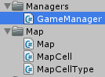
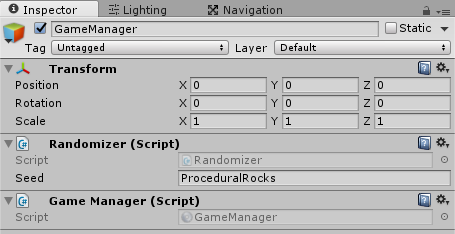
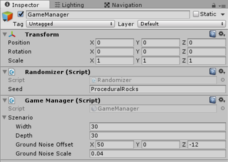

Create our game manager

===

# Game Manager

Since, we are creating more and more stuff, we need a place to get it created organized, and we do it in a GameManager script. Create a new folder in our Scripts folder and name it **Managers**. In there, create a new C# script with the name **GameManager**


It's a MonoSingleton class
``` csharp
using UnityEngine;
using System.Collections;

public class GameManager : MonoSingleton<GameManager> {

    

}
```

Drag this script onto our **GameManager** GameObject


Next, we need a public Szenario object
``` csharp
    public Szenario szenario;
```

Now you can fill on our old ground values to the new szenario object


We also need an instance of the Map, which we initialize in the Start function
``` csharp
    public Map map;

    public void Start() {
        map = new Map(szenario.width, szenario.depth);
    }
```

We need to change our **Ground class** a little bit. We just delete the Start and the Update function, and create a new public function called **Generate**, which gets a width and a depth value, the noise offset and scale value and a list of regions.
``` csharp
    public void Generate(int width, int depth, Vector3 noiseOffset, float noiseScale, List<Region> regions) {
        this.width = width;
        this.depth = depth;

        this.noiseOffset = noiseOffset;
        this.noiseScale = noiseScale;

        this.regions = regions;

        Randomizer.Instance.Init();

        Initialize();
        GenerateGround();
    }
```

Then, we should also make the Ground class a MonoSingleton
``` csharp
public class Ground : MonoSingleton<Ground> {
```

Back in the **GameManager** class, we can now call the Generate function in the Start function with the right values, so our GameManager looks like this
``` csharp
using UnityEngine;
using System.Collections;

public class GameManager : MonoSingleton<GameManager> {

    public Szenario szenario;
    public Map map;

    public void Start() {
        map = new Map(szenario.width, szenario.depth);

        Ground.Instance.Generate(
            szenario.width, 
            szenario.depth, 
            szenario.groundNoiseOffset, 
            szenario.groundNoiseScale, 
            szenario.groundRegions
        );
    }
}
```