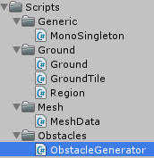
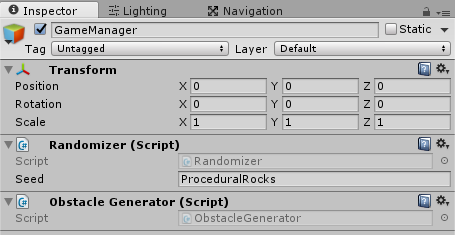
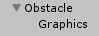
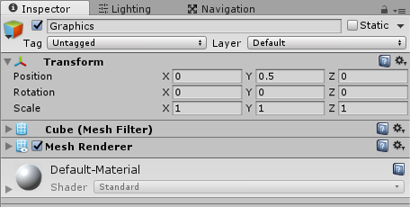
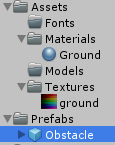
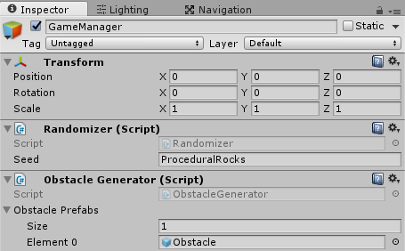
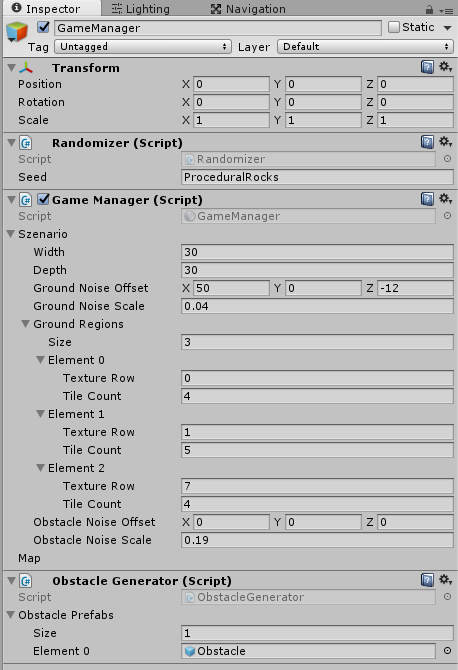
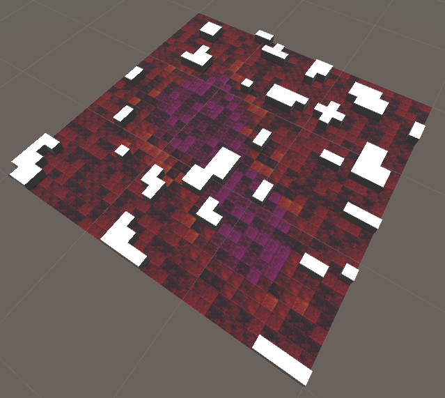

Create the obstacles

===

# Obstacles

Now, we are ready to create our obstacles. At first, create a new folder inside our **Scripts** folder and name it **Obstacles**. Then create a new C# script and call it **ObstacleGenerator**. Drag this script onto our **GameManager** GameObject.



Our ObstacleGenerator is a MonoSingleton
``` csharp
using UnityEngine;
using System.Collections;

public class ObstacleGenerator : MonoSingleton<ObstacleGenerator> {


}
```

We are going to create our obstacles like the ground tiles with the simplexnoise class, so we need an offset and a scale value
``` csharp
    Vector3 noiseOffset;
    float noiseScale;
```

we also need a width and a depth value
``` csharp
    int width;
    int depth;
```

Next, we need a function, which sets the obstacles in our Map grid. The **GetNoise** function is quite similar to the **GetRegion** function from our **Ground** class.

!!!! We are using a reference of the map, because, we don't want to create a dummy object and save it back. It's nicer to just edit the actual Map object.

``` csharp
    public void GenerateObstacleMap(ref Map map, Vector3 noiseOffset, float noiseScale) {
        this.width = map.grid.GetLength(0);
        this.depth = map.grid.GetLength(1);

        this.noiseOffset = noiseOffset;
        this.noiseScale = noiseScale;

        for(int x = 0; x < width; x++) {
            for(int z = 0; z < depth; z++) {
                if(GetNoise(new Vector3(x, 0, z)) > 0.5f) {
                    map.grid[x, z].Type = MapCellType.OBSTACLE;
                }
            }
        }
    }

    float GetNoise(Vector3 position) {
        position += noiseOffset;
        position *= noiseScale;

        return Mathf.Max(0, SimplexNoise.Generate(position));
    }
```

Then we need a public function, which let's us generate our obstacles. We are going to loop through every tile and check, if the current noise value is above the middle, if it is so, we are going to create an obstacle. 
``` csharp
    public void GenerateObstacles(ref Map map) {
        for(int x = 0; x < width; x++) {
            for(int z = 0; z < depth; z++) {
                if(map.grid[x, z].Type == MapCellType.OBSTACLE) {
                    // Create obstacle
                }
            }
        }
    }
```

Now, we need a **prefab for the obstacle**, so, we create a new **empty GameObject** and name it **Obstacle** and in there, we create a **Cube** for now and call it **Graphics**, we can change this inner GameObject later with a real 3D model.


Ensure, that you offset the inner GameObject to Vector3(0, 0.5f, 0)


Now, we drag the created obstacle into our **Prefabs** folder


We can delete the GameObject from the scene now.

Back in our **ObstacleGenerator** script, we need a new GameObject Array for our obstacles.
``` csharp
    public GameObject[] obstaclePrefabs;
```

In the Editor, we can drag our Obstacle prefab into this array. 


We can now complete the GenerateObstacles function in our ObstacleGenerator class, we create a new function, **CreateObstacle** which gets the x and z position, it selects a random prefab from our obstaclePrefabs array and instantiates this obstacle
``` csharp
    public void GenerateObstacles(ref Map map) {
        for(int x = 0; x < width; x++) {
            for(int z = 0; z < depth; z++) {
                if(map.grid[x, z].Type == MapCellType.OBSTACLE) {
                    CreateObstacle(x, z);
                }
            }
        }
    }

    void CreateObstacle(int x, int z) {
        int randomObstacleIndex = Randomizer.GetInt(obstaclePrefabs.Length - 1);

        GameObject obstacle = Instantiate(obstaclePrefabs[randomObstacleIndex], new Vector3(x, 0, z), Quaternion.identity) as GameObject;
        obstacle.transform.parent = transform;
    }
```

The complete code for our **ObstacleGenerator**
``` csharp
using UnityEngine;
using System.Collections;

public class ObstacleGenerator : MonoSingleton<ObstacleGenerator> {

    public GameObject[] obstaclePrefabs;

    Vector3 noiseOffset;
    float noiseScale;

    int width;
    int depth;
    
    public void GenerateObstacleMap(ref Map map, Vector3 noiseOffset, float noiseScale) {
        this.width = map.grid.GetLength(0);
        this.depth = map.grid.GetLength(1);

        this.noiseOffset = noiseOffset;
        this.noiseScale = noiseScale;

        for(int x = 0; x < width; x++) {
            for(int z = 0; z < depth; z++) {
                if(GetNoise(new Vector3(x, 0, z)) > 0.5f) {
                    map.grid[x, z].Type = MapCellType.OBSTACLE;
                }
            }
        }
    }

    public void GenerateObstacles(ref Map map) {
        for(int x = 0; x < width; x++) {
            for(int z = 0; z < depth; z++) {
                if(map.grid[x, z].Type == MapCellType.OBSTACLE) {
                    CreateObstacle(x, z);
                }
            }
        }
    }

    void CreateObstacle(int x, int z) {
        int randomObstacleIndex = Randomizer.GetInt(obstaclePrefabs.Length - 1);

        GameObject obstacle = Instantiate(obstaclePrefabs[randomObstacleIndex], new Vector3(x, 0, z), Quaternion.identity) as GameObject;
        obstacle.transform.parent = transform;
    }

    float GetNoise(Vector3 position) {
        position += noiseOffset;
        position *= noiseScale;

        return Mathf.Max(0, SimplexNoise.Generate(position));
    }

}
```
Now, we need to create two new properties in our **Szenario** class, we need a **noise offset** and a **noise scale** value for our **obstacle generator**
``` csharp
    public Vector3 obstacleNoiseOffset;
    public float obstacleNoiseScale;
```

In our **GameManager** class, we need to generate the **obstacle map** and the **obstacle objects**, so the complete GameManager for now looks like this
``` csharp
using UnityEngine;
using System.Collections;

public class GameManager : MonoSingleton<GameManager> {

    public Szenario szenario;
    public Map map;

    public void Start() {
        map = new Map(szenario.width, szenario.depth);

        Ground.Instance.Generate(
            szenario.width,
            szenario.depth,
            szenario.groundNoiseOffset,
            szenario.groundNoiseScale,
            szenario.groundRegions
        );

        ObstacleGenerator.Instance.GenerateObstacleMap(
            ref map, 
            szenario.obstacleNoiseOffset, 
            szenario.obstacleNoiseScale
        );

        ObstacleGenerator.Instance.GenerateObstacles(ref map);
    }
}
```

In the Editor, be sure, you have the ground noise offset and scale filled in.


if you run this game now, you should see something like this


Just play around with the noise values, till you find a setting, which fits your needs.