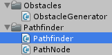

Create our pathfinder class

===

# Pathfinding

Let's create our pathes for our enemies. We are implementing a simple AStar algorithm for the pathfinding, but we don't go too deep into the topic. If you want to learn more about AStar and the Heap data structure, i recommend to watch [Sebastian Lague's tutorial](https://www.youtube.com/watch?v=-L-WgKMFuhE&target=_blank) before you move on.

What we need for a simple AStar
* a [Heap data structure](https://en.wikipedia.org/wiki/Heap_(data_structure)?target=_blank)
* a HeapItem interface
* a grid of PathNodes for every single tile
* a Pathfinder class

So let's start with the **Heap** class, create a new folder inside our Scripts folder and name it **Heap**, in there create a new C# script and call it **Heap**. We don't implement every function, which a heap normally has, we just need the ability to add items, to remove items, to swap items and to sort them up and down.

``` csharp
using UnityEngine;
using System.Collections;

public class Heap<T> where T : IHeapItem<T> {

    T[] items;

    int currentItemCount;

    public Heap(int _maxHeapSize) {
        items = new T[_maxHeapSize];
    }

    public void Add(T _item) {
        _item.HeapIndex = currentItemCount;

        items[currentItemCount] = _item;

        SortUp(_item);

        currentItemCount++;
    }

    public T RemoveFirstItem() {
        T _firstItem = items[0];

        currentItemCount--;

        items[0] = items[currentItemCount];
        items[0].HeapIndex = 0;

        SortDown(items[0]);

        return _firstItem;
    }

    public void UpdateItem(T _item) {
        SortUp(_item);
    }

    public int Count
    {
        get {
            return currentItemCount;
        }
    }

    public bool Contains(T _item) {
        return Equals(items[_item.HeapIndex], _item);
    }

    void SortDown(T _item) {
        while(true) {
            int _childIndexLeft = _item.HeapIndex * 2 + 1;
            int _childIndexRight = _item.HeapIndex * 2 + 2;

            int _swapIndex = 0;

            if(_childIndexLeft < currentItemCount) {
                _swapIndex = _childIndexLeft;

                if(_childIndexRight < currentItemCount) {
                    if(items[_childIndexLeft].CompareTo(items[_childIndexRight]) < 0) {
                        _swapIndex = _childIndexRight;
                    }
                }

                if(_item.CompareTo(items[_swapIndex]) < 0) {
                    Swap(_item, items[_swapIndex]);
                } else {
                    return;
                }
            } else {
                return;
            }
        }
    }

    void SortUp(T _item) {
        int _parentIndex = (_item.HeapIndex - 1) / 2;

        while(true) {
            T _parentItem = items[_parentIndex];

            if(_item.CompareTo(_parentItem) > 0) {
                Swap(_item, _parentItem);
            } else {
                break;
            }

            _parentIndex = (_item.HeapIndex - 1) / 2;
        }
    }

    void Swap(T _itemA, T _itemB) {
        items[_itemA.HeapIndex] = _itemB;
        items[_itemB.HeapIndex] = _itemA;

        int _itemAIndex = _itemA.HeapIndex;
        _itemA.HeapIndex = _itemB.HeapIndex;
        _itemB.HeapIndex = _itemAIndex;
    }

}
```

Next item on the list is the **IHeapItem** interface, we need it, to have the ability to compare multiple items with each other. Create a new C# inside our **Heap** folder and name it **IHeapItem**


``` csharp
using UnityEngine;
using System;
using System.Collections;

public interface IHeapItem<T> : IComparable<T> {

    int HeapIndex { get; set; }

}
```

With that done, we can start to create our **PathNode** class. So create a new folder inside our **Scripts** folder and name it **Pathfinder**. In there, create a new C# script with the name **PathNode**


The PathNode class implements our IHeapItem interface
``` csharp
using UnityEngine;
using System.Collections;

public class PathNode : IHeapItem<PathNode> {


    
}
```

First, we need to know, if the current node is walkable or not, and we need the position of the node.
``` csharp
    public bool walkable;
    public Vector3 position;

    public int x;
    public int z;
```

Since, we are using an AStar pathfinder, we need the gCost, the hCost and the fCost
``` csharp
    public int gCost;
    public int hCost;

    public int FCost {
        get { return gCost + hCost; }
    }
```

Then, we need to keep track of the current node parent of our heap
``` csharp
    public PathNode parent;
```

And we need to store the current HeapIndex
``` csharp
    int heapIndex;
    public int HeapIndex {
        get { return heapIndex; }
        set { heapIndex = value; }
    }
```

In the constructor, we just set the walkable and position value
``` csharp
    public PathNode(bool walkable, Vector3 position) {
        this.walkable = walkable;
        this.position = position;

        this.x = (int)this.position.x;
        this.z = (int)this.position.z;
    }
```

And, since we are implementing the IHeapItem, which extends the ICompare interface, we need to implement the CompareTo function
``` csharp
    public int CompareTo(PathNode node) {
        int compare = FCost.CompareTo(node.FCost);

        if(compare == 0) {
            compare = hCost.CompareTo(node.hCost);
        }

        return -compare;
    }
```

so, our complete PathNode class looks like this
``` csharp
using UnityEngine;
using System.Collections;

public class PathNode : IHeapItem<PathNode> {

    public bool walkable;
    public Vector3 position;

    public int x;
    public int z;

    public int gCost;
    public int hCost;

    public int FCost {
        get { return gCost + hCost; }
    }

    public PathNode parent;

    int heapIndex;
    public int HeapIndex {
        get { return heapIndex; }
        set { heapIndex = value; }
    }

    
    public PathNode(bool walkable, Vector3 position) {
        this.walkable = walkable;
        this.position = position;

        this.x = (int)this.position.x;
        this.z = (int)this.position.z;
    }

    public int CompareTo(PathNode node) {
        int compare = FCost.CompareTo(node.FCost);

        if(compare == 0) {
            compare = hCost.CompareTo(node.hCost);
        }

        return -compare;
    }

}
```

Now comes the actual Pathfinder class, create a new C# script in our Pathfinder folder and name it **Pathfinder**


We want only one instance of a Pathfinder in the scene, so we create a MonoSingleton
``` csharp
using UnityEngine;
using System.Collections;

public class Pathfinder : MonoSingleton<Pathfinder> {
    


}
```

We need the width and the depth of our PathNode grid and the grid itself.
``` csharp
    int width;
    int depth;

    PathNode[,] grid;
```

Then we need a public function, which generates the grid.
``` csharp
    public void GenerateGrid(ref Map map) {
        width = map.grid.GetLength(0);
        depth = map.grid.GetLength(1);

        grid = new PathNode[width, depth];

        for(int x = 0; x < width; x++) {
            for(int z = 0; z < depth; z++) {
                grid[x, z] = new PathNode(
                    map.grid[x,z].Type == MapCellType.WALKABLE, 
                    new Vector3(x, 0, z)
                );
            }
        }
    }
```

Now, we have a grid for our pathfinding method.
``` csharp
    public Vector3[] FindPath(Vector3 start, Vector3 end) {
        PathNode startNode = GetNodeFromPosition(start);
        PathNode endNode = GetNodeFromPosition(end);

        if(!FoundPath(startNode, endNode)) {
            return null;
        }
        
        return GetPath(startNode, endNode);
    }
```

Here are three new functions, GetNodeFromPosition, FoundPath and GetPath. The GetNodeFromPosition function, just returns the node from the grid with the actual position
``` csharp
    PathNode GetNodeFromPosition(Vector3 position) {
        int x = (int)position.x;
        int z = (int)position.z;

        return grid[x, z];
    }
```

The FoundPath function is our actual AStar function, here we are calculating the shortest path from the start node to the end node, and then we are returning true, if we found a path and false if there is no connection between the start and the end node.
``` csharp
    bool FoundPath(PathNode startNode, PathNode endNode) {
        if(startNode.walkable && endNode.walkable) {
            Heap<PathNode> openNodes = new Heap<PathNode>(width * depth);
            HashSet<PathNode> closedNodes = new HashSet<PathNode>();

            openNodes.Add(startNode);

            while(openNodes.Count > 0) {
                PathNode node = openNodes.RemoveFirstItem();

                closedNodes.Add(node);

                if(node == endNode) {
                    return true;
                }

                foreach(PathNode neighborNode in GetNeighborNodes(node)) {
                    if(!neighborNode.walkable || closedNodes.Contains(neighborNode)) {
                        continue;
                    }

                    int moveCost = node.gCost + GetNodeDistance(node, neighborNode);

                    if(moveCost < neighborNode.gCost || !openNodes.Contains(neighborNode)) {
                        neighborNode.gCost = moveCost;
                        neighborNode.hCost = GetNodeDistance(neighborNode, endNode);

                        neighborNode.parent = node;

                        if(!openNodes.Contains(neighborNode)) {
                            openNodes.Add(neighborNode);
                            openNodes.UpdateItem(neighborNode);
                        }
                    }
                }
            }
        }

        return false;
    }
```

For our FoundPath function, we need two more functions, the GetNeighborNodes function and the GetNodeDistance function. In the GetNeighborNodes function, we just get the top, right, bottom and left neighbor of the current node, since we don't want a diagonal check.
``` csharp
    List<PathNode> GetNeighborNodes(PathNode node) {
        List<PathNode> neighbors = new List<PathNode>();

        for(int x = -1; x <= 1; x++) {
            for(int z = -1; z <= 1; z++) {
                if(x == 0 && z == 0) {
                    continue;
                }

                if(x != 0 && z != 0) {
                    continue;
                }

                int cX = node.x + x;
                int cZ = node.z + z;

                if(cX >= 0 && cX < width && cZ >= 0 && cZ < depth) {
                    neighbors.Add(grid[cX, cZ]);
                }
            }
        }

        return neighbors;
    }
```

The GetNodeDistance function calculates the actual distance between two nodes
``` csharp
    int GetNodeDistance(PathNode nodeA, PathNode nodeB) {
        int deltaX = Mathf.Abs(nodeA.x - nodeB.x);
        int deltaZ = Mathf.Abs(nodeA.z - nodeB.z);

        if(deltaX > deltaZ) {
            return 14 * deltaZ + 10 * (deltaX - deltaZ);
        }

        return 14 * deltaX + 10 * (deltaZ - deltaX);
    }
```

Last, we need the GetPath function. Since the AStar stores the parent of a node from the heap, we can just loop through every node, till we reach the start node, and then we reverse the list and return the path array.
``` csharp
    Vector3[] GetPath(PathNode startNode, PathNode endNode) {
        List<Vector3> path = new List<Vector3>();

        PathNode node = endNode;

        while(node != startNode) {
            path.Add(node.position);
            node = node.parent;
        }

        path.Reverse();

        return path.ToArray();
    }
```

So, the tomplete Pathfinder class looks like this
``` csharp
using UnityEngine;
using System;
using System.Collections;
using System.Collections.Generic;

public class Pathfinder : MonoSingleton<Pathfinder> {

    int width;
    int depth;

    PathNode[,] grid;
    
    public void GenerateGrid(ref Map map) {
        width = map.grid.GetLength(0);
        depth = map.grid.GetLength(1);

        grid = new PathNode[width, depth];

        for(int x = 0; x < width; x++) {
            for(int z = 0; z < depth; z++) {
                grid[x, z] = new PathNode(
                    map.grid[x,z].Type == MapCellType.WALKABLE, 
                    new Vector3(x, 0, z)
                );
            }
        }
    }

    public Vector3[] FindPath(Vector3 start, Vector3 end) {
        PathNode startNode = GetNodeFromPosition(start);
        PathNode endNode = GetNodeFromPosition(end);

        if(!FoundPath(startNode, endNode)) {
            return null;
        }
        
        return GetPath(startNode, endNode);
    }

    PathNode GetNodeFromPosition(Vector3 position) {
        int x = (int)position.x;
        int z = (int)position.z;

        return grid[x, z];
    }

    Vector3[] GetPath(PathNode startNode, PathNode endNode) {
        List<Vector3> path = new List<Vector3>();

        PathNode node = endNode;

        while(node != startNode) {
            path.Add(node.position);
            node = node.parent;
        }

        path.Reverse();

        return path.ToArray();
    }

    bool FoundPath(PathNode startNode, PathNode endNode) {
        if(startNode.walkable && endNode.walkable) {
            Heap<PathNode> openNodes = new Heap<PathNode>(width * depth);
            HashSet<PathNode> closedNodes = new HashSet<PathNode>();

            openNodes.Add(startNode);

            while(openNodes.Count > 0) {
                PathNode node = openNodes.RemoveFirstItem();

                closedNodes.Add(node);

                if(node == endNode) {
                    return true;
                }

                foreach(PathNode neighborNode in GetNeighborNodes(node)) {
                    if(!neighborNode.walkable || closedNodes.Contains(neighborNode)) {
                        continue;
                    }

                    int moveCost = node.gCost + GetNodeDistance(node, neighborNode);

                    if(moveCost < neighborNode.gCost || !openNodes.Contains(neighborNode)) {
                        neighborNode.gCost = moveCost;
                        neighborNode.hCost = GetNodeDistance(neighborNode, endNode);

                        neighborNode.parent = node;

                        if(!openNodes.Contains(neighborNode)) {
                            openNodes.Add(neighborNode);
                            openNodes.UpdateItem(neighborNode);
                        }
                    }
                }
            }
        }

        return false;
    }

    List<PathNode> GetNeighborNodes(PathNode node) {
        List<PathNode> neighbors = new List<PathNode>();

        for(int x = -1; x <= 1; x++) {
            for(int z = -1; z <= 1; z++) {
                if(x == 0 && z == 0) {
                    continue;
                }

                if(x != 0 && z != 0) {
                    continue;
                }

                int cX = node.x + x;
                int cZ = node.z + z;

                if(cX >= 0 && cX < width && cZ >= 0 && cZ < depth) {
                    neighbors.Add(grid[cX, cZ]);
                }
            }
        }

        return neighbors;
    }

    int GetNodeDistance(PathNode nodeA, PathNode nodeB) {
        int deltaX = Mathf.Abs(nodeA.x - nodeB.x);
        int deltaZ = Mathf.Abs(nodeA.z - nodeB.z);

        if(deltaX > deltaZ) {
            return 14 * deltaZ + 10 * (deltaX - deltaZ);
        }

        return 14 * deltaX + 10 * (deltaZ - deltaX);
    }
}
```

Now, we have a running pathfinder, and we can start to build our enemy lanes.