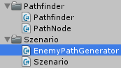
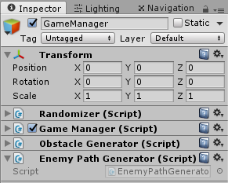
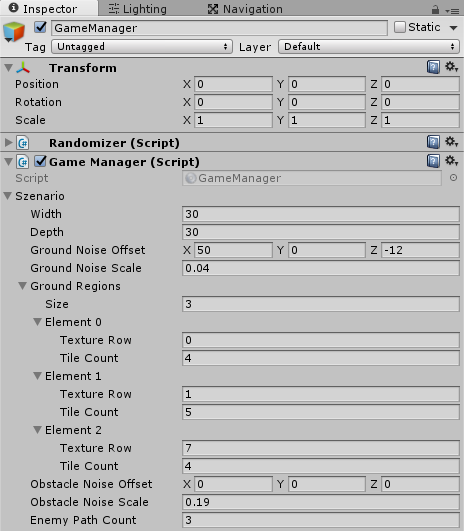
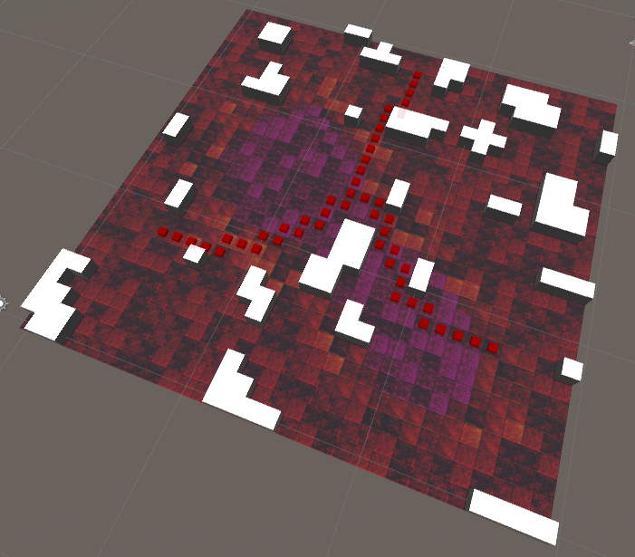

Create the pathes for the enemies

===

# Enemy pathes

Let's create our enemy pathes. Create a new C# script called **EnemyPathGenerator** in our Szenario folder, and add this script to our **GameManager** GameObject.



In our Szenario class, we need to add one more property, the enemy path count.
``` csharp
    public int enemyPathCount;
```

There are many ways, how to randomly start pathes to a certain point. I chose an approach, which sets the starting points on a circle from the map center. Our EnemyPathGenerator class is a MonoSingleton, which stores the enemy path count, the circle radius for our starting points, the target position and a list of starting points, it also gets a reference of our Map object, and for now, it has a public function GenerateEnemyPathes, which sets the properties and starts to create the start points.
``` csharp
using UnityEngine;
using System.Collections;
using System.Collections.Generic;

public class EnemyPathGenerator : MonoSingleton<EnemyPathGenerator> {

    int enemyPathCount;
    int circleRadius;

    Vector3 targetPosition;

    List<Vector3> startPoints;

    public void GenerateEnemyPathes(int enemyPathCount, int circleRadius, Vector3 targetPosition, ref Map map) {
        startPoints = new List<Vector3>();

        this.enemyPathCount = enemyPathCount;
        this.circleRadius = circleRadius;

        this.targetPosition = targetPosition;

        for(int i = 0; i < this.enemyPathCount; i++) {
            CreateStartPoint(i, ref map);
        }
    }

}
```

Next, we need a function, which calculates the circular positions for us.
``` csharp
    Vector3 GetCirclePosition(Vector3 center, float radius, int currentPoint, int totalPoints) {
        float index = (float)currentPoint / (float)totalPoints;

        float angle = index * Mathf.PI * 2f;

        float x = Mathf.Sin(angle) * radius;
        float z = Mathf.Cos(angle) * radius;

        return new Vector3(x, 0, z) + center;
    }
```

Our CreateStartPoint function gets the current index of the starting point and the reference of our map. It fetches the circular position and cleans out the obstacles around this point, and then it adds this point to the starting point list.
``` csharp
    void CreateStartPoint(int index, ref Map map) {
        Vector3 startPoint = GetCirclePosition(targetPosition, circleRadius, index, enemyPathCount);
        int x = (int)startPoint.x;
        int z = (int)startPoint.z;

        // cleaning map from obstacles around the start point
        for(int _x = -1; _x <= 1; _x++) {
            for(int _z = -1; _z <= 1; _z++) {
                if(x + _x >= 0 && x + _x <= map.grid.GetLength(0) && z + _z >= 0 && z + _z < map.grid.GetLength(1)) {
                    map.grid[x + _x, z + _z].Type = MapCellType.WALKABLE;
                }
            }
        }

        startPoint.x = x;
        startPoint.z = z;

        startPoints.Add(startPoint);
    }
```

For our pathes, we create a new list of Vector3 arrays
``` csharp
    List<Vector3[]> enemyPathList;
```

Then, we need the function, which creates us the pathes
``` csharp
    void CreatePathes(ref Map map) {
        enemyPathList = new List<Vector3[]>();

        for(int i = 0; i < startPoints.Count; i++) {
            enemyPathList.Add(Pathfinder.Instance.FindPath(startPoints[i], targetPosition));
        }
    }
```

With that done, we can move on to the GameManager script, we have to generate the pathfinder grid first, then we can create the enemy pathes, so we need to change the Start function of the GameManager class
``` csharp
    public void Start() {
        map = new Map(szenario.width, szenario.depth);

        Ground.Instance.Generate(
            szenario.width,
            szenario.depth,
            szenario.groundNoiseOffset,
            szenario.groundNoiseScale,
            szenario.groundRegions
        );

        ObstacleGenerator.Instance.GenerateObstacleMap(
            ref map, 
            szenario.obstacleNoiseOffset, 
            szenario.obstacleNoiseScale
        );

        Pathfinder.Instance.GenerateGrid(ref map);

        EnemyPathGenerator.Instance.GenerateEnemyPathes(
            szenario.enemyPathCount, 
            (szenario.width > szenario.depth ? szenario.width : szenario.depth) / 2 - 2, 
            new Vector3(szenario.width / 2, 0, szenario.depth / 2), 
            ref map
        );

        ObstacleGenerator.Instance.GenerateObstacles(ref map);
    }
```

Back in Unity, we need to set the enemyPathCount value in the GameManager's szenario object, i set it to 3


Now, we can visualize the generated pathes with gizmos. So back in the EnemyPathGenerator class, we need a new function **OnDrawGizmos** which is a Unity built in function from the MonoBehaviour. We are looping through every path and draw a red cube.
``` csharp
    void OnDrawGizmos() {
        if(enemyPathList == null || enemyPathList.Count == 0) {
            return;
        }

        Gizmos.color = Color.red;

        for(int i = 0; i < enemyPathList.Count; i++) {
            for(int j = 0; j < enemyPathList[i].Length; j++) {
                Gizmos.DrawCube(enemyPathList[i][j], Vector3.one * 0.5f);
            }
        }
    }
```

If you hit play now, you should see something like that


So, our complete EnemyPathGenerator class looks like this
``` csharp
using UnityEngine;
using System.Collections;
using System.Collections.Generic;

public class EnemyPathGenerator : MonoSingleton<EnemyPathGenerator> {

    int enemyPathCount;
    int circleRadius;

    Vector3 targetPosition;

    List<Vector3> startPoints;
    List<Vector3[]> enemyPathList;

    public void GenerateEnemyPathes(int enemyPathCount, int circleRadius, Vector3 targetPosition, ref Map map) {
        startPoints = new List<Vector3>();

        this.enemyPathCount = enemyPathCount;
        this.circleRadius = circleRadius;

        this.targetPosition = targetPosition;

        for(int i = 0; i < this.enemyPathCount; i++) {
            CreateStartPoint(i, ref map);
        }

        CreatePathes(ref map);
    }

    void CreateStartPoint(int index, ref Map map) {
        Vector3 startPoint = GetCirclePosition(targetPosition, circleRadius, index, enemyPathCount);
        int x = (int)startPoint.x;
        int z = (int)startPoint.z;

        // cleaning map from obstacles around the start point
        for(int _x = -1; _x <= 1; _x++) {
            for(int _z = -1; _z <= 1; _z++) {
                if(x + _x >= 0 && x + _x <= map.grid.GetLength(0) && z + _z >= 0 && z + _z < map.grid.GetLength(1)) {
                    map.grid[x + _x, z + _z].Type = MapCellType.WALKABLE;
                }
            }
        }

        startPoint.x = x;
        startPoint.z = z;

        startPoints.Add(startPoint);
    }

    void CreatePathes(ref Map map) {
        enemyPathList = new List<Vector3[]>();

        for(int i = 0; i < startPoints.Count; i++) {
            enemyPathList.Add(Pathfinder.Instance.FindPath(startPoints[i], targetPosition));
        }
    }

    void OnDrawGizmos() {
        if(enemyPathList == null || enemyPathList.Count == 0) {
            return;
        }

        Gizmos.color = Color.red;

        for(int i = 0; i < enemyPathList.Count; i++) {
            for(int j = 0; j < enemyPathList[i].Length; j++) {
                Gizmos.DrawCube(enemyPathList[i][j], Vector3.one * 0.5f);
            }
        }
    }

    Vector3 GetCirclePosition(Vector3 center, float radius, int currentPoint, int totalPoints) {
        float index = (float)currentPoint / (float)totalPoints;

        float angle = index * Mathf.PI * 2f;

        float x = Mathf.Sin(angle) * radius;
        float z = Mathf.Cos(angle) * radius;

        return new Vector3(x, 0, z) + center;
    }

}
```

Next time, we will draw the enemy pathes.