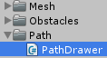

Draw the enemy pathes

===

# Path mesh

Before we start to create the **PathDrawer** class, we need a few other things. Like a **Material** for the path. So let's create a new material in our Materials folder and name it **Path**.


I chose a lighter orange for my path material.


Now we need a new empty GameObject in our scene


We need to set the position to Vector3(0.5f, 0.01f, 0.5f), the 0.01f in y, because if it were 0, we would have overlapping artefacts, so it's like a layer above the ground.


Now, we can start to create our **PathDrawer** class, so create a new folder in our Scripts folder with the name **Path** and inside create a new C# script called **PathDrawer**


Our PathDrawer is a MonoSingleton
``` csharp
using UnityEngine;
using System.Collections;

public class PathDrawer : MonoSingleton<PathDrawer> {


}
```

It stores the width and the depth of the map, the map itself and the meshdata for our mesh, it also sets the path border, so how many units it will be smaller than 1 unit (in my case, i chose 0.3f, so the path will be 0.4 units thick)
``` csharp
    int width;
    int depth;

    Map map;

    MeshData meshData;

    float pathBorder = 0.3f;
```

Next, we need a public function which draws the pathes from the map. It sets the map property, the width and the depth, initializes a new meshdata object and loops through every MapCell. If the current MapCell is of type PATH, it will draw the path, after checking its neighbors. The last thing, this function does, is to get the MeshFilter component and set its mesh from the meshData object.
``` csharp
    public void DrawPathes(ref Map map) {
        this.map = map;

        width = map.grid.GetLength(0);
        depth = map.grid.GetLength(1);

        meshData = new MeshData();

        for(int x = 0; x < width; x++) {
            for(int z = 0; z < depth; z++) {
                if(map.grid[x, z].Type == MapCellType.PATH) {
                    DrawPath(x, z, GetNeighbors(x, z));
                }
            }
        }

        GetComponent<MeshFilter>().mesh = meshData.GetMesh();
    }
```

Before we check the neighbors, we need another class called **PathNeighbors**, so create a new C# script in our **Path** folder.


All this class does, is to store the four possible neighbor bools.
```csharp
public class PathNeighbors {

    public bool left;
    public bool top;
    public bool right;
    public bool bottom;

} 
```

Back in our **PathDrawer** class, we can now get our neighbors. At first, we initialize a new PathNeighbors object, then we check every neighbor cell, if this neighbor is a PATH cell. then we return the PathNeighbors object.
``` csharp
    PathNeighbors GetNeighbors(int x, int z) {
        PathNeighbors neighbors = new PathNeighbors();

        neighbors.left = x - 1 < 0 ? false : map.grid[x - 1, z].Type == MapCellType.PATH; // left
        neighbors.top = z + 1 >= depth ? false : map.grid[x, z + 1].Type == MapCellType.PATH; // top
        neighbors.right = x + 1 >= width ? false : map.grid[x + 1, z].Type == MapCellType.PATH; // right
        neighbors.bottom = z - 1 < 0 ? false : map.grid[x, z - 1].Type == MapCellType.PATH; // bottom

        return neighbors;
    }
```

Now we can start to draw our pathes. We have 11 possibilities in our map.


So in our **DrawPath** function, we need to match these variations.
``` csharp
    void DrawPath(int x, int z, PathNeighbors neighbors) {
        if((neighbors.left || neighbors.right) && !neighbors.top && !neighbors.bottom) { // horizontal
            
        }

        if((neighbors.top || neighbors.bottom) && !neighbors.left && !neighbors.right) { // vertical
            
        }

        if(neighbors.top && neighbors.left && !neighbors.right && !neighbors.bottom) { // up left
            
        }

        if(neighbors.top && neighbors.right && !neighbors.left && !neighbors.bottom) { // up right
            
        }

        if(neighbors.bottom && neighbors.left && !neighbors.right && !neighbors.top) { // down left
            
        }

        if(neighbors.bottom && neighbors.right && !neighbors.left && !neighbors.top) { // down right
            
        }

        if(neighbors.left && neighbors.top && neighbors.right && neighbors.bottom) { // full cross
            
        }

        if(neighbors.left && neighbors.right && neighbors.top && !neighbors.bottom) { // horizontal cross up
            
        }

        if(neighbors.left && neighbors.right && neighbors.bottom && !neighbors.top) { // horizontal cross down
            
        }

        if(neighbors.top && neighbors.bottom && neighbors.left && !neighbors.right) { // vertical cross left
            
        }

        if(neighbors.top && neighbors.bottom && neighbors.right && !neighbors.left) { // vertical cross right
            
        }
    }
```

Now, we can draw our mesh for each different path tile, we just draw quads for now.

``` csharp
    void DrawPath(int x, int z, PathNeighbors neighbors) {
        if((neighbors.left || neighbors.right) && !neighbors.top && !neighbors.bottom) { // horizontal
            meshData.DrawQuad(
                new Vector3(x - 1, 0, z - pathBorder),
                new Vector3(x, 0, z - pathBorder),
                new Vector3(x, 0, z - 1 + pathBorder),
                new Vector3(x - 1, 0, z - 1 + pathBorder)
            );

            return;
        }

        if((neighbors.top || neighbors.bottom) && !neighbors.left && !neighbors.right) { // vertical
            meshData.DrawQuad(
                new Vector3(x - 1 + pathBorder, 0, z),
                new Vector3(x - pathBorder, 0, z),
                new Vector3(x - pathBorder, 0, z - 1),
                new Vector3(x - 1 + pathBorder, 0, z - 1)
            );

            return;
        }

        if(neighbors.top && neighbors.left && !neighbors.right && !neighbors.bottom) { // up left
            meshData.DrawQuad(
                new Vector3(x - 1 + pathBorder, 0, z),
                new Vector3(x - pathBorder, 0, z),
                new Vector3(x - pathBorder, 0, z - 1 + pathBorder),
                new Vector3(x - 1 + pathBorder, 0, z - 1 + pathBorder)
            );

            meshData.DrawQuad(
                new Vector3(x - 1, 0, z - pathBorder),
                new Vector3(x - 1 + pathBorder, 0, z - pathBorder),
                new Vector3(x - 1 + pathBorder, 0, z - 1 + pathBorder),
                new Vector3(x - 1, 0, z - 1 + pathBorder)
            );

            return;
        }

        if(neighbors.top && neighbors.right && !neighbors.left && !neighbors.bottom) { // up right
            meshData.DrawQuad(
                new Vector3(x - 1 + pathBorder, 0, z),
                new Vector3(x - pathBorder, 0, z),
                new Vector3(x - pathBorder, 0, z - 1 + pathBorder),
                new Vector3(x - 1 + pathBorder, 0, z - 1 + pathBorder)
            );

            meshData.DrawQuad(
                new Vector3(x - pathBorder, 0, z - pathBorder),
                new Vector3(x, 0, z - pathBorder),
                new Vector3(x, 0, z - 1 + pathBorder),
                new Vector3(x - pathBorder, 0, z - 1 + pathBorder)
            );

            return;
        }

        if(neighbors.bottom && neighbors.left && !neighbors.right && !neighbors.top) { // down left
            meshData.DrawQuad(
                new Vector3(x - 1 + pathBorder, 0, z - pathBorder),
                new Vector3(x - pathBorder, 0, z - pathBorder),
                new Vector3(x - pathBorder, 0, z - 1),
                new Vector3(x - 1 + pathBorder, 0, z - 1)
            );

            meshData.DrawQuad(
                new Vector3(x - 1, 0, z - pathBorder),
                new Vector3(x - 1 + pathBorder, 0, z - pathBorder),
                new Vector3(x - 1 + pathBorder, 0, z - 1 + pathBorder),
                new Vector3(x - 1, 0, z - 1 + pathBorder)
            );

            return;
        }

        if(neighbors.bottom && neighbors.right && !neighbors.left && !neighbors.top) { // down right
            meshData.DrawQuad(
                new Vector3(x - 1 + pathBorder, 0, z - pathBorder),
                new Vector3(x - pathBorder, 0, z - pathBorder),
                new Vector3(x - pathBorder, 0, z - 1),
                new Vector3(x - 1 + pathBorder, 0, z - 1)
            );

            meshData.DrawQuad(
                new Vector3(x - pathBorder, 0, z - pathBorder),
                new Vector3(x, 0, z - pathBorder),
                new Vector3(x, 0, z - 1 + pathBorder),
                new Vector3(x - pathBorder, 0, z - 1 + pathBorder)
            );

            return;
        }

        if(neighbors.left && neighbors.top && neighbors.right && neighbors.bottom) { // full cross
            meshData.DrawQuad(
                new Vector3(x - 1 + pathBorder, 0, z),
                new Vector3(x - pathBorder, 0, z),
                new Vector3(x - pathBorder, 0, z - 1),
                new Vector3(x - 1 + pathBorder, 0, z - 1)
            );

            meshData.DrawQuad(
                new Vector3(x - pathBorder, 0, z - pathBorder),
                new Vector3(x, 0, z - pathBorder),
                new Vector3(x, 0, z - 1 + pathBorder),
                new Vector3(x - pathBorder, 0, z - 1 + pathBorder)
            );

            meshData.DrawQuad(
                new Vector3(x - 1, 0, z - pathBorder),
                new Vector3(x - 1 + pathBorder, 0, z - pathBorder),
                new Vector3(x - 1 + pathBorder, 0, z - 1 + pathBorder),
                new Vector3(x - 1, 0, z - 1 + pathBorder)
            );

            return;
        }

        if(neighbors.left && neighbors.right && neighbors.top && !neighbors.bottom) { // horizontal cross up
            meshData.DrawQuad(
                new Vector3(x - 1, 0, z - pathBorder),
                new Vector3(x, 0, z - pathBorder),
                new Vector3(x, 0, z - 1 + pathBorder),
                new Vector3(x - 1, 0, z - 1 + pathBorder)
            );

            meshData.DrawQuad(
                new Vector3(x - 1 + pathBorder, 0, z),
                new Vector3(x - pathBorder, 0, z),
                new Vector3(x - pathBorder, 0, z - pathBorder),
                new Vector3(x - 1 + pathBorder, 0, z - pathBorder)
            );

            return;
        }

        if(neighbors.left && neighbors.right && neighbors.bottom && !neighbors.top) { // horizontal cross down
            meshData.DrawQuad(
                new Vector3(x - 1, 0, z - pathBorder),
                new Vector3(x, 0, z - pathBorder),
                new Vector3(x, 0, z - 1 + pathBorder),
                new Vector3(x - 1, 0, z - 1 + pathBorder)
            );

            meshData.DrawQuad(
                new Vector3(x - 1 + pathBorder, 0, z - 1 + pathBorder),
                new Vector3(x - pathBorder, 0, z - 1 + pathBorder),
                new Vector3(x - pathBorder, 0, z - 1),
                new Vector3(x - 1 + pathBorder, 0, z - 1)
            );

            return;
        }

        if(neighbors.top && neighbors.bottom && neighbors.left && !neighbors.right) { // vertical cross left
            meshData.DrawQuad(
                new Vector3(x - 1 + pathBorder, 0, z),
                new Vector3(x - pathBorder, 0, z),
                new Vector3(x - pathBorder, 0, z - 1),
                new Vector3(x - 1 + pathBorder, 0, z - 1)
            );

            meshData.DrawQuad(
                new Vector3(x - 1, 0, z - pathBorder),
                new Vector3(x - 1 + pathBorder, 0, z - pathBorder),
                new Vector3(x - 1 + pathBorder, 0, z - 1 + pathBorder),
                new Vector3(x - 1, 0, z - 1 + pathBorder)
            );

            return;
        }

        if(neighbors.top && neighbors.bottom && neighbors.right && !neighbors.left) { // vertical cross right
            meshData.DrawQuad(
                new Vector3(x - 1 + pathBorder, 0, z),
                new Vector3(x - pathBorder, 0, z),
                new Vector3(x - pathBorder, 0, z - 1),
                new Vector3(x - 1 + pathBorder, 0, z - 1)
            );

            meshData.DrawQuad(
                new Vector3(x - pathBorder, 0, z - pathBorder),
                new Vector3(x, 0, z - pathBorder),
                new Vector3(x, 0, z - 1 + pathBorder),
                new Vector3(x - pathBorder, 0, z - 1 + pathBorder)
            );

            return;
        }
    }
```

That was the whole magic to draw pathes with crossings :) keep in mind, that this isn't the most optimized version, we will come back to it later maybe. So the complete code for our **PathDrawer** class looks like this
``` csharp
using UnityEngine;
using System.Collections;

public class PathDrawer : MonoSingleton<PathDrawer> {

    int width;
    int depth;
    
    Map map;

    MeshData meshData;

    float pathBorder = 0.3f;

    public void DrawPathes(ref Map map) {
        this.map = map;

        width = map.grid.GetLength(0);
        depth = map.grid.GetLength(1);

        meshData = new MeshData();

        for(int x = 0; x < width; x++) {
            for(int z = 0; z < depth; z++) {
                if(map.grid[x, z].Type == MapCellType.PATH) {
                    DrawPath(x, z, GetNeighbors(x, z));
                }
            }
        }

        GetComponent<MeshFilter>().mesh = meshData.GetMesh();
    }

    void DrawPath(int x, int z, PathNeighbors neighbors) {
        if((neighbors.left || neighbors.right) && !neighbors.top && !neighbors.bottom) { // horizontal
            meshData.DrawQuad(
                new Vector3(x - 1, 0, z - pathBorder),
                new Vector3(x, 0, z - pathBorder),
                new Vector3(x, 0, z - 1 + pathBorder),
                new Vector3(x - 1, 0, z - 1 + pathBorder)
            );

            return;
        }

        if((neighbors.top || neighbors.bottom) && !neighbors.left && !neighbors.right) { // vertical
            meshData.DrawQuad(
                new Vector3(x - 1 + pathBorder, 0, z),
                new Vector3(x - pathBorder, 0, z),
                new Vector3(x - pathBorder, 0, z - 1),
                new Vector3(x - 1 + pathBorder, 0, z - 1)
            );

            return;
        }

        if(neighbors.top && neighbors.left && !neighbors.right && !neighbors.bottom) { // up left
            meshData.DrawQuad(
                new Vector3(x - 1 + pathBorder, 0, z),
                new Vector3(x - pathBorder, 0, z),
                new Vector3(x - pathBorder, 0, z - 1 + pathBorder),
                new Vector3(x - 1 + pathBorder, 0, z - 1 + pathBorder)
            );

            meshData.DrawQuad(
                new Vector3(x - 1, 0, z - pathBorder),
                new Vector3(x - 1 + pathBorder, 0, z - pathBorder),
                new Vector3(x - 1 + pathBorder, 0, z - 1 + pathBorder),
                new Vector3(x - 1, 0, z - 1 + pathBorder)
            );

            return;
        }

        if(neighbors.top && neighbors.right && !neighbors.left && !neighbors.bottom) { // up right
            meshData.DrawQuad(
                new Vector3(x - 1 + pathBorder, 0, z),
                new Vector3(x - pathBorder, 0, z),
                new Vector3(x - pathBorder, 0, z - 1 + pathBorder),
                new Vector3(x - 1 + pathBorder, 0, z - 1 + pathBorder)
            );

            meshData.DrawQuad(
                new Vector3(x - pathBorder, 0, z - pathBorder),
                new Vector3(x, 0, z - pathBorder),
                new Vector3(x, 0, z - 1 + pathBorder),
                new Vector3(x - pathBorder, 0, z - 1 + pathBorder)
            );

            return;
        }

        if(neighbors.bottom && neighbors.left && !neighbors.right && !neighbors.top) { // down left
            meshData.DrawQuad(
                new Vector3(x - 1 + pathBorder, 0, z - pathBorder),
                new Vector3(x - pathBorder, 0, z - pathBorder),
                new Vector3(x - pathBorder, 0, z - 1),
                new Vector3(x - 1 + pathBorder, 0, z - 1)
            );

            meshData.DrawQuad(
                new Vector3(x - 1, 0, z - pathBorder),
                new Vector3(x - 1 + pathBorder, 0, z - pathBorder),
                new Vector3(x - 1 + pathBorder, 0, z - 1 + pathBorder),
                new Vector3(x - 1, 0, z - 1 + pathBorder)
            );

            return;
        }

        if(neighbors.bottom && neighbors.right && !neighbors.left && !neighbors.top) { // down right
            meshData.DrawQuad(
                new Vector3(x - 1 + pathBorder, 0, z - pathBorder),
                new Vector3(x - pathBorder, 0, z - pathBorder),
                new Vector3(x - pathBorder, 0, z - 1),
                new Vector3(x - 1 + pathBorder, 0, z - 1)
            );

            meshData.DrawQuad(
                new Vector3(x - pathBorder, 0, z - pathBorder),
                new Vector3(x, 0, z - pathBorder),
                new Vector3(x, 0, z - 1 + pathBorder),
                new Vector3(x - pathBorder, 0, z - 1 + pathBorder)
            );

            return;
        }

        if(neighbors.left && neighbors.top && neighbors.right && neighbors.bottom) { // full cross
            meshData.DrawQuad(
                new Vector3(x - 1 + pathBorder, 0, z),
                new Vector3(x - pathBorder, 0, z),
                new Vector3(x - pathBorder, 0, z - 1),
                new Vector3(x - 1 + pathBorder, 0, z - 1)
            );

            meshData.DrawQuad(
                new Vector3(x - pathBorder, 0, z - pathBorder),
                new Vector3(x, 0, z - pathBorder),
                new Vector3(x, 0, z - 1 + pathBorder),
                new Vector3(x - pathBorder, 0, z - 1 + pathBorder)
            );

            meshData.DrawQuad(
                new Vector3(x - 1, 0, z - pathBorder),
                new Vector3(x - 1 + pathBorder, 0, z - pathBorder),
                new Vector3(x - 1 + pathBorder, 0, z - 1 + pathBorder),
                new Vector3(x - 1, 0, z - 1 + pathBorder)
            );

            return;
        }

        if(neighbors.left && neighbors.right && neighbors.top && !neighbors.bottom) { // horizontal cross up
            meshData.DrawQuad(
                new Vector3(x - 1, 0, z - pathBorder),
                new Vector3(x, 0, z - pathBorder),
                new Vector3(x, 0, z - 1 + pathBorder),
                new Vector3(x - 1, 0, z - 1 + pathBorder)
            );

            meshData.DrawQuad(
                new Vector3(x - 1 + pathBorder, 0, z),
                new Vector3(x - pathBorder, 0, z),
                new Vector3(x - pathBorder, 0, z - pathBorder),
                new Vector3(x - 1 + pathBorder, 0, z - pathBorder)
            );

            return;
        }

        if(neighbors.left && neighbors.right && neighbors.bottom && !neighbors.top) { // horizontal cross down
            meshData.DrawQuad(
                new Vector3(x - 1, 0, z - pathBorder),
                new Vector3(x, 0, z - pathBorder),
                new Vector3(x, 0, z - 1 + pathBorder),
                new Vector3(x - 1, 0, z - 1 + pathBorder)
            );

            meshData.DrawQuad(
                new Vector3(x - 1 + pathBorder, 0, z - 1 + pathBorder),
                new Vector3(x - pathBorder, 0, z - 1 + pathBorder),
                new Vector3(x - pathBorder, 0, z - 1),
                new Vector3(x - 1 + pathBorder, 0, z - 1)
            );

            return;
        }

        if(neighbors.top && neighbors.bottom && neighbors.left && !neighbors.right) { // vertical cross left
            meshData.DrawQuad(
                new Vector3(x - 1 + pathBorder, 0, z),
                new Vector3(x - pathBorder, 0, z),
                new Vector3(x - pathBorder, 0, z - 1),
                new Vector3(x - 1 + pathBorder, 0, z - 1)
            );

            meshData.DrawQuad(
                new Vector3(x - 1, 0, z - pathBorder),
                new Vector3(x - 1 + pathBorder, 0, z - pathBorder),
                new Vector3(x - 1 + pathBorder, 0, z - 1 + pathBorder),
                new Vector3(x - 1, 0, z - 1 + pathBorder)
            );

            return;
        }

        if(neighbors.top && neighbors.bottom && neighbors.right && !neighbors.left) { // vertical cross right
            meshData.DrawQuad(
                new Vector3(x - 1 + pathBorder, 0, z),
                new Vector3(x - pathBorder, 0, z),
                new Vector3(x - pathBorder, 0, z - 1),
                new Vector3(x - 1 + pathBorder, 0, z - 1)
            );

            meshData.DrawQuad(
                new Vector3(x - pathBorder, 0, z - pathBorder),
                new Vector3(x, 0, z - pathBorder),
                new Vector3(x, 0, z - 1 + pathBorder),
                new Vector3(x - pathBorder, 0, z - 1 + pathBorder)
            );

            return;
        }
    }

    PathNeighbors GetNeighbors(int x, int z) {
        PathNeighbors neighbors = new PathNeighbors();

        neighbors.left = x - 1 < 0 ? false : map.grid[x - 1, z].Type == MapCellType.PATH; // left
        neighbors.top = z + 1 >= depth ? false : map.grid[x, z + 1].Type == MapCellType.PATH; // top
        neighbors.right = x + 1 >= width ? false : map.grid[x + 1, z].Type == MapCellType.PATH; // right
        neighbors.bottom = z - 1 < 0 ? false : map.grid[x, z - 1].Type == MapCellType.PATH; // bottom

        return neighbors;
    }

}

```

Back in Unity, we need to add a few things to our **Path** GameObject. At first, we need to add our PathDrawer class. Then we need a MeshFilter component on it, a MeshRenderer component and our Path Material.


We also need to change our **GameManager**'s **Start** function a little bit, we don't generate our PathFinder grid in the game manager any more and we need to start the PathDrawer's DrawPathes function.

``` csharp
    public void Start() {
        map = new Map(szenario.width, szenario.depth);

        Ground.Instance.Generate(
            szenario.width,
            szenario.depth,
            szenario.groundNoiseOffset,
            szenario.groundNoiseScale,
            szenario.groundRegions
        );

        ObstacleGenerator.Instance.GenerateObstacleMap(
            ref map, 
            szenario.obstacleNoiseOffset, 
            szenario.obstacleNoiseScale
        );

        EnemyPathGenerator.Instance.GenerateEnemyPathes(
            szenario.enemyPathCount, 
            (szenario.width > szenario.depth ? szenario.width : szenario.depth) / 2 - 2, 
            new Vector3(szenario.width / 2, 0, szenario.depth / 2), 
            ref map
        );

        PathDrawer.Instance.DrawPathes(ref map);

        ObstacleGenerator.Instance.GenerateObstacles(ref map);
    }
```

Last, we need to change our **EnemyPathGenerator** script a little bit. The **GenerateEnemyPath** class will now generate the Pathfinder's grid, because, we should do that after we cleaned out the obstacles from our starting points.
```csharp
    public void GenerateEnemyPathes(int enemyPathCount, int circleRadius, Vector3 targetPosition, ref Map map) {
        startPoints = new List<Vector3>();

        this.enemyPathCount = enemyPathCount;
        this.circleRadius = circleRadius;

        this.targetPosition = targetPosition;

        for(int i = 0; i < this.enemyPathCount; i++) {
            CreateStartPoint(i, ref map);
        }

        Pathfinder.Instance.GenerateGrid(ref map);

        CreatePathes(ref map);
    }
```

If you hit play now in Unity, you should see something like this


Now, we are ready to create some action :) Next step will be our enemies.