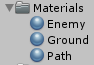
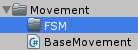

Prepare the enemy movement

===

# Enemy movement with a finite state machine

At first, we need to create our enemy prefab, so lets create a new empty game object in the scene and call it **Enemy**, and in there create a new capsule game object and rename it to **Graphics**. 


Then create a new Material and call it **Enemy**.


Select the **Graphics** game object, and add the material to it. Then set the position to Vector3(0, 1f, 0) and delete the capsulecollider component


Then drag the **Enemy** game object to our **Prefabs** folder and delete the object from the scene.


An enemy can do two things, it can move and it can take (and maybe make) damage, so we need two classes for it, a Move class and a Combat class. Since we want to create a movement and combat system, which works for AI units and for the player unit, we make base move classes and then we extend that classes with our AI or player logic. So lets create our BaseMovement class first, so create a new folder **Movement** in our Scripts folder and in there create a new C# script and call it **BaseMovement**


The **BaseMovement** class is an abstract MonoBehaviour
``` csharp
using UnityEngine;
using System.Collections;

public abstract class BaseMovement : MonoBehaviour {
    


}
```

We are using the **CharacterController** component to move our enemies
``` csharp
    protected CharacterController controller;
```

Our enemy can move, fall, turn and maybe jump, so we need a few properties:
* Speed - how fast is our unit moving
* Gravity - the down force for our unit
* JumpForce - the jump force for our unit
* VerticalVelocity - the current gravity velocity
* TerminalVelocity - the maximum jump and gravity velocity

``` csharp
    protected float baseSpeed = 5f;
    float baseGravity = 25f;
    float baseJumpForce = 7f;
    float terminalVelocity = 30f;

    public float Speed { get { return baseSpeed; } }
    public float Gravity { get { return baseGravity; } }
    public float JumpForce { get { return baseJumpForce; } }
    public float TerminalVelocity { get { return terminalVelocity; } }
    public float VerticalVelocity { get; set; }

    public Vector3 MoveVector { get; set; }
    public Quaternion RotationQuaternion { get; set; }
```

We are using RayCasts for our ground distance detection, so we need to set that properties as well. We are using 5 rays (the four bottom corners of our enemy and the bottom middle of the enemy). The rayDistance describes, how many units one ray is out of the middle and the innerRayOffset describes the y offset of the middle ray.
``` csharp
    float rayDistance = 0.5f;
    float innerRayOffset = 0.1f;
```

In the **Start** function, we just set the character controller instance. In the **Update** function, we call an abstract function **UpdateMovement**, which has to be implmented by any Movement class which inherits the BaseMovement class.
``` csharp
    protected virtual void Start() {
        controller = GetComponent<CharacterController>();
    }

    void Update() {
        UpdateMovement();
    }

    protected abstract void UpdateMovement();
```

In the Move function, we set the current MoveVector to the CharacterController, so that the enemy moves.
``` csharp
    protected virtual void Move() {
        controller.Move(MoveVector * Time.deltaTime);
    }
```

We also create a virtual Rotate function, which we can override for the actual AI object
``` csharp
    protected virtual void Rotate() {

    }
```

Our enemy has two movement states for now, it can walk and it can fall. Maybe we want to implement more states later, so it's a good idea to start with a **Finite State Machine (FSM)** which controls in which state we are currently in.

To do that, we create a new folder inside our **Movement** folder and name it **FSM**


We also create a BaseMovementState which we are going to extend for our AIMovement states, so create a new C# script with the name **BaseMovementState**


The BaseMovement class is an abstract Monobehaviour
``` csharp
using UnityEngine;
using System.Collections;

public abstract class BaseMovementState : MonoBehaviour {
    


}
```

At first, we need a reference to the Movement component. Then we need three functions for our actual FSM system. We need the ability to set the state and to remove (unset) the state and we need a function, which lets us make a transition from one state to another.
``` csharp
    protected BaseMovement movement;

    public virtual void Set() {
        movement = GetComponent<BaseMovement>();
    }

    public virtual void Unset() {
        Destroy(this);
    }

    public virtual void Transition() { }
```

Next, we need the motion vector and the rotation quaternion
``` csharp
    public abstract Vector3 Motion(Vector3 input);
    public virtual Quaternion Rotation(Vector3 input) { return transform.rotation; }
```

We also need to set the speed and the gravity
``` csharp
    protected void SetSpeed(ref Vector3 input, float speed) {
        input *= speed;
    }

    protected void SetGravity(ref Vector3 input, float gravity) {
        movement.VerticalVelocity -= gravity * Time.deltaTime;
        movement.VerticalVelocity = Mathf.Clamp(
            movement.VerticalVelocity, 
            -movement.TerminalVelocity, 
            movement.TerminalVelocity
        );

        input.Set(input.x, movement.VerticalVelocity, input.z);
    }
```

We can now build or two AI movement states. Let's begin with the walk state. Create a new C# script in our **FSM** folder with the name **AIWalkState**


The AIMoveState class extends our BaseMovementState class
``` csharp
using UnityEngine;
using System;
using System.Collections;

public class AIWalkState : BaseMovementState {
    


}
```

At first, we need to set the motion vector and the rotation
``` csharp
    public override Vector3 Motion(Vector3 input) {
        SetSpeed(ref input, movement.Speed);

        return input;
    }

    public override Quaternion Rotation(Vector3 input) {
        return Quaternion.FromToRotation(Vector3.forward, input);
    }
```

Then we need to set the gravity to zero, since we are walking and not falling
``` csharp
    public override void Set() {
        base.Set();

        movement.VerticalVelocity = 0f;
    }
```

For now, this is it, we will add the fall state later.

Back in our **BaseMovement** class, we can now add our movement state reference
``` csharp
    protected BaseMovementState state;
```

For the actual AI movement, we can now create the **AIMovement** class, so create a new C# script in our **Movement** folder with the name **AIMovement**


The AIMovement class extends our BaseMovement class
``` csharp
using UnityEngine;
using System;
using System.Collections;

public class AIMovement : BaseMovement {
    
}
```

Our AI needs a destination, to which it should walk
``` csharp
    Vector3 destination = Vector3.zero;
```

In the Start function, we add the AIWalkState component and set it
``` csharp
    protected override void Start() {
        base.Start();

        state = gameObject.AddComponent<AIWalkState>();
        state.Set();
    }
```

Next, we create the UpdateMovement function, in which we set the MoveVector, which is actually the direction between our current position and the destination
``` csharp
    protected override void UpdateMovement() {
        MoveVector = Direction();
    }

    Vector3 Direction() {
        if(destination == Vector3.zero) {
            return destination;
        }

        Vector3 _direction = destination - transform.position;

        return _direction.normalized;
    }
```

Next, we need to add the speed to the motion vector and we need to set the rotation vector. Then we set the state transition. Now, we can move and rotate
``` csharp
    protected override void UpdateMovement() {
        MoveVector = Direction();
        MoveVector = state.Motion(MoveVector);
        RotationQuaternion = state.Rotation(MoveVector);

        state.Transition();

        Move();
        Rotate();
    }
```

Back in our **BaseMovement** class, we can now add a function, which lets us change the current state
``` csharp
    public void SetState(string stateName) {
        System.Type t = System.Type.GetType(stateName);

        state.Unset();

        state = gameObject.AddComponent(t) as BaseMovementState;
        state.Set();
    }
```

Back in Unity, select the Enemy prefab and add a CharacterController component, change the **Radius** to 0.3f, also the **Height** to 0.3f and the **Y Center** to 0.3f. Then add the AIMovement component to it.


The complete code for our **BaseMovement** class
``` csharp
using UnityEngine;
using System.Collections;

public abstract class BaseMovement : MonoBehaviour {

    protected CharacterController controller;
    protected BaseMovementState state;

    protected float baseSpeed = 5f;
    float baseGravity = 25f;
    float baseJumpForce = 7f;
    float terminalVelocity = 30f;

    public float Speed { get { return baseSpeed; } }
    public float Gravity { get { return baseGravity; } }
    public float JumpForce { get { return baseJumpForce; } }
    public float TerminalVelocity { get { return terminalVelocity; } }
    public float VerticalVelocity { get; set; }

    public Vector3 MoveVector { get; set; }
    public Quaternion RotationQuaternion { get; set; }


    float rayDistance = 0.5f;
    float innerRayOffset = 0.1f;

    protected virtual void Start() {
        controller = GetComponent<CharacterController>();
    }

    void Update() {
        UpdateMovement();
    }

    protected abstract void UpdateMovement();

    protected virtual void Move() {
        controller.Move(MoveVector * Time.deltaTime);
    }

    protected virtual void Rotate() {

    }

    public void SetState(string stateName) {
        System.Type t = System.Type.GetType(stateName);

        state.Unset();

        state = gameObject.AddComponent(t) as BaseMovementState;
        state.Set();
    }

}
```

The complete code for our AIMovement class
``` csharp
using UnityEngine;
using System;
using System.Collections;

public class AIMovement : BaseMovement {

    Vector3 destination = Vector3.zero;

    protected override void Start() {
        base.Start();

        state = gameObject.AddComponent<AIWalkState>();
        state.Set();
    }

    protected override void UpdateMovement() {
        MoveVector = Direction();
        MoveVector = state.Motion(MoveVector);
        RotationQuaternion = state.Rotation(MoveVector);

        state.Transition();

        Move();
        Rotate();
    }

    Vector3 Direction() {
        if(destination == Vector3.zero) {
            return destination;
        }

        Vector3 _direction = destination - transform.position;

        return _direction.normalized;
    }
}
```

The complete code for our BaseMovementState class
``` csharp
using UnityEngine;
using System.Collections;

public abstract class BaseMovementState : MonoBehaviour {

    protected BaseMovement movement;

    public virtual void Set() {
        movement = GetComponent<BaseMovement>();
    }

    public virtual void Unset() {
        Destroy(this);
    }

    public virtual void Transition() { }

    public abstract Vector3 Motion(Vector3 input);
    public virtual Quaternion Rotation(Vector3 input) { return transform.rotation; }

    protected void SetSpeed(ref Vector3 input, float speed) {
        input *= speed;
    }

    protected void SetGravity(ref Vector3 input, float gravity) {
        movement.VerticalVelocity -= gravity * Time.deltaTime;
        movement.VerticalVelocity = Mathf.Clamp(
            movement.VerticalVelocity, 
            -movement.TerminalVelocity, 
            movement.TerminalVelocity
        );

        input.Set(input.x, movement.VerticalVelocity, input.z);
    }

}
```

The complete code for our AIWalkState class
``` csharp
using UnityEngine;
using System;
using System.Collections;

public class AIWalkState : BaseMovementState {

    public override Vector3 Motion(Vector3 input) {
        SetSpeed(ref input, movement.Speed);

        return input;
    }

    public override Quaternion Rotation(Vector3 input) {
        return Quaternion.FromToRotation(Vector3.forward, input);
    }

    public override void Set() {
        base.Set();

        movement.VerticalVelocity = 0f;
    }

}
```