Build an RC Car controlled by a PC anywhere in the network

===

# Network controlled RC Car

Today, we build an RC Car which can be controlled by a computer or a smartphone anywhere in the network.

What we need:

  - a raspberry pi (model 3 has WiFi)
  - an SD-Card with at least 8GB
  - a simple Webcam
  - an L293D IC 
  - a 9V motor (i chose an M Lego Motor)
  - a servo motor (i chose the RS-2 servo from Modelcraft)
  - a battery pack for the motor
  - a power bank for the raspberry
  - a model car (i built one with lego technic parts)
  - multiple cables
  - optional: a breadboard for testing 

## Raspberry PI setup

### OS Installation

First, we need a plain raspbain installation on our PI.

Download the image from [raspberrypi.org](https://www.raspberrypi.org/downloads/raspbian/?target=_blank)
Then, upload the image to your SD-Card, you can use the instructions at [raspberrypi.org](https://www.raspberrypi.org/documentation/installation/installing-images/README.md?target=_blank)

Once you uploaded the image, stick the SD-Card into your raspberry pi and start it up.

Login into your raspberry (normally the username is pi and the password is raspberry)

Set up the WiFi connection in the raspberry desktop.


### node.js installation

Next step is to install node.js

The node.js version which is in the debian repository isn't that new, so we need to use another version. The nicest way to install multiple versions of node.js is to use [NVM](https://github.com/creationix/nvm?target=_blank)

Ensure, that you are logged in as the user pi

Type in the following command(s) into your terminal:

``` bash
    curl -o- https://raw.githubusercontent.com/creationix/nvm/v0.33.0/install.sh | bash
```

this will install NVM to your user profile. Now logout and login again, or just type following command into the term:

``` bash
    . ~/.nvm/nvm.sh
```

This will enable the nvm script.

Now, we can install a newer version of node.js, i chose version 6.2.2. So, type following command to install this version:

``` bash
    nvm install 6.2.2
```

### webcam installation

if you have a common webcam, you should be able to just plug it in and it's running. i have a Logitech webcam, which works quite well.

Next, we need a tool, which controls our webcam. The nicest tool i found is motion. We need to install it with:

``` bash
    sudo apt-get install motion
```

Then, we need to configure motion, so login as root, or just switch to the user root by typing:

``` bash
    sudo su
```

now, we start the nano editor and edit the motion.conf file:

``` bash
    nano /etc/motion/motion.conf
```

we need to change some lines here, find the following lines and set them to the right values:

``` bash
    daemon on
    
    stream_port 8081
    stream_quality 50
    stream_maxrate 12
    stream_localhost off

    width 320
    height 240
    framerate 15
```

after that change, we can test the tool with

``` csharp
    motion start
```

if the cam is going on, everything went right. To test the stream, you have to find out your raspberries ip address. You can do this with

``` csharp
    ifconfig
```

There you should see an adapter called wlan0, in anywhere there, you should see inet address and the ip address of your pi. 

Now you can go to your browser at any computer in your network and browse to the location: http://[ip of your pi]:8081

you should see the stream of your webcam.

Alright, if that worked out, you can shutdown your pi for now.


## The hardware setup

Next, we wire up our hardware. 
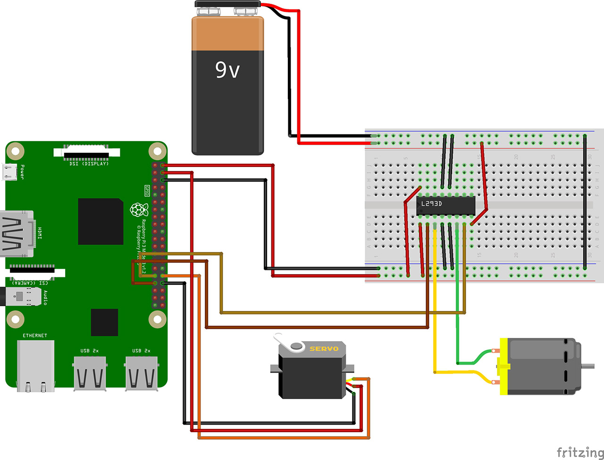

## The node.js controller

Now, we are ready to create our controller script. So power up the raspberry pi and log in via ssh.

Create a new folder in the home folder named picar

``` bash
mkdir ~/picar
```

In there, create a new file named package.json

``` json
{
  "name": "picar",
  "version": "1.0.0",
  "description": "",
  "main": "index.js",
  "scripts": {
    "test": "echo \"Error: no test specified\" && exit 1"
  },
  "author": "",
  "license": "MIT",
  "dependencies": {
    "johnny-five": "^0.10.6",
    "socket.io": "^1.7.2",
    "raspi-io": "^7.1.0"
  }
}
```

next, we need to install the dependencies of our package.json with npm
``` bash
npm install
```

This takes a while.

After that, we can start to create our controller script. So create a new file named controller.js

First, we need the references to the dependency packages
``` js
var raspi = require('raspi-io');
var five = require('johnny-five');
```

Then, we need to create a new socket.io instance at the port 3001
``` js
var port = 3001;
var io = require('socket.io')(port);
var socketio;
```

Next, we need to store our pin configuration
``` js
var servoPin = 26;
var motorSpeedPin = 23;
var motorControlPin = 22;
```

And we need to store the references to the parts (motor, servo) itself
``` js
var servo;
var motor;
```

Then we can start to connect to the raspberry IO device
``` js
var boardReady = false;

var board = new five.Board({
    io: new raspi()
});
```

After the board is connected, we can initialize our motor and our servo
``` js
board.on('ready', function(){
    boardReady = true;

    motor = new five.Motor({
        pins: {
            pwm: motorSpeedPin,
            dir: motorControlPin
        }
    });

    motor.reverse(255);
    motor.stop();

    servo = new five.Servo(servoPin);

    servo.to(90);
});
```

Now, we need a function, which lets us steer our servo
``` js
var currentSteer = 90;

var Steer = function(direction){
    var s = Math.round(direction * 180);
    if(s != currentSteer){
      servo.to(s);
      currentSteer = s;
    }
};
```

And, the funny part, we need to control our motor
``` js
var Drive = function(speed){
    if(speed > 0){
        var high = 240;
        var low = 30;

        var cSpeed = (1 - speed) * (high - low) + low;

        motor.forward(Math.round(cSpeed));
    }

    if(speed < 0){
        var high = 240;
        var low = 30;

        var cSpeed = -speed * (high - low) + low;

        motor.reverse(Math.round(cSpeed));
    }

    if(speed == 0){
        motor.reverse(255);
        motor.stop();
    }
};
```

At last, we need to start our socket.io server, to which we can connect from anywhere
``` js
socketio = io.on('connection', function(socket){

    socket.on('control', function(data){
        Steer(data.steer);
        Drive(data.speed);
    });

});
```

So, the complete script looks like this
``` js
var raspi = require('raspi-io');
var five = require('johnny-five');

var port = 3001;
var io = require('socket.io')(port);
var socketio;

var boardReady = false;

var servo;
var servoPin = 26;

var motor;
var motorSpeedPin = 23;
var motorControlPin = 22;


var board = new five.Board({
    io: new raspi()
});

board.on('ready', function(){
    boardReady = true;

    motor = new five.Motor({
        pins: {
            pwm: motorSpeedPin,
            dir: motorControlPin
        }
    });

    motor.reverse(255);
    motor.stop();

    servo = new five.Servo(servoPin);

    servo.to(90);
});

var currentSteer = 90;

var Steer = function(direction){
    var s = Math.round(direction * 180);
    if(s != currentSteer){
      servo.to(s);
      currentSteer = s;
    }
};

var Drive = function(speed){
    if(speed > 0){
        var high = 240;
        var low = 30;

        var cSpeed = (1 - speed) * (high - low) + low;

        motor.forward(Math.round(cSpeed));
    }

    if(speed < 0){
        var high = 240;
        var low = 30;

        var cSpeed = -speed * (high - low) + low;

        motor.reverse(Math.round(cSpeed));
    }

    if(speed == 0){
        motor.reverse(255);
        motor.stop();
    }
};


socketio = io.on('connection', function(socket){

    socket.on('control', function(data){
        Steer(data.steer);
        Drive(data.speed);
    });

});
```

## automatic startup on power

Now we want to start up everything, everytime the pi is booting.

First, we need to get root
``` bash
sudo su
```

Then, we need to create a new bash script in the root folder
``` bash
nano /root/startup.sh
```

In there, we change the node.js version, we start the webcam, and we start our controller script
``` bash
#!/bin/bash

. /home/pi/.nvm/nvm.sh

motion start
forever start /home/pi/legopi/controller.js
```

Then, we need to make this script executable
``` bash
chmod a+x /root/startup.sh
```

Now, we need to add this script in our crontab
``` bash
crontab -e
```

add a new line at the end of this file
``` bash
@reboot sudo /root/startup.sh
```

Now, when you reboot your pi, everything should be started automagically :)

You can shutdown your pi for now.

## Unity3D Driving controller

In the next step, we create our program, which lets us drive our picar.
I use Unity, because, we can export it to many platforms, so we can drive on a windows, or mac PC, or linux, etc...

So, create a new Unity3D project and name it PICar
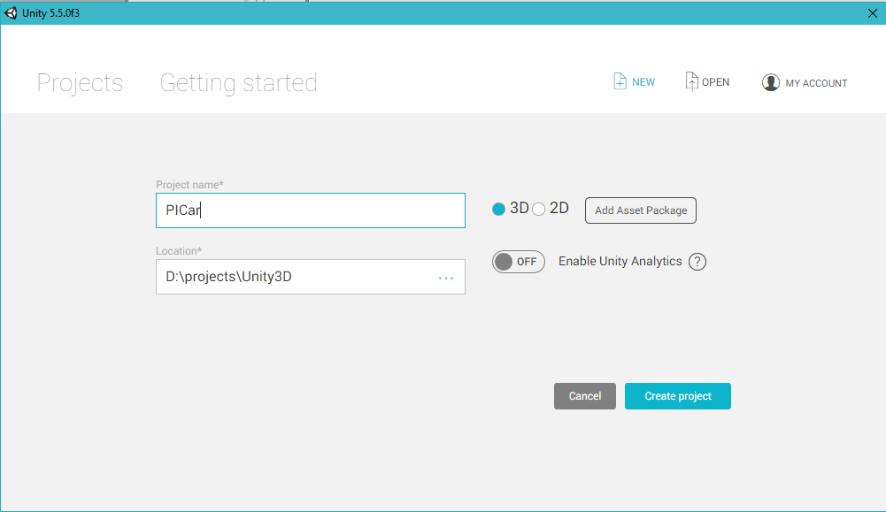

Then open the Asset Store
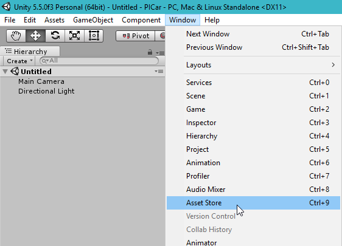

Search for SocketIO
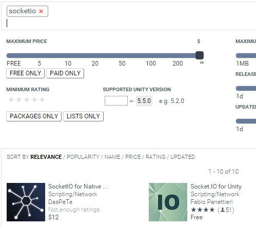

There are two packages, one, i created (it isn't free, but not that expensive) and a free package. I explain the way with my asset, but you can follow this also with the free package, they are quite similar.

So import the package
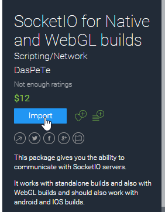
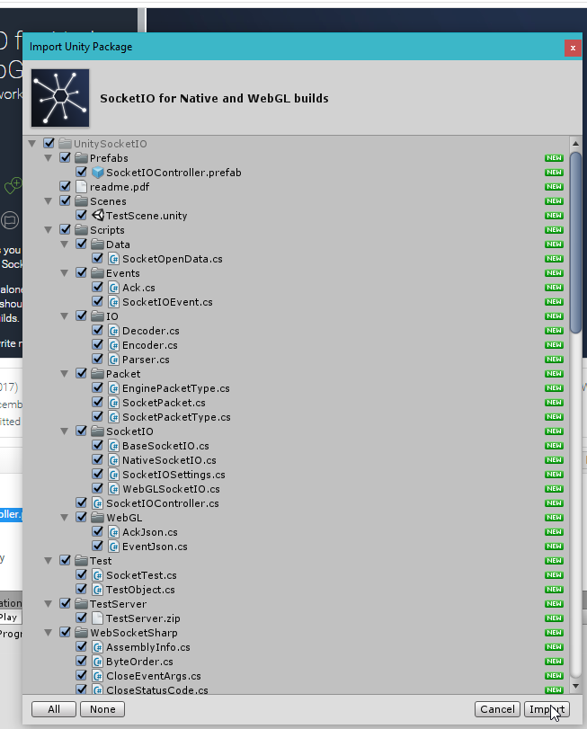

After the import, you will find a new folder, **UnitySocketIO** and in there, you'll find a Prefabs folder. Drag the prefab from this folder into the scene.
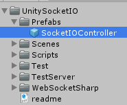
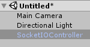

Select the object in the scene, and change the url parameter to the ip address of your pi and the port to 3001
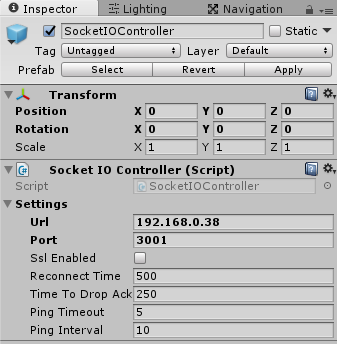

Next, create a new folder named Scripts in our project, and in there, create a new C# script called Driver
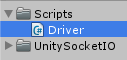

First, we need the UnitySocketIO namespaces
``` csharp
using UnityEngine;
using System.Collections;
using UnitySocketIO;
using UnitySocketIO.Events;
```

Then we need to create a class named ControlData, which is used to send through the network. It stores the speed and the steer values
``` csharp
public class ControlData {
  public float steer;
  public float speed;
}
```

Next, we need to create our Driver class
``` csharp
public class Driver : MonoBehaviour {

}
```

In there, we need to create the reference to the socket.io controller and a bool which checks, if we are connected
``` csharp
  SocketIOController io;

  bool connected;
```

And we need the current steer and speed values, which is in the middle by default
``` csharp
  float speedRatio = 0.5f;
  float steerRatio = 0.5f;
```

In the Start function, we get our socket.io controller reference, and we connect to the pi controller.
``` csharp
  void Start(){
    io = GetComponent<SocketIOController>();

    io.On("connect", (SocketIOEvent e) => {
      connected = true;

      StartCoroutine(Driving());
    });

    io.Connect();
  }
```

Next, we need the Driving CoRoutine. As long, we are connected, we send the current speed and steer values to the pi controller every 100ms 
``` csharp
  IEnumerator Driving(){
    while(connected){
      yield return new WaitForSeconds(0.1f);

      ControlData data = new ControlData();
      data.speed = -speedRatio;
      data.steer = steerRatio;

      io.Emit("control", JsonUtility.ToJson(data));
    }
  }
```

At last, we need the Update function, which calculates the current steer and speed values with the input values (could be a gamepad, or the WSAD keys or the arrow keys on the keyboard)
``` csharp
  void Update(){
    if(!connected) return;

    
    float steer = Input.GetAxis("Horizontal");
    steerRatio = (steer + 1f) / 2f;

    float speed = Input.GetAxis("Vertical");
    speedRatio = speed;
  }
```

Alright, next, drop the Driver script on our SocketIOController object
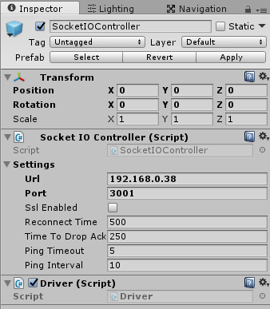

Next, create a new RawImage GameObject in our scene
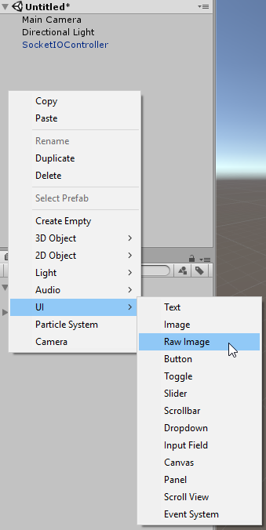

Rename it to WebCamImage
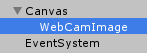

Set the RectTransform component to stretch and the top,left,bottom,right values to 0
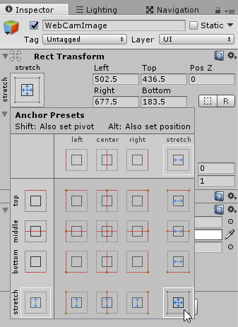
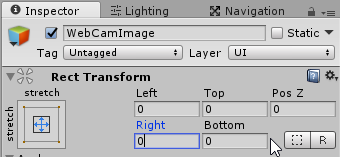

Create a new C# script named WebCamImage
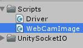

Drop this script on our WebCamImage GameObject
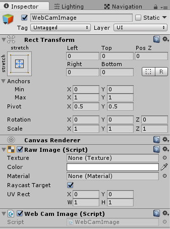

At first, we need the right namespaces in the script
``` csharp
using UnityEngine;
using System.Collections;
using System;
using System.Net;
using System.IO;
using UnityEngine.UI;
```

Then we need the class itself
``` csharp
public class WebCamImage : MonoBehaviour {

}
```

In this class, we need a reference to the RawImage component
``` csharp
  RawImage image;
```

And we also need the source stream url, then we need to store the current texture and the stream object
``` csharp
  string sourceURL = "http://192.168.0.38:8081";
  Texture2D texture; 
  Stream stream;
```

In the Start function, we get the RawImage reference and we get the video stream
``` csharp
  void Start(){
    image = GetComponent<RawImage>();
    GetVideo();
  }
```

In the GetVideo function, we create a new texture and then we request the image stream
``` csharp
public void GetVideo(){
  texture = new Texture2D(2, 2); 
  HttpWebRequest req = (HttpWebRequest)WebRequest.Create(sourceURL);
  WebResponse resp = req.GetResponse();
  stream = resp.GetResponseStream();
  StartCoroutine(GetFrame());
}
```

Now we need the GetFrame CoRoutine, in which we decode the stream content and save it to the current texture
``` csharp
  IEnumerator GetFrame(){
    Byte[] jpgData = new Byte[65536];

    while(true){
      int bytesToRead = FindLength(stream);

      if(bytesToRead == -1){
        yield break;
      }

      int leftToRead=bytesToRead;

      while(leftToRead > 0){
        leftToRead -= stream.Read(jpgData, bytesToRead - leftToRead, leftToRead);
        yield return null;
      }

      MemoryStream ms = new MemoryStream(jpgData, 0, bytesToRead, false, true);

      texture.LoadImage(ms.GetBuffer());
      image.texture = texture;
      stream.ReadByte();
      stream.ReadByte();
    }
  }

  int FindLength(Stream stream){
    int b;
    string line = "";
    int result = -1;
    bool atEOL = false;

    while((b = stream.ReadByte()) != -1){
      if(b == 10) continue;

      if(b == 13){
        if(atEOL){
          stream.ReadByte();
          return result;
        }

        if(line.StartsWith("Content-Length:")){
          result = Convert.ToInt32(line.Substring("Content-Length:".Length).Trim());
        }else{
          line = "";
        }

        atEOL = true;
      }else{
        atEOL = false;
        line += (char)b;
      }
    }

    return -1;
  }
```

Okay, this was it. If you build this out as a standalone build, and you startup your pi, and your built Unity3D Project, you should be able to drive around :) Hope you have fun :)